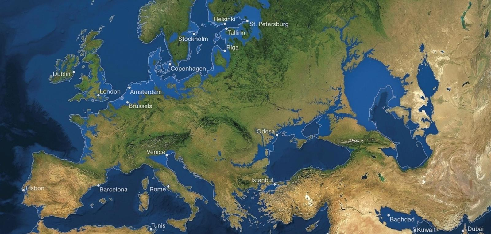

# Sage als mathematischer Werkzeugkasten: Wenn das Eis schmilzt

Die kürzlich von mir wiederentdeckte mathematische Wundertüte Sage kann man natürlich auch als mathematischen Werkzeugkasten im alltäglichen Gebrauch (wie einen besseren, wissenschaftlichen Taschenrechner) nutzen. Wenn ich die Zeit dazu finde, werde ich in der nächsten Zeit einige Berechnungen vorstellen, die ich mit Sage angestellt habe. Ich beginne mit einer uns alle interessierenden Frage: Wie hoch steigt der Meeresspiegel, wenn das Eis der Antarktis komplett wegschmilzt?

Der [Kontinent Antarktika](de.wikipedia.org/wiki/Antarktis) ist mit fast 13,2 Millionen km² um etwa 2,7 Millionen km² größer als Europa. Im antarktischen Inlandeis sind etwa 90 Prozent des Eises und knapp 70 Prozent des Süßwassers der Erde gebunden. Das Festland ist erst seit relativ kurzer Zeit (seit etwa 15 Millionen Jahren) vereist. Für die durchschnittliche Eisdicke wird ein Wert von 2,16 km angenommen, die maximale bekannte Eisdicke wurde mit 4.776 Metern in *Adélieland* gemessen. Um wieviel Meter steigt der Meeresspiegel, wenn das Eis zur Gänze schmilzt?

Ich rechne mit der Einheit km. Laut [Wikipedia](https://de.wikipedia.org/wiki/Antarktischer_Eisschild) wird das Eisvolumen (ohne Schelfeis) auf 26.370.000 km³ geschätzt. Beim Schmelzen verliert das Eis etwa 10 Prozent seines Volumens, wodurch immer noch etwa


```python
26.37*0.9
```
    23.7330000000000

23.73 Millionen km³ übrigbleiben.

Die Erde hat etwa [510 Millionen km² Oberfläche](https://de.wikipedia.org/wiki/Erdoberfl%C3%A4che) ($510 * 10^6 km^2$), Davon sind etwa 70,7 Prozent $≈ 360.6 * 10^6 km^2$ Wasser. Sei $∆$ der Höhenunterschied des Meeresspiegels, dann gilt

$$
360.6 * 10^6 km² * ∆ = 23.73 * 10^6 km²
$$

Daraus folgt, daß $∆$å ungefähr

```python
23.73/360.6
```
    0.0658069883527454

beträgt. Das sind etwas weniger als 66 Meter, um die der Meeresspiegel im Durchschnitt steigen würde. Die Berechnung ist natürlich nur sehr grob. Im oben verlinkten Wikipedia-Artikel wird ein globaler Meeresspiegelanstieg von 61,1 Metern angegeben. Vermutlich haben die [Wissenschaftler](https://de.wikipedia.org/wiki/Eustasie), die dies berechnet hatten, noch weitere Faktoren in ihre Rechnung einbezogen, zum Beispiel daß sich der Kontinent Antarktika durch den Wegfall des Eisgewichts heben wird.

In dieser Berechnung habe ich [Grönland](https://de.wikipedia.org/wiki/Gr%C3%B6nland) nicht berücksichtigt, dessen Fläche von rund 2.150.000 km² nur zu rund 410.000 km² eisfrei ist. Das grönländische Eisschild ist im Schnitt 2 km stark. Die Wissenschaft geht davon aus, daß ein vollständiges Schmelzen des Grönlandeises den Meeresspiegel noch einmal um sechs bis sieben Meter steigen lassen würde. Diese Berechnung kann in Sage nach dem gleichen Muster wie oben erfolgen und ich überlasse sie dem Leser.

## Die Folgen des Eisanstiegs



Die Zeitschrift *[National Geographic](http://www.nationalgeographic.de/)* hatte schon in der Septemberausgabe 2013 eine Karte veröffentlicht, die die Folgen für Europa zeigte, wenn der Meeresspiegel auf 66 Meter ansteigen würde. Auch Berlin stände dann unter Wasser. Und auf der Webseite [Flood Maps](http://flood.firetree.net/?ll=48.3416,14.6777&z=13) Könnt Ihr weltweit im Detail beobachten wie sich ein Meeresspiegelansteig von einem bis sechzig Meter auswirken würde. Schon ein »moderater« Anstieg von fünf Metern hätte zum Beispiel für Norddeutschland, die Niederlande, das Vereinigte Königreich oder Dänemark verheerende Folgen.


