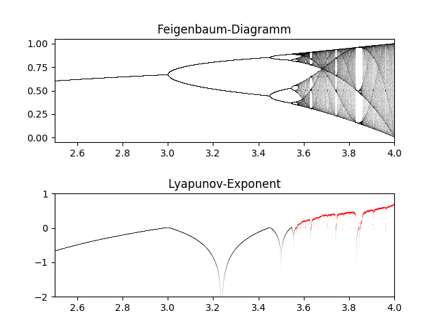

# Feigenbaum-Diagramm mit Lyapunov-Exponenten

Zuerst importieren wir die benötigten Pakete Numpy und die Matplotlib


```python
import numpy as np
import matplotlib.pyplot as plt
%matplotlib inline
```

Dann implementieren wir die logistische Funktion


```python
def logistic(r, x):
    return r*x*(1-x)
```
Zur Berechnung der Funktion wird ein Array mit 10.000 Werten implementiert, die zwischen 2,5 und 4 gleichverteilt sind:

```python
n = 10000
r = np.linspace(2.5, 4.0, n)
```

Das Programm soll 1.000 Iterationen der logistischen Gleichung durchlaufen und die letzten 100 sollen für das Bifurkations-Diagramm genutzt werden.


```python
iterations = 1000
last = 100
```

Wir initialisieren das System mit $x_0 = 0.00001$:


```python
x = 1e-5 * np.ones(n)
```

Zur Berechnung des Lyanpunov-Exponenten initialisieren wir als erstes den `lyapunov`-Vektor:


```python
lyapunov = np.zeros(n)
```

Nun folgt das eigentliche Programm:


```python
plt.subplot(211)
for i in range(iterations):
    x = logistic(r, x)
    lyapunov += np.log(abs(r - 2*r*x))
    if i >= (iterations - last):
        plt.plot(r, x, ", k", alpha = 0.02)
plt.xlim(2.5, 4)
plt.title("Feigenbaum-Diagramm")

plt.subplot(212)
plt.plot(r[lyapunov < 0], lyapunov[lyapunov < 0]/iterations,
         ",k", alpha = 0.1)
plt.plot(r[lyapunov >= 0], lyapunov[lyapunov >= 0] / iterations,
         ",r", alpha = 0.25)
plt.xlim(2.5, 4.0)
plt.ylim(-2, 1)
plt.title("Lyapunov-Exponent")
```





Wir sehen einen Fixpunkt bei `r < 3.0` und der Lyapunov-Exponent ist positiv (hier in rot markiert), wenn das System chaotisch wird.
