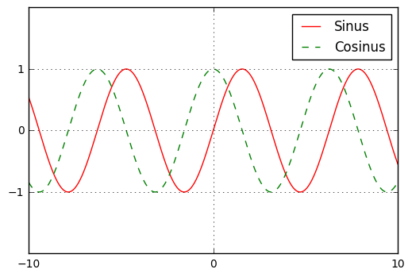

# Sage-Test

Schaun wir mal, was dabei herauskommt.


```python
import numpy as np
import matplotlib.pyplot as plt
```

Mit diesen beiden Befehlen werden die vorherigen Plots gelöscht.


```python
plt.cla()
plt.clf()
```

Ein Array mit 1000 Elementen zwischen -10 und 10


```python
x = np.linspace(-10, 10, 1000)
```

Und nun die ganzen Plotbefehle:


```python
plt.plot(x, np.sin(x), "-r", label = "Sinus")
plt.plot(x, np.cos(x), "--g", label = "Cosinus")
plt.xticks([-10, 0, 10])
plt.yticks([-1, 0, 1])
plt.ylim(-2, 2)
plt.legend()
plt.grid()
```


```python
plt.show()
```





```python

```
