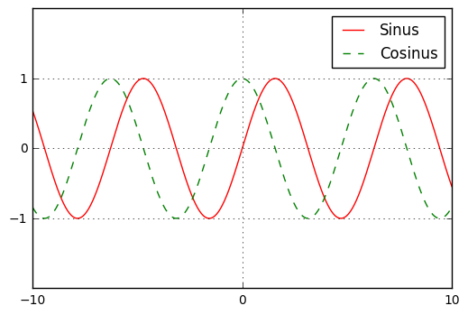

# Sage-Test

Schaun wir mal, was dabei herauskommt.


```python
import numpy as np
import matplotlib.pyplot as plt
```

Mit diesen beiden Befehlen werden die vorherigen Plots gelöscht.


```python
plt.cla()
plt.clf()
```

Ein Array mit 1000 Elementen zwischen -10 und 10


```python
x = np.linspace(-10, 10, 1000)
```

Und nun die ganzen Plotbefehle:


```python
plt.plot(x, np.sin(x), "-r", label = "Sinus")
plt.plot(x, np.cos(x), "--g", label = "Cosinus")
plt.xticks([-10, 0, 10])
plt.yticks([-1, 0, 1])
plt.ylim(-2, 2)
plt.legend()
plt.grid()
```


```python
plt.show()
```





Und jetzt zur Abwechslung mal ein wenig 3D (nach Craig Finch: *Sage Beginner's Guide*, Birmingham (Packt) 2011):


```python
var("u, v")
r = 2.0
f_x = (r + cos(u/2)*sin(v) - sin(u/2)*sin(2*v))*cos(u)
f_y = (r + cos(u/2)*sin(v) - sin(u/2)*sin(2*v))*sin(u)
f_z = sin(u/2)*sin(v) + cos(u/2)*sin(2*v)
```


```python
parametric_plot3d([f_x, f_y, f_z], (u, 0, 2*pi), (v, 0, 2*pi), color = "red")
```


<iframe srcdoc="
<html>
<head>
  <style>
    * {
      margin: 0;
      padding: 0;
      overflow: hidden;
    }
    body, html {      
      height: 100%;
      width: 100%;
    }
  </style>
  <script type=&quot;text/javascript&quot; src=&quot;/nbextensions/jsmol/JSmol.min.js&quot;></script>
</head>
<body>
  <script type=&quot;text/javascript&quot;>
    var script = [
  'data &quot;model list&quot;',
  '10',
  'empty',
  'Xx -3.0 -4.0 -3.0',
  'Xx 0.0 -4.0 -3.0',
  'Xx 3.0 -4.0 -3.0',
  'Xx 4.0 -3.0 -3.0',
  'Xx 4.0 0.0 -3.0',
  'Xx 4.0 3.0 -3.0',
  'Xx -4.0 -3.0 -3.0',
  'Xx -4.0 -3.0 0.0',
  'Xx -4.0 -3.0 3.0',
  'Xx 5.5 5.5 5.5',
  'end &quot;model list&quot;; show data',
  'select *',
  'wireframe off; spacefill off',
  'set labelOffset 0 0',
  'background [255,255,255]',
  'spin OFF',
  'moveto 0 -764 -346 -545 76.39',
  'centerAt absolute {0 0 0}',
  'zoom 100',
  'frank OFF',
  'set perspectivedepth ON',
  'pmesh obj_1 inline &quot;1845',
  '2.0036 0.000564996 4.44089e-16',
  '2.16356 0.000564996 0.76084',
  '2.31938 0.000564996 1.44337',
  '2.46703 0.000564996 1.97734',
  '2.60267 0.000564996 2.30778',
  '2.72279 0.000564996 2.4007',
  '2.82429 0.000564996 2.24651',
  '2.90453 0.000564996 1.8611',
  '2.96144 0.000564996 1.28413',
  '2.99354 0.000564996 0.57499',
  '3 0.000564996 -0.193333',
  '2.98066 0.000564996 -0.941756',
  '2.93601 0.000564996 -1.59325',
  '2.86721 0.000564996 -2.08075',
  '2.77604 0.000564996 -2.35409',
  '2.66487 0.000564996 -2.38513',
  '2.53657 0.000564996 -2.17067',
  '2.39447 0.000564996 -1.73279',
  '2.24225 0.000564996 -1.11656',
  '2.08384 0.000564996 -0.385411',
  '1.92336 0.000564996 0.385411',
  '1.76495 0.000564996 1.11656',
  '1.61273 0.000564996 1.73279',
  '1.47063 0.000564996 2.17067',
  '1.34233 0.000564996 2.38513',
  '1.23116 0.000564996 2.35409',
  '1.13999 0.000564996 2.08075',
  '1.07119 0.000564996 1.59325',
  '1.02654 0.000564996 0.941756',
  '1.0072 0.000564996 0.193333',
  '1.01366 0.000564996 -0.57499',
  '1.04576 0.000564996 -1.28413',
  '1.10267 0.000564996 -1.8611',
  '1.18291 0.000564996 -2.24651',
  '1.28441 0.000564996 -2.4007',
  '1.40453 0.000564996 -2.30778',
  '1.54017 0.000564996 -1.97734',
  '1.68782 0.000564996 -1.44337',
  '1.84364 0.000564996 -0.76084',
  '2.0036 0.000564996 -7.32867e-16',
  '1.97777 0.297513 4.44089e-16',
  '2.11007 0.31747 0.789386',
  '2.24088 0.337201 1.49991',
  '2.36853 0.356457 2.06077',
  '2.49109 0.374943 2.41644',
  '2.60621 0.392309 2.53234',
  '2.71115 0.408138 2.39834',
  '2.8028 0.421963 2.02973',
  '2.87781 0.433278 1.46567',
  '2.93277 0.441568 0.765049',
  '2.96445 0.446347 0.000470125',
  '2.97009 0.447198 -0.749277',
  '2.94764 0.443811 -1.40731',
  '2.89602 0.436025 -1.90657',
  '2.81534 0.423855 -2.1967',
  '2.70699 0.407511 -2.24919',
  '2.57369 0.387404 -2.0603',
  '2.41945 0.364138 -1.65139',
  '2.24937 0.338482 -1.06668',
  '2.06942 0.311338 -0.368605',
  '1.88612 0.283688 0.368605',
  '1.70617 0.256544 1.06668',
  '1.53609 0.230889 1.65139',
  '1.38185 0.207623 2.0603',
  '1.24855 0.187516 2.24919',
  '1.1402 0.171172 2.1967',
  '1.05952 0.159001 1.90657',
  '1.0079 0.151215 1.40731',
  '0.985451 0.147829 0.749277',
  '0.991091 0.148679 -0.000470125',
  '1.02278 0.153459 -0.765049',
  '1.07774 0.161749 -1.46567',
  '1.15274 0.173064 -2.02973',
  '1.2444 0.186889 -2.39834',
  '1.34934 0.202718 -2.53234',
  '1.46446 0.220083 -2.41644',
  '1.58701 0.23857 -2.06077',
  '1.71467 0.257826 -1.49991',
  '1.84547 0.277557 -0.789386',
  '1.97777 0.297513 -7.76403e-16',
  '1.90096 0.586771 4.44089e-16',
  '2.00268 0.61829 0.812812',
  '2.10546 0.65014 1.54673',
  '2.20997 0.682525 2.13084',
  '2.3161 0.715409 2.50943',
  '2.42269 0.748441 2.64757',
  '2.52746 0.780905 2.53461',
  '2.62693 0.811726 2.1852',
  '2.71664 0.839527 1.6377',
  '2.79148 0.862717 0.950145',
  '2.84605 0.879627 0.19427',
  '2.87521 0.888661 -0.551938',
  '2.87454 0.888456 -1.21225',
  '2.84092 0.878036 -1.72003',
  '2.77283 0.856937 -2.02506',
  '2.6707 0.825291 -2.09866',
  '2.53704 0.783873 -1.93657',
  '2.37634 0.734079 -1.55929',
  '2.19491 0.677857 -1.00987',
  '2.00043 0.617593 -0.349407',
  '1.80149 0.555949 0.349407',
  '1.60701 0.495685 1.00987',
  '1.42557 0.439463 1.55929',
  '1.26488 0.389668 1.93657',
  '1.13122 0.34825 2.09866',
  '1.02909 0.316605 2.02506',
  '0.961 0.295505 1.72003',
  '0.927374 0.285086 1.21225',
  '0.926714 0.284881 0.551938',
  '0.955867 0.293915 -0.19427',
  '1.01044 0.310825 -0.950145',
  '1.08528 0.334015 -1.6377',
  '1.17499 0.361816 -2.1852',
  '1.27446 0.392637 -2.53461',
  '1.37922 0.425101 -2.64757',
  '1.48582 0.458132 -2.50943',
  '1.59195 0.491017 -2.13084',
  '1.69646 0.523402 -1.54673',
  '1.79924 0.555252 -0.812812',
  '1.90096 0.586771 -8.12024e-16',
  '1.77515 0.860846 4.44089e-16',
  '1.84576 0.895243 0.830967',
  '1.91969 0.93126 1.58351',
  '1.99966 0.970216 2.18709',
  '2.08721 1.01287 2.58614',
  '2.18232 1.05919 2.74562',
  '2.28314 1.10831 2.65444',
  '2.38602 1.15843 2.32649',
  '2.48569 1.20698 1.79911',
  '2.57566 1.25081 1.12908',
  '2.64879 1.28643 0.386809',
  '2.69798 1.3104 -0.35102',
  '2.71689 1.31961 -1.00933',
  '2.70062 1.31168 -1.52233',
  '2.64628 1.28521 -1.84029',
  '2.55344 1.23998 -1.93453',
  '2.42427 1.17706 -1.80028',
  '2.26359 1.09879 -1.45706',
  '2.07852 1.00863 -0.946515',
  '1.87803 0.910965 -0.327944',
  '1.67227 0.810727 0.327944',
  '1.47178 0.71306 0.946515',
  '1.28671 0.622904 1.45706',
  '1.12603 0.54463 1.80028',
  '0.996866 0.48171 1.93453',
  '0.904019 0.43648 1.84029',
  '0.849682 0.41001 1.52233',
  '0.83341 0.402083 1.00933',
  '0.852322 0.411296 0.35102',
  '0.901515 0.43526 -0.386809',
  '0.974645 0.470885 -1.12908',
  '1.06461 0.514711 -1.79911',
  '1.16428 0.563265 -2.32649',
  '1.26716 0.613384 -2.65444',
  '1.36799 0.662498 -2.74562',
  '1.46309 0.708826 -2.58614',
  '1.55064 0.751476 -2.18709',
  '1.63061 0.790432 -1.58351',
  '1.70454 0.826449 -0.830967',
  '1.77515 0.860846 -8.39499e-16',
  '1.6036 1.11264 4.44089e-16',
  '1.64496 1.14149 0.843732',
  '1.69141 1.17388 1.61002',
  '1.74726 1.21284 2.22916',
  '1.81539 1.26036 2.64609',
  '1.89672 1.31708 2.82587',
  '1.98989 1.38206 2.75706',
  '2.09123 1.45275 2.4527',
  '2.19501 1.52513 1.94885',
  '2.29386 1.59408 1.30069',
  '2.37949 1.6538 0.57684',
  '2.44346 1.69842 -0.147826',
  '2.47806 1.72255 -0.799855',
  '2.47711 1.72189 -1.31476',
  '2.4367 1.69371 -1.64359',
  '2.35566 1.63718 -1.75785',
  '2.23584 1.55361 -1.65232',
  '2.08207 1.44636 -1.34539',
  '1.90189 1.32069 -0.877021',
  '1.70495 1.18333 -0.304354',
  '1.50226 1.04196 0.304354',
  '1.30532 0.904592 0.877021',
  '1.12514 0.77892 1.34539',
  '0.971372 0.671672 1.65232',
  '0.85155 0.588099 1.75785',
  '0.77051 0.531576 1.64359',
  '0.7301 0.50339 1.31476',
  '0.729153 0.50273 0.799855',
  '0.763749 0.52686 0.147826',
  '0.827719 0.571478 -0.57684',
  '0.913349 0.631202 -1.30069',
  '1.0122 0.70015 -1.94885',
  '1.11598 0.772533 -2.4527',
  '1.21732 0.843218 -2.75706',
  '1.31049 0.908199 -2.82587',
  '1.39182 0.964923 -2.64609',
  '1.45995 1.01245 -2.22916',
  '1.5158 1.0514 -1.61002',
  '1.56225 1.08379 -0.843732',
  '1.6036 1.11264 -8.58649e-16',
  '1.39076 1.33563 4.44089e-16',
  '1.40696 1.35129 0.851026',
  '1.42935 1.37292 1.62609',
  '1.46326 1.40569 2.25677',
  '1.51247 1.45324 2.68887',
  '1.57855 1.5171 2.88779',
  '1.66061 1.59639 2.84179',
  '1.75518 1.68778 2.563',
  '1.85647 1.78566 2.08595',
  '1.95684 1.88266 1.46387',
  '2.04755 1.97031 0.76313',
  '2.11957 2.0399 0.0563276',
  '2.16453 2.08335 -0.585198',
  '2.17563 2.09407 -1.09866',
  '2.14833 2.06769 -1.43622',
  '2.08098 2.00261 -1.56977',
  '1.97505 1.90025 -1.49363',
  '1.83514 1.76505 -1.225',
  '1.66868 1.6042 -0.801839',
  '1.48533 1.42702 -0.27879',
  '1.29619 1.24424 0.27879',
  '1.11284 1.06707 0.801839',
  '0.946385 0.906216 1.225',
  '0.806478 0.771019 1.49363',
  '0.700547 0.668654 1.56977',
  '0.633196 0.603571 1.43622',
  '0.605901 0.577195 1.09866',
  '0.616996 0.587916 0.585198',
  '0.661961 0.631368 -0.0563276',
  '0.733977 0.700959 -0.76313',
  '0.824682 0.78861 -1.46387',
  '0.925056 0.885605 -2.08595',
  '1.02635 0.983484 -2.563',
  '1.12092 1.07487 -2.84179',
  '1.20298 1.15417 -2.88779',
  '1.26906 1.21803 -2.68887',
  '1.31826 1.26557 -2.25677',
  '1.35218 1.29835 -1.62609',
  '1.37456 1.31998 -0.851026',
  '1.39076 1.33563 -8.6935e-16',
  '1.14214 1.52405 4.44089e-16',
  '1.13924 1.52014 0.8528',
  '1.14283 1.52497 1.63162',
  '1.15859 1.54616 2.26974',
  '1.19061 1.58922 2.71421',
  '1.24085 1.65678 2.93098',
  '1.30879 1.74815 2.9081',
  '1.39138 1.8592 2.65668',
  '1.48323 1.98271 2.20952',
  '1.57707 2.1089 1.61755',
  '1.66451 2.22647 0.944471',
  '1.73678 2.32366 0.260116',
  '1.78571 2.38945 -0.366745',
  '1.80452 2.41474 -0.87544',
  '1.78861 2.39335 -1.21955',
  '1.73609 2.32273 -1.37151',
  '1.64806 2.20436 -1.32527',
  '1.52861 2.04373 -1.09666',
  '1.38452 1.84997 -0.721457',
  '1.22473 1.63511 -0.251419',
  '1.05955 1.41299 0.251419',
  '0.899759 1.19812 0.721457',
  '0.755671 1.00437 1.09666',
  '0.636217 0.843736 1.32527',
  '0.548185 0.725361 1.37151',
  '0.495667 0.654741 1.21955',
  '0.479761 0.633351 0.87544',
  '0.498571 0.658645 0.366745',
  '0.547496 0.724434 -0.260116',
  '0.61977 0.821621 -0.944471',
  '0.707205 0.939194 -1.61755',
  '0.801052 1.06539 -2.20952',
  '0.892895 1.18889 -2.65668',
  '0.975486 1.29995 -2.9081',
  '1.04343 1.39132 -2.93098',
  '1.09367 1.45888 -2.71421',
  '1.12569 1.50193 -2.26974',
  '1.14145 1.52312 -1.63162',
  '1.14504 1.52795 -0.8528',
  '1.14214 1.52405 -8.71533e-16',
  '0.864173 1.673 4.44089e-16',
  '0.849779 1.64485 0.849044',
  '0.841331 1.62832 1.62656',
  '0.844048 1.63364 2.26799',
  '0.861769 1.6683 2.72195',
  '0.896458 1.73616 2.95516',
  '0.947895 1.83677 2.95555',
  '1.01362 1.96534 2.73313',
  '1.08911 2.113 2.31877',
  '1.16817 2.26766 1.76074',
  '1.24358 2.41516 1.11969',
  '1.30774 2.54067 0.462217',
  '1.35352 2.63021 -0.145914',
  '1.37495 2.67213 -0.64654',
  '1.36791 2.65837 -0.994958',
  '1.33059 2.58535 -1.16435',
  '1.26371 2.45453 -1.1483',
  '1.17058 2.27236 -0.961203',
  '1.05682 2.04984 -0.636396',
  '0.929898 1.80157 -0.222416',
  '0.798448 1.54444 0.222416',
  '0.671524 1.29617 0.636396',
  '0.557768 1.07365 0.961203',
  '0.46464 0.891483 1.1483',
  '0.39776 0.760661 1.16435',
  '0.360432 0.687642 0.994958',
  '0.353393 0.673875 0.64654',
  '0.374825 0.715798 0.145914',
  '0.420602 0.805341 -0.462217',
  '0.484765 0.93085 -1.11969',
  '0.560171 1.07835 -1.76074',
  '0.639239 1.23301 -2.31877',
  '0.714726 1.38067 -2.73313',
  '0.780451 1.50924 -2.95555',
  '0.831888 1.60985 -2.95516',
  '0.866577 1.67771 -2.72195',
  '0.884298 1.71237 -2.26799',
  '0.887015 1.71768 -1.62656',
  '0.878567 1.70116 -0.849044',
  '0.864173 1.673 -8.65184e-16',
  '0.564063 1.77865 4.44089e-16',
  '0.546862 1.72353 0.839781',
  '0.534173 1.68287 1.61096',
  '0.52997 1.6694 2.25154',
  '0.537216 1.69262 2.71203',
  '0.557489 1.75758 2.96018',
  '0.590759 1.86419 2.98383',
  '0.635343 2.00706 2.79186',
  '0.688024 2.17587 2.41297',
  '0.744357 2.35639 1.89252',
  '0.799093 2.53178 1.28764',
  '0.846708 2.68436 0.66132',
  '0.881971 2.79736 0.0758639',
  '0.900487 2.85669 -0.413446',
  '0.899171 2.85248 -0.763917',
  '0.876598 2.78014 -0.94964',
  '0.833185 2.64103 -0.963894',
  '0.771203 2.44241 -0.819516',
  '0.694598 2.19694 -0.547208',
  '0.608646 1.92151 -0.191971',
  '0.51948 1.63578 0.191971',
  '0.433527 1.36035 0.547208',
  '0.356922 1.11488 0.819516',
  '0.294941 0.916263 0.963894',
  '0.251528 0.77715 0.94964',
  '0.228954 0.704815 0.763917',
  '0.227639 0.700599 0.413446',
  '0.246155 0.759932 -0.0758639',
  '0.281418 0.872929 -0.66132',
  '0.329033 1.02551 -1.28764',
  '0.383769 1.20091 -1.89252',
  '0.440101 1.38142 -2.41297',
  '0.492783 1.55023 -2.79186',
  '0.537366 1.6931 -2.98383',
  '0.570637 1.79971 -2.96018',
  '0.590909 1.86467 -2.71203',
  '0.598155 1.88789 -2.25154',
  '0.593952 1.87443 -1.61096',
  '0.581263 1.83376 -0.839781',
  '0.564063 1.77865 -8.50343e-16',
  '0.249581 1.83824 4.44089e-16',
  '0.238773 1.75561 0.825072',
  '0.230189 1.69 1.58491',
  '0.225795 1.65641 2.22048',
  '0.22707 1.66616 2.68453',
  '0.234826 1.72544 2.946',
  '0.249098 1.83454 2.99275',
  '0.269124 1.98763 2.83247',
  '0.293399 2.17319 2.49153',
  '0.319821 2.37517 2.01202',
  '0.345893 2.57447 1.44724',
  '0.368977 2.75092 0.856134',
  '0.386562 2.88534 0.297149',
  '0.396527 2.96152 -0.177671',
  '0.39737 2.96797 -0.527923',
  '0.38837 2.89916 -0.728774',
  '0.36968 2.75629 -0.773233',
  '0.342332 2.54724 -0.672514',
  '0.308155 2.28598 -0.454471',
  '0.269607 1.99132 -0.160281',
  '0.229556 1.68516 0.160281',
  '0.191008 1.39049 0.454471',
  '0.15683 1.12923 0.672514',
  '0.129483 0.92018 0.773233',
  '0.110793 0.77731 0.728774',
  '0.101792 0.708508 0.527923',
  '0.102635 0.71495 0.177671',
  '0.112601 0.79113 -0.297149',
  '0.130186 0.925552 -0.856134',
  '0.153269 1.10201 -1.44724',
  '0.179341 1.30131 -2.01202',
  '0.205763 1.50328 -2.49153',
  '0.230039 1.68885 -2.83247',
  '0.250064 1.84193 -2.99275',
  '0.264337 1.95103 -2.946',
  '0.272092 2.01032 -2.68453',
  '0.273368 2.02006 -2.22048',
  '0.268974 1.98648 -1.58491',
  '0.26039 1.92086 -0.825072',
  '0.249581 1.83824 -8.27108e-16',
  '-0.0711266 1.85023 4.44089e-16',
  '-0.0664181 1.74179 0.805012',
  '-0.062538 1.65242 1.54858',
  '-0.0602203 1.59904 2.17502',
  '-0.0600209 1.59444 2.63962',
  '-0.0622517 1.64582 2.91271',
  '-0.0669411 1.75383 2.98227',
  '-0.0738247 1.91238 2.85472',
  '-0.0823662 2.10911 2.55393',
  '-0.0918088 2.32659 2.11847',
  '-0.10125 2.54404 1.59746',
  '-0.109731 2.73938 1.0454',
  '-0.116338 2.89155 0.516508',
  '-0.120294 2.98269 0.0592558',
  '-0.121046 3 -0.288504',
  '-0.118319 2.93719 -0.503181',
  '-0.112156 2.79524 -0.577557',
  '-0.102914 2.58238 -0.521151',
  '-0.0912411 2.31352 -0.358787',
  '-0.0780101 2.00878 -0.127552',
  '-0.064243 1.69169 0.127552',
  '-0.0510121 1.38695 0.358787',
  '-0.0393387 1.11808 0.521151',
  '-0.0300973 0.90523 0.577557',
  '-0.0239338 0.763271 0.503181',
  '-0.021207 0.700465 0.288504',
  '-0.0219586 0.717777 -0.0592558',
  '-0.0259155 0.808912 -0.516508',
  '-0.0325224 0.961086 -1.0454',
  '-0.0410035 1.15643 -1.59746',
  '-0.0504443 1.37387 -2.11847',
  '-0.0598869 1.59136 -2.55393',
  '-0.0684284 1.78809 -2.85472',
  '-0.075312 1.94663 -2.98227',
  '-0.0800014 2.05464 -2.91271',
  '-0.0822322 2.10602 -2.63962',
  '-0.0820328 2.10143 -2.17502',
  '-0.0797151 2.04805 -1.54858',
  '-0.075835 1.95868 -0.805012',
  '-0.0711266 1.85023 -7.95629e-16',
  '-0.389754 1.81432 4.44089e-16',
  '-0.361063 1.68388 0.779731',
  '-0.336883 1.57394 1.5022',
  '-0.321222 1.50274 2.11545',
  '-0.317131 1.48414 2.57759',
  '-0.326353 1.52607 2.86054',
  '-0.349108 1.62952 2.95245',
  '-0.384044 1.78836 2.85846',
  '-0.428346 1.98978 2.59976',
  '-0.478011 2.21558 2.21118',
  '-0.528237 2.44393 1.73732',
  '-0.573919 2.65163 1.22788',
  '-0.610167 2.81643 0.732517',
  '-0.632814 2.91939 0.295799',
  '-0.638859 2.94688 -0.0472149',
  '-0.626791 2.89201 -0.274324',
  '-0.596769 2.75552 -0.378136',
  '-0.550634 2.54576 -0.366408',
  '-0.491748 2.27804 -0.260776',
  '-0.42469 1.97316 -0.0939952',
  '-0.354818 1.65549 0.0939952',
  '-0.28776 1.35061 0.260776',
  '-0.228875 1.08288 0.366408',
  '-0.18274 0.87313 0.378136',
  '-0.152718 0.736637 0.274324',
  '-0.14065 0.681771 0.0472149',
  '-0.146695 0.709253 -0.295799',
  '-0.169342 0.812217 -0.732517',
  '-0.205589 0.977017 -1.22788',
  '-0.251272 1.18471 -1.73732',
  '-0.301498 1.41307 -2.21118',
  '-0.351162 1.63886 -2.59976',
  '-0.395465 1.84029 -2.85846',
  '-0.430401 1.99912 -2.95245',
  '-0.453156 2.10258 -2.86054',
  '-0.462378 2.1445 -2.57759',
  '-0.458287 2.1259 -2.11545',
  '-0.442626 2.0547 -1.5022',
  '-0.418446 1.94477 -0.779731',
  '-0.389754 1.81432 -7.56109e-16',
  '-0.69805 1.73144 4.44089e-16',
  '-0.638116 1.58476 0.749394',
  '-0.586833 1.45925 1.44609',
  '-0.551897 1.37374 2.04217',
  '-0.539195 1.34266 2.49884',
  '-0.552139 1.37434 2.78981',
  '-0.59126 1.47008 2.90348',
  '-0.654107 1.62389 2.84365',
  '-0.735455 1.82298 2.62874',
  '-0.827816 2.04903 2.28955',
  '-0.922181 2.27997 1.86591',
  '-1.00894 2.4923 1.4024',
  '-1.07885 2.66342 0.943775',
  '-1.12404 2.77402 0.530423',
  '-1.13879 2.8101 0.194381',
  '-1.12015 2.76449 -0.0436889',
  '-1.06833 2.63767 -0.176262',
  '-0.986671 2.43781 -0.209288',
  '-0.881367 2.18009 -0.161073',
  '-0.760897 1.88525 -0.059829',
  '-0.635203 1.57763 0.059829',
  '-0.514734 1.28279 0.161073',
  '-0.409429 1.02507 0.209288',
  '-0.327767 0.825208 0.176262',
  '-0.275947 0.698384 0.0436889',
  '-0.257312 0.652777 -0.194381',
  '-0.272056 0.688861 -0.530423',
  '-0.317246 0.799459 -0.943775',
  '-0.387163 0.970575 -1.4024',
  '-0.473919 1.1829 -1.86591',
  '-0.568284 1.41385 -2.28955',
  '-0.660645 1.63989 -2.62874',
  '-0.741993 1.83898 -2.84365',
  '-0.80484 1.9928 -2.90348',
  '-0.843961 2.08854 -2.78981',
  '-0.856905 2.12022 -2.49884',
  '-0.844203 2.08913 -2.04217',
  '-0.809267 2.00363 -1.44609',
  '-0.757984 1.87812 -0.749394',
  '-0.69805 1.73144 -7.08806e-16',
  '-0.988029 1.60372 4.44089e-16',
  '-0.891281 1.44819 0.714196',
  '-0.807572 1.31361 1.38059',
  '-0.748517 1.21867 1.95564',
  '-0.723039 1.17772 2.40389',
  '-0.736372 1.19915 2.70099',
  '-0.789457 1.28449 2.83568',
  '-0.878783 1.4281 2.81041',
  '-0.996704 1.61767 2.64066',
  '-1.13218 1.83546 2.35307',
  '-1.27187 2.06005 1.9824',
  '-1.40155 2.26851 1.56782',
  '-1.50747 2.4388 1.14891',
  '-1.57788 2.552 0.761608',
  '-1.60422 2.59434 0.434716',
  '-1.582 2.55862 0.18723',
  '-1.51139 2.4451 0.0267553',
  '-1.39717 2.26147 -0.0508116',
  '-1.24836 2.02224 -0.0603259',
  '-1.07736 1.74733 -0.0252747',
  '-0.898702 1.46012 0.0252747',
  '-0.727697 1.1852 0.0603259',
  '-0.578892 0.945978 0.0508116',
  '-0.464671 0.762351 -0.0267553',
  '-0.394055 0.648825 -0.18723',
  '-0.37184 0.613111 -0.434716',
  '-0.398173 0.655445 -0.761608',
  '-0.468588 0.768647 -1.14891',
  '-0.574512 0.938936 -1.56782',
  '-0.704183 1.1474 -1.9824',
  '-0.843882 1.37199 -2.35307',
  '-0.979354 1.58978 -2.64066',
  '-1.09727 1.77935 -2.81041',
  '-1.1866 1.92296 -2.83568',
  '-1.23969 2.0083 -2.70099',
  '-1.25302 2.02973 -2.40389',
  '-1.22754 1.98877 -1.95564',
  '-1.16849 1.89384 -1.38059',
  '-1.08478 1.75926 -0.714196',
  '-0.988029 1.60372 -6.54026e-16',
  '-1.25218 1.43449 4.44089e-16',
  '-1.11512 1.27867 0.674367',
  '-0.995501 1.14269 1.30614',
  '-0.9089 1.04425 1.85643',
  '-0.86731 0.996966 2.29334',
  '-0.877844 1.00894 2.59465',
  '-0.941927 1.08179 2.74949',
  '-1.05508 1.21043 2.75893',
  '-1.20734 1.38352 2.63546',
  '-1.38422 1.58459 2.40134',
  '-1.56818 1.79372 2.08603',
  '-1.74042 1.98953 1.72308',
  '-1.88282 2.1514 1.3466',
  '-1.97978 2.26163 0.987853',
  '-2.01988 2.30722 0.672231',
  '-1.9971 2.28132 0.416935',
  '-1.91146 2.18396 0.229599',
  '-1.76909 2.02211 0.107995',
  '-1.58168 1.80906 0.0408124',
  '-1.36534 1.56313 0.00944343',
  '-1.13902 1.30585 -0.00944343',
  '-0.922683 1.05991 -0.0408124',
  '-0.735272 0.846865 -0.107995',
  '-0.592902 0.685017 -0.229599',
  '-0.507259 0.587657 -0.416935',
  '-0.484478 0.56176 -0.672231',
  '-0.524583 0.607352 -0.987853',
  '-0.621542 0.717575 -1.3466',
  '-0.763938 0.879452 -1.72308',
  '-0.936183 1.07526 -2.08603',
  '-1.12014 1.28439 -2.40134',
  '-1.29702 1.48546 -2.63546',
  '-1.44928 1.65855 -2.75893',
  '-1.56243 1.78719 -2.74949',
  '-1.62652 1.86004 -2.59465',
  '-1.63705 1.87201 -2.29334',
  '-1.59546 1.82473 -1.85643',
  '-1.50886 1.72628 -1.30614',
  '-1.38924 1.5903 -0.674367',
  '-1.25218 1.43449 -5.92124e-16',
  '-1.48366 1.22812 4.44089e-16',
  '-1.30511 1.0813 0.630163',
  '-1.14821 0.952279 1.22322',
  '-1.03229 0.85696 1.74518',
  '-0.972309 0.807635 2.16793',
  '-0.977204 0.81166 2.47149',
  '-1.04893 0.870641 2.64547',
  '-1.18218 0.980213 2.68957',
  '-1.36489 1.13045 2.61317',
  '-1.5794 1.30684 2.43403',
  '-1.80429 1.49177 2.17613',
  '-2.01656 1.66631 1.86716',
  '-2.19395 1.81218 1.53555',
  '-2.3173 1.91361 1.20769',
  '-2.3725 1.959 0.905388',
  '-2.35201 1.94215 0.643935',
  '-2.25566 1.86292 0.430953',
  '-2.09075 1.72732 0.266101',
  '-1.87134 1.5469 0.141686',
  '-1.61692 1.33769 0.0441003',
  '-1.35041 1.11855 -0.0441003',
  '-1.09598 0.90933 -0.141686',
  '-0.876576 0.728915 -0.266101',
  '-0.711665 0.59331 -0.430953',
  '-0.615317 0.514083 -0.643935',
  '-0.594825 0.497233 -0.905388',
  '-0.650026 0.542625 -1.20769',
  '-0.773374 0.644053 -1.53555',
  '-0.950768 0.789922 -1.86716',
  '-1.16303 0.964467 -2.17613',
  '-1.38793 1.1494 -2.43403',
  '-1.60244 1.32579 -2.61317',
  '-1.78514 1.47602 -2.68957',
  '-1.9184 1.58559 -2.64547',
  '-1.99012 1.64457 -2.47149',
  '-1.99502 1.6486 -2.16793',
  '-1.93503 1.59927 -1.74518',
  '-1.81911 1.50396 -1.22322',
  '-1.66221 1.37494 -0.630163',
  '-1.48366 1.22812 -5.23502e-16',
  '-1.67648 0.989952 4.44089e-16',
  '-1.45774 0.861561 0.581874',
  '-1.2644 0.748085 1.13237',
  '-1.1192 0.662862 1.62261',
  '-1.03976 0.616232 2.02845',
  '-1.0367 0.614436 2.33229',
  '-1.11252 0.658937 2.52429',
  '-1.26125 0.746233 2.60276',
  '-1.46904 0.868192 2.57394',
  '-1.71552 1.01287 2.45093',
  '-1.97592 1.16571 2.25212',
  '-2.22355 1.31105 1.99913',
  '-2.43257 1.43373 1.71455',
  '-2.58065 1.52065 1.4197',
  '-2.65131 1.56212 1.13267',
  '-2.63563 1.55292 0.866759',
  '-2.5332 1.4928 0.629513',
  '-2.35225 1.38659 0.422481',
  '-2.10882 1.24371 0.241641',
  '-1.82521 1.07725 0.0784713',
  '-1.52775 0.902655 -0.0784713',
  '-1.24415 0.736195 -0.241641',
  '-1.00072 0.593316 -0.422481',
  '-0.819763 0.487107 -0.629513',
  '-0.717334 0.426987 -0.866759',
  '-0.701651 0.417782 -1.13267',
  '-0.772313 0.459256 -1.4197',
  '-0.920396 0.546172 -1.71455',
  '-1.12941 0.668853 -1.99913',
  '-1.37704 0.814196 -2.25212',
  '-1.63744 0.967036 -2.45093',
  '-1.88393 1.11171 -2.57394',
  '-2.09172 1.23367 -2.60276',
  '-2.24045 1.32097 -2.52429',
  '-2.31627 1.36547 -2.33229',
  '-2.31321 1.36367 -2.02845',
  '-2.23376 1.31704 -1.62261',
  '-2.08856 1.23182 -1.13237',
  '-1.89523 1.11834 -0.581874',
  '-1.67648 0.989952 -4.48604e-16',
  '-1.82564 0.726161 4.44089e-16',
  '-1.57044 0.625237 0.52981',
  '-1.34376 0.535598 1.03418',
  '-1.17117 0.467343 1.48952',
  '-1.0725 0.428325 1.87582',
  '-1.05985 0.42332 2.17797',
  '-1.13621 0.453518 2.38674',
  '-1.29516 0.516378 2.49907',
  '-1.52149 0.605881 2.518',
  '-1.7927 0.713133 2.45194',
  '-2.08133 0.827275 2.31351',
  '-2.35777 0.936595 2.11814',
  '-2.59329 1.02973 1.88242',
  '-2.76301 1.09685 1.6225',
  '-2.84849 1.13066 1.35261',
  '-2.83965 1.12716 1.08396',
  '-2.73581 1.08609 0.82399',
  '-2.54584 1.01097 0.576121',
  '-2.28729 0.908722 0.340029',
  '-1.9846 0.789022 0.112333',
  '-1.66669 0.663301 -0.112333',
  '-1.364 0.543601 -0.340029',
  '-1.10545 0.441354 -0.576121',
  '-0.91548 0.36623 -0.82399',
  '-0.811639 0.325165 -1.08396',
  '-0.802793 0.321667 -1.35261',
  '-0.888277 0.355472 -1.6225',
  '-1.058 0.42259 -1.88242',
  '-1.29352 0.515728 -2.11814',
  '-1.56996 0.625048 -2.31351',
  '-1.85859 0.73919 -2.45194',
  '-2.1298 0.846442 -2.518',
  '-2.35613 0.935945 -2.49907',
  '-2.51508 0.998805 -2.38674',
  '-2.59144 1.029 -2.17797',
  '-2.57879 1.024 -1.87582',
  '-2.48012 0.98498 -1.48952',
  '-2.30752 0.916725 -1.03418',
  '-2.08085 0.827085 -0.52981',
  '-1.82564 0.726161 -3.67918e-16',
  '-1.92728 0.443579 4.44089e-16',
  '-1.64163 0.378229 0.47431',
  '-1.38682 0.319935 0.929272',
  '-1.19049 0.275019 1.34676',
  '-1.07417 0.248408 1.71102',
  '-1.05106 0.243121 2.00953',
  '-1.12462 0.25995 2.23371',
  '-1.28819 0.297371 2.37917',
  '-1.52567 0.3517 2.44574',
  '-1.81312 0.41746 2.43704',
  '-2.12124 0.487951 2.35989',
  '-2.41838 0.555929 2.22341',
  '-2.67378 0.614359 2.03809',
  '-2.86076 0.657133 1.81477',
  '-2.95943 0.679708 1.56378',
  '-2.95884 0.679572 1.29414',
  '-2.85803 0.65651 1.01312',
  '-2.66623 0.612631 0.726025',
  '-2.40189 0.552157 0.436211',
  '-2.09086 0.481 0.145467',
  '-1.76371 0.406157 -0.145467',
  '-1.45267 0.335 -0.436211',
  '-1.18834 0.274527 -0.726025',
  '-0.996536 0.230647 -1.01312',
  '-0.895728 0.207585 -1.29414',
  '-0.895134 0.207449 -1.56378',
  '-0.993812 0.230024 -1.81477',
  '-1.18079 0.272799 -2.03809',
  '-1.43619 0.331228 -2.22341',
  '-1.73333 0.399207 -2.35989',
  '-2.04145 0.469697 -2.43704',
  '-2.3289 0.535458 -2.44574',
  '-2.56637 0.589786 -2.37917',
  '-2.72995 0.627208 -2.23371',
  '-2.80351 0.644036 -2.00953',
  '-2.7804 0.638749 -1.71102',
  '-2.66408 0.612138 -1.34676',
  '-2.46774 0.567222 -0.929272',
  '-2.21294 0.508928 -0.47431',
  '-1.92728 0.443579 -2.81965e-16',
  '-1.97877 0.149522 4.44089e-16',
  '-1.67069 0.126437 0.415735',
  '-1.39481 0.105766 0.818342',
  '-1.18001 0.0896709 1.19528',
  '-1.04886 0.0798438 1.53512',
  '-1.01527 0.0773272 1.82805',
  '-1.08308 0.0824081 2.06619',
  '-1.24562 0.0945869 2.24385',
  '-1.4864 0.112629 2.35762',
  '-1.78082 0.13469 2.40634',
  '-2.09868 0.158507 2.39096',
  '-2.40727 0.18163 2.31426',
  '-2.67479 0.201675 2.18054',
  '-2.87354 0.216567 1.99528',
  '-2.98287 0.224759 1.7648',
  '-2.99124 0.225386 1.49592',
  '-2.89744 0.218358 1.19569',
  '-2.71074 0.204368 0.87122',
  '-2.4499 0.184824 0.529564',
  '-2.14131 0.161701 0.177657',
  '-1.81623 0.137343 -0.177657',
  '-1.50764 0.114221 -0.529564',
  '-1.24681 0.0946761 -0.87122',
  '-1.0601 0.0806862 -1.19569',
  '-0.966302 0.0736579 -1.49592',
  '-0.97467 0.0742849 -1.7648',
  '-1.084 0.082477 -1.99528',
  '-1.28276 0.0973697 -2.18054',
  '-1.55027 0.117414 -2.31426',
  '-1.85886 0.140538 -2.39096',
  '-2.17672 0.164355 -2.40634',
  '-2.47114 0.186416 -2.35762',
  '-2.71193 0.204458 -2.24385',
  '-2.87446 0.216636 -2.06619',
  '-2.94227 0.221717 -1.82805',
  '-2.90868 0.219201 -1.53512',
  '-2.77753 0.209374 -1.19528',
  '-2.56274 0.193279 -0.818342',
  '-2.28686 0.172607 -0.415735',
  '-1.97877 0.149522 -1.91303e-16',
  '-1.97877 -0.148392 4.44089e-16',
  '-1.65785 -0.124345 0.354463',
  '-1.36946 -0.102736 0.702105',
  '-1.14281 -0.0857536 1.03604',
  '-1.00077 -0.0751106 1.34927',
  '-0.957542 -0.0718715 1.63472',
  '-1.0172 -0.0763419 1.88528',
  '-1.1733 -0.0880381 2.09397',
  '-1.40951 -0.105738 2.2542',
  '-1.70136 -0.127606 2.36004',
  '-2.0187 -0.151384 2.40653',
  '-2.32885 -0.174623 2.3901',
  '-2.59994 -0.194937 2.30884',
  '-2.80422 -0.210243 2.16285',
  '-2.92087 -0.218983 1.95438',
  '-2.93816 -0.220279 1.68799',
  '-2.85466 -0.214023 1.37049',
  '-2.67936 -0.200887 1.01076',
  '-2.43074 -0.182258 0.619484',
  '-2.13487 -0.160088 0.208695',
  '-1.82268 -0.136696 -0.208695',
  '-1.5268 -0.114526 -0.619484',
  '-1.27818 -0.0958971 -1.01076',
  '-1.10288 -0.0827619 -1.37049',
  '-1.01938 -0.0765053 -1.68799',
  '-1.03667 -0.077801 -1.95438',
  '-1.15332 -0.0865413 -2.16285',
  '-1.3576 -0.101848 -2.30884',
  '-1.6287 -0.122161 -2.3901',
  '-1.93884 -0.145401 -2.40653',
  '-2.25618 -0.169179 -2.36004',
  '-2.54803 -0.191047 -2.2542',
  '-2.78424 -0.208746 -2.09397',
  '-2.94034 -0.220443 -1.88528',
  '-3 -0.224913 -1.63472',
  '-2.95677 -0.221674 -1.34927',
  '-2.81473 -0.211031 -1.03604',
  '-2.58808 -0.194048 -0.702105',
  '-2.2997 -0.172439 -0.354463',
  '-1.97877 -0.148392 -9.65203e-17',
  '-1.92728 -0.442449 4.44089e-16',
  '-1.60419 -0.368533 0.290892',
  '-1.31291 -0.301895 0.581314',
  '-1.08202 -0.249073 0.870082',
  '-0.933949 -0.215199 1.15467',
  '-0.882721 -0.203479 1.43079',
  '-0.932523 -0.214873 1.69213',
  '-1.07732 -0.247998 1.93051',
  '-1.30147 -0.299279 2.13617',
  '-1.5814 -0.36332 2.29843',
  '-1.88801 -0.433465 2.4065',
  '-2.18968 -0.502479 2.45044',
  '-2.45554 -0.563299 2.42218',
  '-2.65861 -0.609758 2.31639',
  '-2.77863 -0.637215 2.13128',
  '-2.80406 -0.643032 1.86913',
  '-2.73328 -0.62684 1.53641',
  '-2.57474 -0.59057 1.14375',
  '-2.34603 -0.538248 0.705385',
  '-2.07208 -0.475573 0.238379',
  '-1.78249 -0.409324 -0.238379',
  '-1.50853 -0.34665 -0.705385',
  '-1.27983 -0.294328 -1.14375',
  '-1.12129 -0.258057 -1.53641',
  '-1.05051 -0.241865 -1.86913',
  '-1.07594 -0.247682 -2.13128',
  '-1.19596 -0.275139 -2.31639',
  '-1.39903 -0.321598 -2.42218',
  '-1.66489 -0.382419 -2.45044',
  '-1.96655 -0.451433 -2.4065',
  '-2.27316 -0.521577 -2.29843',
  '-2.5531 -0.585619 -2.13617',
  '-2.77725 -0.6369 -1.93051',
  '-2.92204 -0.670025 -1.69213',
  '-2.97185 -0.681418 -1.43079',
  '-2.92062 -0.669698 -1.15467',
  '-2.77255 -0.635824 -0.870082',
  '-2.54166 -0.583002 -0.581314',
  '-2.25038 -0.516364 -0.290892',
  '-1.92728 -0.442449 1.76822e-18',
  '-1.82564 -0.725031 4.44089e-16',
  '-1.51156 -0.600826 0.225435',
  '-1.22754 -0.488508 0.456753',
  '-1.00061 -0.398764 0.698481',
  '-0.852021 -0.340004 0.952584',
  '-0.795156 -0.317516 1.21757',
  '-0.834161 -0.332942 1.48802',
  '-0.963585 -0.384123 1.75453',
  '-1.16897 -0.465343 2.00428',
  '-1.42836 -0.567923 2.22191',
  '-1.71462 -0.681124 2.39085',
  '-1.99817 -0.79326 2.49489',
  '-2.25012 -0.892896 2.5198',
  '-2.44517 -0.970028 2.4549',
  '-2.56421 -1.0171 2.29437',
  '-2.59627 -1.02978 2.03814',
  '-2.53965 -1.00739 1.69237',
  '-2.40198 -0.95295 1.26933',
  '-2.19945 -0.872858 0.786712',
  '-1.95507 -0.776213 0.266518',
  '-1.69622 -0.67385 -0.266518',
  '-1.45183 -0.577205 -0.786712',
  '-1.2493 -0.497113 -1.26933',
  '-1.11164 -0.442671 -1.69237',
  '-1.05501 -0.420279 -2.03814',
  '-1.08708 -0.432961 -2.29437',
  '-1.20612 -0.480035 -2.4549',
  '-1.40116 -0.557167 -2.5198',
  '-1.65311 -0.656803 -2.49489',
  '-1.93667 -0.768938 -2.39085',
  '-2.22293 -0.88214 -2.22191',
  '-2.48232 -0.98472 -2.00428',
  '-2.6877 -1.06594 -1.75453',
  '-2.81713 -1.11712 -1.48802',
  '-2.85613 -1.13255 -1.21757',
  '-2.79927 -1.11006 -0.952584',
  '-2.65068 -1.0513 -0.698481',
  '-2.42374 -0.961555 -0.456753',
  '-2.13972 -0.849237 -0.225435',
  '-1.82564 -0.725031 1.02925e-16',
  '-1.67648 -0.988822 4.44089e-16',
  '-1.38251 -0.816275 0.158515',
  '-1.11589 -0.659788 0.32923',
  '-0.901259 -0.53381 0.52235',
  '-0.758022 -0.449738 0.744317',
  '-0.698469 -0.414784 0.996463',
  '-0.726554 -0.431268 1.27425',
  '-0.837547 -0.496415 1.56718',
  '-1.01857 -0.602665 1.8594',
  '-1.24996 -0.738479 2.13098',
  '-1.50732 -0.889535 2.3597',
  '-1.76405 -1.04022 2.52316',
  '-1.99406 -1.17522 2.60108',
  '-2.1745 -1.28113 2.5775',
  '-2.28804 -1.34777 2.44257',
  '-2.32464 -1.36925 2.19393',
  '-2.28255 -1.34455 1.83735',
  '-2.16842 -1.27756 1.38667',
  '-1.99658 -1.1767 0.862936',
  '-1.78748 -1.05397 0.292928',
  '-1.56549 -0.923675 -0.292928',
  '-1.35638 -0.80094 -0.862936',
  '-1.18454 -0.700081 -1.38667',
  '-1.07042 -0.633096 -1.83735',
  '-1.02833 -0.608391 -2.19393',
  '-1.06493 -0.629873 -2.44257',
  '-1.17846 -0.696512 -2.5775',
  '-1.3589 -0.802419 -2.60108',
  '-1.58892 -0.937425 -2.52316',
  '-1.84564 -1.08811 -2.3597',
  '-2.103 -1.23916 -2.13098',
  '-2.33439 -1.37498 -1.8594',
  '-2.51542 -1.48123 -1.56718',
  '-2.62641 -1.54637 -1.27425',
  '-2.6545 -1.56286 -0.996463',
  '-2.59494 -1.5279 -0.744317',
  '-2.45171 -1.44383 -0.52235',
  '-2.23707 -1.31786 -0.32923',
  '-1.97046 -1.16137 -0.158515',
  '-1.67648 -0.988822 2.06295e-16',
  '-1.48366 -1.22699 4.44089e-16',
  '-1.2202 -1.01034 0.090568',
  '-0.980578 -0.813305 0.199572',
  '-0.786284 -0.653538 0.342832',
  '-0.654294 -0.545004 0.531223',
  '-0.595421 -0.496594 0.768891',
  '-0.613269 -0.511269 1.05222',
  '-0.703924 -0.585814 1.36966',
  '-0.856416 -0.711207 1.70246',
  '-1.05389 -0.873585 2.02624',
  '-1.27535 -1.05569 2.31325',
  '-1.49789 -1.23868 2.53506',
  '-1.69898 -1.40404 2.6655',
  '-1.85885 -1.5355 2.68338',
  '-1.96245 -1.62069 2.57493',
  '-2.00097 -1.65237 2.33549',
  '-1.97273 -1.62914 1.97041',
  '-1.88325 -1.55557 1.49501',
  '-1.74466 -1.4416 0.933564',
  '-1.57432 -1.30153 0.317438',
  '-1.39301 -1.15244 -0.317438',
  '-1.22267 -1.01237 -0.933564',
  '-1.08407 -0.898407 -1.49501',
  '-0.994595 -0.824831 -1.97041',
  '-0.966354 -0.801608 -2.33549',
  '-1.00488 -0.833286 -2.57493',
  '-1.10847 -0.918472 -2.68338',
  '-1.26834 -1.04993 -2.6655',
  '-1.46944 -1.21529 -2.53506',
  '-1.69197 -1.39828 -2.31325',
  '-1.91344 -1.58039 -2.02624',
  '-2.11091 -1.74277 -1.70246',
  '-2.2634 -1.86816 -1.36966',
  '-2.35406 -1.9427 -1.05222',
  '-2.37191 -1.95738 -0.768891',
  '-2.31303 -1.90897 -0.531223',
  '-2.18104 -1.80044 -0.342832',
  '-1.98675 -1.64067 -0.199572',
  '-1.74713 -1.44363 -0.090568',
  '-1.48366 -1.22699 3.11207e-16',
  '-1.25218 -1.43336 4.44089e-16',
  '-1.02838 -1.17894 0.0220333',
  '-0.824267 -0.946905 0.0686197',
  '-0.657607 -0.757444 0.161091',
  '-0.542467 -0.626552 0.314684',
  '-0.487864 -0.564479 0.536332',
  '-0.49691 -0.574763 0.823364',
  '-0.566555 -0.653936 1.16325',
  '-0.687954 -0.791943 1.53447',
  '-0.847424 -0.97323 1.90835',
  '-1.02788 -1.17837 2.25179',
  '-1.21061 -1.38611 2.53053',
  '-1.37722 -1.57551 2.71262',
  '-1.51149 -1.72814 2.77186',
  '-1.60103 -1.82993 2.69059',
  '-1.63853 -1.87256 2.46191',
  '-1.62245 -1.85429 2.0907',
  '-1.55714 -1.78004 1.59367',
  '-1.45227 -1.66082 0.998138',
  '-1.32183 -1.51253 0.339889',
  '-1.18254 -1.35419 -0.339889',
  '-1.05209 -1.2059 -0.998138',
  '-0.947223 -1.08668 -1.59367',
  '-0.881907 -1.01243 -2.0907',
  '-0.865833 -0.994157 -2.46191',
  '-0.903335 -1.03679 -2.69059',
  '-0.992875 -1.13858 -2.77186',
  '-1.12714 -1.29121 -2.71262',
  '-1.29375 -1.48061 -2.53053',
  '-1.47648 -1.68835 -2.25179',
  '-1.65694 -1.89349 -1.90835',
  '-1.81641 -2.07478 -1.53447',
  '-1.93781 -2.21278 -1.16325',
  '-2.00745 -2.29196 -0.823364',
  '-2.0165 -2.30224 -0.536332',
  '-1.96189 -2.24017 -0.314684',
  '-1.84675 -2.10927 -0.161091',
  '-1.68009 -1.91981 -0.0686197',
  '-1.47598 -1.68778 -0.0220333',
  '-1.25218 -1.43336 4.16981e-16',
  '-0.988029 -1.60259 4.44089e-16',
  '-0.811299 -1.31848 -0.0466443',
  '-0.64968 -1.05865 -0.0627777',
  '-0.516804 -0.845032 -0.0216955',
  '-0.423506 -0.695042 0.0961034',
  '-0.376777 -0.619918 0.300295',
  '-0.379113 -0.623673 0.589169',
  '-0.428319 -0.702779 0.949305',
  '-0.517785 -0.846608 1.35653',
  '-0.637207 -1.0386 1.77808',
  '-0.773674 -1.25799 2.17573',
  '-0.913018 -1.482 2.50958',
  '-1.04127 -1.68818 2.74216',
  '-1.14608 -1.85668 2.84236',
  '-1.218 -1.9723 2.7888',
  '-1.25137 -2.02595 2.57236',
  '-1.2449 -2.01555 2.19742',
  '-1.20173 -1.94615 1.68198',
  '-1.12904 -1.82928 1.05624',
  '-1.03723 -1.6817 0.360136',
  '-0.938823 -1.52349 -0.360136',
  '-0.847021 -1.3759 -1.05624',
  '-0.774329 -1.25904 -1.68198',
  '-0.731159 -1.18964 -2.19742',
  '-0.724691 -1.17924 -2.57236',
  '-0.758062 -1.23289 -2.7888',
  '-0.829977 -1.3485 -2.84236',
  '-0.934791 -1.51701 -2.74216',
  '-1.06304 -1.72319 -2.50958',
  '-1.20238 -1.9472 -2.17573',
  '-1.33885 -2.16659 -1.77808',
  '-1.45827 -2.35858 -1.35653',
  '-1.54774 -2.50241 -0.949305',
  '-1.59694 -2.58152 -0.589169',
  '-1.59928 -2.58527 -0.300295',
  '-1.55255 -2.51015 -0.0961034',
  '-1.45925 -2.36016 0.0216955',
  '-1.32638 -2.14654 0.0627777',
  '-1.16476 -1.88671 0.0466443',
  '-0.988029 -1.60259 5.2293e-16',
  '-0.69805 -1.73031 4.44089e-16',
  '-0.573671 -1.4259 -0.115019',
  '-0.459611 -1.14675 -0.193768',
  '-0.365194 -0.915677 -0.204341',
  '-0.297845 -0.750849 -0.1231',
  '-0.262394 -0.664085 0.06231',
  '-0.260624 -0.659753 0.351153',
  '-0.291143 -0.734445 0.729201',
  '-0.349565 -0.877426 1.1698',
  '-0.428993 -1.07182 1.63629',
  '-0.520754 -1.29639 2.08556',
  '-0.615303 -1.52779 2.47235',
  '-0.703209 -1.74293 2.75391',
  '-0.776116 -1.92137 2.89443',
  '-0.827589 -2.04734 2.86893',
  '-0.853742 -2.11135 2.66612',
  '-0.85361 -2.11103 2.2899',
  '-0.829197 -2.05128 1.75939',
  '-0.785221 -1.94365 1.10749',
  '-0.728569 -1.805 0.378048',
  '-0.667531 -1.65562 -0.378048',
  '-0.610879 -1.51697 -1.10749',
  '-0.566903 -1.40934 -1.75939',
  '-0.54249 -1.34959 -2.2899',
  '-0.542358 -1.34927 -2.66612',
  '-0.568512 -1.41328 -2.86893',
  '-0.619984 -1.53925 -2.89443',
  '-0.692891 -1.71768 -2.75391',
  '-0.780797 -1.93282 -2.47235',
  '-0.875346 -2.16422 -2.08556',
  '-0.967107 -2.3888 -1.63629',
  '-1.04654 -2.58319 -1.1698',
  '-1.10496 -2.72617 -0.729201',
  '-1.13548 -2.80086 -0.351153',
  '-1.13371 -2.79653 -0.06231',
  '-1.09825 -2.70977 0.1231',
  '-1.03091 -2.54494 0.204341',
  '-0.936489 -2.31386 0.193768',
  '-0.82243 -2.03471 0.115019',
  '-0.69805 -1.73031 6.28369e-16',
  '-0.389754 -1.81319 4.44089e-16',
  '-0.32059 -1.49874 -0.182649',
  '-0.256986 -1.20956 -0.323502',
  '-0.20397 -0.968526 -0.385662',
  '-0.165561 -0.793898 -0.341505',
  '-0.14439 -0.697643 -0.176079',
  '-0.141465 -0.684346 0.11086',
  '-0.156099 -0.750879 0.504367',
  '-0.186003 -0.886839 0.975477',
  '-0.227546 -1.07571 1.48388',
  '-0.276137 -1.29663 1.98186',
  '-0.326714 -1.52658 2.4191',
  '-0.374258 -1.74274 2.7478',
  '-0.414312 -1.92484 2.92772',
  '-0.443422 -2.05719 2.93045',
  '-0.459482 -2.13021 2.7426',
  '-0.461921 -2.1413 2.36752',
  '-0.451739 -2.09501 1.82539',
  '-0.431368 -2.00239 1.15156',
  '-0.404388 -1.87973 0.393508',
  '-0.375121 -1.74666 -0.393508',
  '-0.348141 -1.624 -1.15156',
  '-0.32777 -1.53138 -1.82539',
  '-0.317588 -1.48509 -2.36752',
  '-0.320027 -1.49618 -2.7426',
  '-0.336087 -1.56919 -2.93045',
  '-0.365197 -1.70154 -2.92772',
  '-0.405251 -1.88365 -2.7478',
  '-0.452795 -2.09981 -2.4191',
  '-0.503372 -2.32975 -1.98186',
  '-0.551963 -2.55068 -1.48388',
  '-0.593505 -2.73955 -0.975477',
  '-0.62341 -2.87551 -0.504367',
  '-0.638044 -2.94204 -0.11086',
  '-0.635119 -2.92874 0.176079',
  '-0.613948 -2.83249 0.341505',
  '-0.575538 -2.65786 0.385662',
  '-0.522523 -2.41682 0.323502',
  '-0.458919 -2.12765 0.182649',
  '-0.389754 -1.81319 7.32612e-16',
  '-0.0711266 -1.8491 4.44089e-16',
  '-0.0574943 -1.53512 -0.249093',
  '-0.0449215 -1.24554 -0.451137',
  '-0.0343674 -1.00245 -0.564481',
  '-0.0266012 -0.823576 -0.557696',
  '-0.0221307 -0.720609 -0.413326',
  '-0.021158 -0.698205 -0.130153',
  '-0.0235651 -0.753647 0.276263',
  '-0.0289319 -0.877257 0.77483',
  '-0.0365837 -1.0535 1.32185',
  '-0.045664 -1.26264 1.86531',
  '-0.0552242 -1.48283 2.35015',
  '-0.064322 -1.69238 2.72387',
  '-0.0721169 -1.87191 2.94203',
  '-0.0779543 -2.00636 2.97296',
  '-0.0814293 -2.0864 2.80129',
  '-0.0824231 -2.10929 2.42979',
  '-0.0811091 -2.07902 1.87954',
  '-0.0779278 -2.00575 1.18816',
  '-0.0735337 -1.90454 0.406416',
  '-0.0687194 -1.79366 -0.406416',
  '-0.0643254 -1.69245 -1.18816',
  '-0.061144 -1.61918 -1.87954',
  '-0.05983 -1.58892 -2.42979',
  '-0.0608238 -1.61181 -2.80129',
  '-0.0642989 -1.69184 -2.97296',
  '-0.0701363 -1.82629 -2.94203',
  '-0.0779311 -2.00583 -2.72387',
  '-0.0870289 -2.21537 -2.35015',
  '-0.0965891 -2.43557 -1.86531',
  '-0.105669 -2.64471 -1.32185',
  '-0.113321 -2.82095 -0.77483',
  '-0.118688 -2.94456 -0.276263',
  '-0.121095 -3 0.130153',
  '-0.120122 -2.9776 0.413326',
  '-0.115652 -2.87463 0.557696',
  '-0.107886 -2.69575 0.564481',
  '-0.0973316 -2.45267 0.451137',
  '-0.0847588 -2.16309 0.249093',
  '-0.0711266 -1.8491 8.34984e-16',
  '0.249581 -1.83711 4.44089e-16',
  '0.209908 -1.53384 -0.313922',
  '0.173207 -1.25328 -0.575847',
  '0.142171 -1.01604 -0.739639',
  '0.118971 -0.838697 -0.770269',
  '0.105051 -0.732287 -0.647892',
  '0.101008 -0.701386 -0.370321',
  '0.106555 -0.743784 0.046367',
  '0.120561 -0.850852 0.569157',
  '0.141191 -1.00855 1.15124',
  '0.166097 -1.19893 1.73667',
  '0.192671 -1.40207 2.26596',
  '0.218313 -1.59808 2.68228',
  '0.240693 -1.76916 2.93726',
  '0.257986 -1.90135 2.9962',
  '0.269046 -1.9859 2.84181',
  '0.273506 -2.02 2.47631',
  '0.271801 -2.00696 1.92151',
  '0.265092 -1.95567 1.21705',
  '0.255128 -1.8795 0.416688',
  '0.244035 -1.79471 -0.416688',
  '0.234071 -1.71854 -1.21705',
  '0.227362 -1.66726 -1.92151',
  '0.225656 -1.65422 -2.47631',
  '0.230117 -1.68832 -2.84181',
  '0.241177 -1.77286 -2.9962',
  '0.25847 -1.90505 -2.93726',
  '0.28085 -2.07613 -2.68228',
  '0.306491 -2.27214 -2.26596',
  '0.333066 -2.47528 -1.73667',
  '0.357972 -2.66567 -1.15124',
  '0.378601 -2.82336 -0.569157',
  '0.392608 -2.93043 -0.046367',
  '0.398154 -2.97283 0.370321',
  '0.394112 -2.94193 0.647892',
  '0.380191 -2.83552 0.770269',
  '0.356991 -2.65817 0.739639',
  '0.325956 -2.42093 0.575847',
  '0.289254 -2.14038 0.313922',
  '0.249581 -1.83711 9.3482e-16',
  '0.564063 -1.77752 4.44089e-16',
  '0.475705 -1.49438 -0.376716',
  '0.3937 -1.2316 -0.696822',
  '0.323821 -1.00768 -0.910001',
  '0.270729 -0.837549 -0.977847',
  '0.237566 -0.73128 -0.878257',
  '0.225687 -0.693214 -0.608087',
  '0.234575 -0.721696 -0.18383',
  '0.261942 -0.809391 0.359793',
  '0.303995 -0.944147 0.973174',
  '0.355856 -1.11033 1.59676',
  '0.412076 -1.29049 2.16708',
  '0.467201 -1.46713 2.62328',
  '0.516321 -1.62453 2.91344',
  '0.555559 -1.75027 3',
  '0.582439 -1.8364 2.8639',
  '0.596098 -1.88017 2.50676',
  '0.597328 -1.88411 1.95102',
  '0.588439 -1.85563 1.23805',
  '0.572951 -1.806 0.424257',
  '0.555174 -1.74903 -0.424257',
  '0.539687 -1.69941 -1.23805',
  '0.530797 -1.67092 -1.95102',
  '0.532028 -1.67486 -2.50676',
  '0.545687 -1.71863 -2.8639',
  '0.572566 -1.80477 -3',
  '0.611805 -1.9305 -2.91344',
  '0.660925 -2.0879 -2.62328',
  '0.716049 -2.26455 -2.16708',
  '0.77227 -2.4447 -1.59676',
  '0.824131 -2.61089 -0.973174',
  '0.866184 -2.74564 -0.359793',
  '0.89355 -2.83334 0.18383',
  '0.902439 -2.86182 0.608087',
  '0.89056 -2.82375 0.878257',
  '0.857396 -2.71748 0.977847',
  '0.804305 -2.54736 0.910001',
  '0.734425 -2.32343 0.696822',
  '0.652421 -2.06065 0.376716',
  '0.564063 -1.77752 1.03147e-15',
  '0.864173 -1.67187 4.44089e-16',
  '0.733861 -1.41697 -0.437066',
  '0.612497 -1.17957 -0.813279',
  '0.508224 -0.975608 -1.07446',
  '0.427654 -0.818006 -1.17908',
  '0.375295 -0.715586 -1.10293',
  '0.353182 -0.672331 -0.84191',
  '0.360759 -0.687153 -0.412834',
  '0.395007 -0.754145 0.148096',
  '0.450813 -0.863305 0.788792',
  '0.521536 -1.00165 1.44649',
  '0.599717 -1.15458 2.05414',
  '0.677849 -1.30741 2.54728',
  '0.749136 -1.44685 2.87072',
  '0.808161 -1.56231 2.98435',
  '0.851393 -1.64687 2.86742',
  '0.877485 -1.69791 2.52095',
  '0.887331 -1.71717 1.96788',
  '0.883886 -1.71043 1.25102',
  '0.87175 -1.6867 0.429075',
  '0.856596 -1.65705 -0.429075',
  '0.844461 -1.63332 -1.25102',
  '0.841015 -1.62657 -1.96788',
  '0.850862 -1.64584 -2.52095',
  '0.876953 -1.69687 -2.86742',
  '0.920185 -1.78144 -2.98435',
  '0.97921 -1.8969 -2.87072',
  '1.0505 -2.03634 -2.54728',
  '1.12863 -2.18917 -2.05414',
  '1.20681 -2.3421 -1.44649',
  '1.27753 -2.48044 -0.788792',
  '1.33334 -2.5896 -0.148096',
  '1.36759 -2.6566 0.412834',
  '1.37516 -2.67142 0.84191',
  '1.35305 -2.62816 1.10293',
  '1.30069 -2.52574 1.17908',
  '1.22012 -2.36814 1.07446',
  '1.11585 -2.16417 0.813279',
  '0.994485 -1.92678 0.437066',
  '0.864173 -1.67187 1.12432e-15',
  '1.14214 -1.52292 4.44089e-16',
  '0.978314 -1.30262 -0.494581',
  '0.825152 -1.09667 -0.92446',
  '0.692382 -0.918132 -1.23195',
  '0.587949 -0.777701 -1.37267',
  '0.517347 -0.682763 -1.32044',
  '0.483188 -0.63683 -1.07027',
  '0.485056 -0.639341 -0.639162',
  '0.519649 -0.685859 -0.0645614',
  '0.581203 -0.768629 0.599295',
  '0.662137 -0.877461 1.28685',
  '0.753871 -1.00082 1.92788',
  '0.847713 -1.127 2.45476',
  '0.935734 -1.24537 2.80939',
  '1.01154 -1.3473 2.94934',
  '1.07086 -1.42707 2.85234',
  '1.11189 -1.48225 2.5188',
  '1.13539 -1.51385 1.97197',
  '1.14444 -1.52601 1.25588',
  '1.14401 -1.52543 0.431111',
  '1.14027 -1.52041 -0.431111',
  '1.13984 -1.51982 -1.25588',
  '1.14889 -1.53199 -1.97197',
  '1.17238 -1.56359 -2.5188',
  '1.21342 -1.61877 -2.85234',
  '1.27274 -1.69853 -2.94934',
  '1.34855 -1.80047 -2.80939',
  '1.43657 -1.91883 -2.45476',
  '1.53041 -2.04502 -1.92788',
  '1.62214 -2.16837 -1.28685',
  '1.70308 -2.27721 -0.599295',
  '1.76463 -2.35998 0.0645614',
  '1.79922 -2.40649 0.639162',
  '1.80109 -2.409 1.07027',
  '1.76693 -2.36307 1.32044',
  '1.69633 -2.26813 1.37267',
  '1.5919 -2.1277 1.23195',
  '1.45913 -1.94917 0.92446',
  '1.30597 -1.74321 0.494581',
  '1.14214 -1.52292 1.21275e-15',
  '1.39076 -1.3345 4.44089e-16',
  '1.20308 -1.15313 -0.548889',
  '1.02685 -0.982846 -1.02965',
  '0.872588 -0.833773 -1.38145',
  '0.748906 -0.714256 -1.55736',
  '0.661881 -0.630161 -1.52939',
  '0.614574 -0.584446 -1.29169',
  '0.60687 -0.577002 -0.861344',
  '0.635625 -0.604788 -0.2768',
  '0.695084 -0.662246 0.40591',
  '0.777552 -0.741937 1.11885',
  '0.874224 -0.835355 1.78912',
  '0.976099 -0.9338 2.34631',
  '1.07488 -1.02926 2.72983',
  '1.16379 -1.11517 2.8952',
  '1.23813 -1.18701 2.81877',
  '1.29573 -1.24267 2.50031',
  '1.33694 -1.28249 1.96327',
  '1.36451 -1.30913 1.25259',
  '1.38306 -1.32706 0.43035',
  '1.39847 -1.34195 -0.43035',
  '1.41702 -1.35988 -1.25259',
  '1.44459 -1.38651 -1.96327',
  '1.4858 -1.42634 -2.50031',
  '1.54339 -1.48199 -2.81877',
  '1.61774 -1.55384 -2.8952',
  '1.70664 -1.63975 -2.72983',
  '1.80543 -1.73521 -2.34631',
  '1.9073 -1.83365 -1.78912',
  '2.00397 -1.92707 -1.11885',
  '2.08644 -2.00676 -0.40591',
  '2.1459 -2.06422 0.2768',
  '2.17466 -2.092 0.861344',
  '2.16695 -2.08456 1.29169',
  '2.11964 -2.03884 1.52939',
  '2.03262 -1.95475 1.55736',
  '1.90894 -1.83523 1.38145',
  '1.75467 -1.68616 1.02965',
  '1.57845 -1.51587 0.548889',
  '1.39076 -1.3345 1.2962e-15',
  '1.6036 -1.11151 4.44089e-16',
  '1.40236 -0.971147 -0.599637',
  '1.21249 -0.838714 -1.12815',
  '1.04442 -0.721495 -1.522',
  '0.906848 -0.625538 -1.73195',
  '0.805995 -0.555196 -1.72843',
  '0.74523 -0.512814 -1.50474',
  '0.724879 -0.498619 -1.07794',
  '0.742349 -0.510804 -0.487244',
  '0.792518 -0.545795 0.209894',
  '0.868347 -0.598685 0.943606',
  '0.961654 -0.663764 1.63875',
  '1.06397 -0.735124 2.22265',
  '1.16736 -0.807239 2.63257',
  '1.26521 -0.875488 2.82229',
  '1.35277 -0.93656 2.76691',
  '1.42753 -0.9887 2.4656',
  '1.48927 -1.03177 1.94184',
  '1.53996 -1.06712 1.24118',
  '1.58325 -1.09732 0.426799',
  '1.62396 -1.12571 -0.426799',
  '1.66725 -1.1559 -1.24118',
  '1.71793 -1.19125 -1.94184',
  '1.77968 -1.23432 -2.4656',
  '1.85444 -1.28646 -2.76691',
  '1.942 -1.34753 -2.82229',
  '2.03985 -1.41578 -2.63257',
  '2.14324 -1.4879 -2.22265',
  '2.24555 -1.55926 -1.63875',
  '2.33886 -1.62434 -0.943606',
  '2.41469 -1.67723 -0.209894',
  '2.46486 -1.71222 0.487244',
  '2.48233 -1.7244 1.07794',
  '2.46198 -1.71021 1.50474',
  '2.40121 -1.66783 1.72843',
  '2.30036 -1.59748 1.73195',
  '2.16278 -1.50153 1.522',
  '1.99472 -1.38431 1.12815',
  '1.80485 -1.25187 0.599637',
  '1.6036 -1.11151 1.37412e-15',
  '1.77515 -0.859716 4.44089e-16',
  '1.57071 -0.760124 -0.646497',
  '1.37672 -0.665622 -1.21935',
  '1.20282 -0.580911 -1.65267',
  '1.05715 -0.509946 -1.8953',
  '0.945704 -0.455656 -1.91625',
  '0.872004 -0.419754 -1.70802',
  '0.836915 -0.40266 -1.28754',
  '0.838733 -0.403546 -0.694528',
  '0.873504 -0.420485 0.0125158',
  '0.935522 -0.450697 0.762239',
  '1.01798 -0.490864 1.47776',
  '1.11366 -0.537476 2.08458',
  '1.21569 -0.587176 2.51824',
  '1.3181 -0.637068 2.73107',
  '1.41641 -0.684957 2.69711',
  '1.50785 -0.729502 2.41491',
  '1.59151 -0.770255 1.90782',
  '1.66818 -0.807606 1.22172',
  '1.74006 -0.842623 0.420479',
  '1.81024 -0.87681 -0.420479',
  '1.88212 -0.911826 -1.22172',
  '1.9588 -0.949177 -1.90782',
  '2.04245 -0.989931 -2.41491',
  '2.13389 -1.03447 -2.69711',
  '2.2322 -1.08236 -2.73107',
  '2.33462 -1.13226 -2.51824',
  '2.43664 -1.18196 -2.08458',
  '2.53232 -1.22857 -1.47776',
  '2.61478 -1.26874 -0.762239',
  '2.6768 -1.29895 -0.0125158',
  '2.71157 -1.31589 0.694528',
  '2.71339 -1.31677 1.28754',
  '2.6783 -1.29968 1.70802',
  '2.6046 -1.26378 1.91625',
  '2.49315 -1.20949 1.8953',
  '2.34748 -1.13852 1.65267',
  '2.17358 -1.05381 1.21935',
  '1.97959 -0.959308 0.646497',
  '1.77515 -0.859716 1.44601e-15',
  '1.90096 -0.585641 4.44089e-16',
  '1.70314 -0.524344 -0.689163',
  '1.51415 -0.465781 -1.30263',
  '1.3422 -0.412499 -1.77262',
  '1.19434 -0.366681 -2.04637',
  '1.07601 -0.330013 -2.09165',
  '0.990717 -0.303584 -1.90023',
  '0.93993 -0.287846 -1.4888',
  '0.923086 -0.282627 -0.897307',
  '0.937815 -0.287191 -0.184943',
  '0.980286 -0.300352 0.575928',
  '1.04566 -0.320609 1.30718',
  '1.12861 -0.346312 1.93298',
  '1.22381 -0.375811 2.38758',
  '1.32642 -0.407609 2.62214',
  '1.43247 -0.440469 2.60981',
  '1.53904 -0.473494 2.34855',
  '1.64443 -0.506151 1.86142',
  '1.74804 -0.538255 1.19434',
  '1.85017 -0.569903 0.411433',
  '1.95175 -0.601378 -0.411433',
  '2.05388 -0.633027 -1.19434',
  '2.15749 -0.665131 -1.86142',
  '2.26288 -0.697788 -2.34855',
  '2.36945 -0.730813 -2.60981',
  '2.4755 -0.763673 -2.62214',
  '2.57811 -0.795471 -2.38758',
  '2.67331 -0.82497 -1.93298',
  '2.75626 -0.850673 -1.30718',
  '2.82163 -0.87093 -0.575928',
  '2.8641 -0.884091 0.184943',
  '2.87883 -0.888655 0.897307',
  '2.86199 -0.883435 1.4888',
  '2.8112 -0.867698 1.90023',
  '2.72591 -0.841269 2.09165',
  '2.60758 -0.804601 2.04637',
  '2.45972 -0.758783 1.77262',
  '2.28776 -0.7055 1.30263',
  '2.09877 -0.646938 0.689163',
  '1.90096 -0.585641 1.51141e-15',
  '1.97777 -0.296383 4.44089e-16',
  '1.79531 -0.26886 -0.727361',
  '1.61951 -0.242342 -1.37747',
  '1.45665 -0.217775 -1.88108',
  '1.31231 -0.196002 -2.18416',
  '1.19106 -0.177713 -2.25348',
  '1.09628 -0.163417 -2.08012',
  '1.03004 -0.153425 -1.6804',
  '0.993073 -0.147848 -1.09427',
  '0.984867 -0.146611 -0.381203',
  '1.00384 -0.149472 0.385881',
  '1.04754 -0.156064 1.12813',
  '1.11295 -0.16593 1.76885',
  '1.1967 -0.178565 2.24143',
  '1.29541 -0.193453 2.49621',
  '1.40581 -0.210106 2.50559',
  '1.52496 -0.22808 2.26696',
  '1.65033 -0.246992 1.80295',
  '1.77979 -0.266519 1.15921',
  '1.91153 -0.286391 0.399718',
  '2.04401 -0.306375 -0.399718',
  '2.17576 -0.326248 -1.15921',
  '2.30521 -0.345775 -1.80295',
  '2.43058 -0.364687 -2.26696',
  '2.54974 -0.382661 -2.50559',
  '2.66014 -0.399314 -2.49621',
  '2.75884 -0.414202 -2.24143',
  '2.8426 -0.426837 -1.76885',
  '2.908 -0.436702 -1.12813',
  '2.95171 -0.443295 -0.385881',
  '2.97068 -0.446156 0.381203',
  '2.96247 -0.444918 1.09427',
  '2.9255 -0.439342 1.6804',
  '2.85926 -0.42935 2.08012',
  '2.76449 -0.415054 2.25348',
  '2.64324 -0.396764 2.18416',
  '2.4989 -0.374991 1.88108',
  '2.33604 -0.350425 1.37747',
  '2.16023 -0.323906 0.727361',
  '1.97777 -0.296383 1.56988e-15',
  '2.0036 0.000564996 4.44089e-16',
  '1.84364 0.000564996 -0.76084',
  '1.68782 0.000564996 -1.44337',
  '1.54017 0.000564996 -1.97734',
  '1.40453 0.000564996 -2.30778',
  '1.28441 0.000564996 -2.4007',
  '1.18291 0.000564996 -2.24651',
  '1.10267 0.000564996 -1.8611',
  '1.04576 0.000564996 -1.28413',
  '1.01366 0.000564996 -0.57499',
  '1.0072 0.000564996 0.193333',
  '1.02654 0.000564996 0.941756',
  '1.07119 0.000564996 1.59325',
  '1.13999 0.000564996 2.08075',
  '1.23116 0.000564996 2.35409',
  '1.34233 0.000564996 2.38513',
  '1.47063 0.000564996 2.17067',
  '1.61273 0.000564996 1.73279',
  '1.76495 0.000564996 1.11656',
  '1.92336 0.000564996 0.385411',
  '2.08384 0.000564996 -0.385411',
  '2.24225 0.000564996 -1.11656',
  '2.39447 0.000564996 -1.73279',
  '2.53657 0.000564996 -2.17067',
  '2.66487 0.000564996 -2.38513',
  '2.77604 0.000564996 -2.35409',
  '2.86721 0.000564996 -2.08075',
  '2.93601 0.000564996 -1.59325',
  '2.98066 0.000564996 -0.941756',
  '3 0.000564996 -0.193333',
  '2.99354 0.000564996 0.57499',
  '2.96144 0.000564996 1.28413',
  '2.90453 0.000564996 1.8611',
  '2.82429 0.000564996 2.24651',
  '2.72279 0.000564996 2.4007',
  '2.60267 0.000564996 2.30778',
  '2.46703 0.000564996 1.97734',
  '2.31938 0.000564996 1.44337',
  '2.16356 0.000564996 0.76084',
  '2.0036 0.000564996 1.62105e-15',
  '2.72279 0.000564996 2.4007',
  '2.77604 0.000564996 -2.35409',
  '2.66487 0.000564996 -2.38513',
  '1.34233 0.000564996 2.38513',
  '1.23116 0.000564996 2.35409',
  '1.28441 0.000564996 -2.4007',
  '2.60621 0.392309 2.53234',
  '2.81534 0.423855 -2.1967',
  '2.70699 0.407511 -2.24919',
  '1.24855 0.187516 2.24919',
  '1.1402 0.171172 2.1967',
  '1.2444 0.186889 -2.39834',
  '1.34934 0.202718 -2.53234',
  '2.42269 0.748441 2.64757',
  '2.77283 0.856937 -2.02506',
  '2.6707 0.825291 -2.09866',
  '1.13122 0.34825 2.09866',
  '1.02909 0.316605 2.02506',
  '1.27446 0.392637 -2.53461',
  '1.37922 0.425101 -2.64757',
  '2.18232 1.05919 2.74562',
  '2.64628 1.28521 -1.84029',
  '2.55344 1.23998 -1.93453',
  '0.996866 0.48171 1.93453',
  '0.904019 0.43648 1.84029',
  '1.26716 0.613384 -2.65444',
  '1.36799 0.662498 -2.74562',
  '1.89672 1.31708 2.82587',
  '2.4367 1.69371 -1.64359',
  '2.35566 1.63718 -1.75785',
  '0.85155 0.588099 1.75785',
  '0.77051 0.531576 1.64359',
  '1.21732 0.843218 -2.75706',
  '1.31049 0.908199 -2.82587',
  '1.57855 1.5171 2.88779',
  '2.14833 2.06769 -1.43622',
  '2.08098 2.00261 -1.56977',
  '0.700547 0.668654 1.56977',
  '0.633196 0.603571 1.43622',
  '1.12092 1.07487 -2.84179',
  '1.20298 1.15417 -2.88779',
  '1.24085 1.65678 2.93098',
  '1.78861 2.39335 -1.21955',
  '1.73609 2.32273 -1.37151',
  '0.548185 0.725361 1.37151',
  '0.495667 0.654741 1.21955',
  '1.04343 1.39132 -2.93098',
  '0.896458 1.73616 2.95516',
  '1.36791 2.65837 -0.994958',
  '1.33059 2.58535 -1.16435',
  '0.39776 0.760661 1.16435',
  '0.360432 0.687642 0.994958',
  '0.831888 1.60985 -2.95516',
  '0.557489 1.75758 2.96018',
  '0.899171 2.85248 -0.763917',
  '0.876598 2.78014 -0.94964',
  '0.251528 0.77715 0.94964',
  '0.228954 0.704815 0.763917',
  '0.570637 1.79971 -2.96018',
  '0.234826 1.72544 2.946',
  '0.39737 2.96797 -0.527923',
  '0.38837 2.89916 -0.728774',
  '0.110793 0.77731 0.728774',
  '0.101792 0.708508 0.527923',
  '0.264337 1.95103 -2.946',
  '-0.0622517 1.64582 2.91271',
  '-0.121046 3 -0.288504',
  '-0.118319 2.93719 -0.503181',
  '-0.0239338 0.763271 0.503181',
  '-0.021207 0.700465 0.288504',
  '-0.0800014 2.05464 -2.91271',
  '-0.326353 1.52607 2.86054',
  '-0.638859 2.94688 -0.0472149',
  '-0.626791 2.89201 -0.274324',
  '-0.152718 0.736637 0.274324',
  '-0.14065 0.681771 0.0472149',
  '-0.453156 2.10258 -2.86054',
  '-0.552139 1.37434 2.78981',
  '-1.13879 2.8101 0.194381',
  '-1.12015 2.76449 -0.0436889',
  '-0.275947 0.698384 0.0436889',
  '-0.257312 0.652777 -0.194381',
  '-0.843961 2.08854 -2.78981',
  '-0.736372 1.19915 2.70099',
  '-1.60422 2.59434 0.434716',
  '-1.582 2.55862 0.18723',
  '-0.394055 0.648825 -0.18723',
  '-0.37184 0.613111 -0.434716',
  '-1.23969 2.0083 -2.70099',
  '-0.877844 1.00894 2.59465',
  '-2.01988 2.30722 0.672231',
  '-1.9971 2.28132 0.416935',
  '-0.507259 0.587657 -0.416935',
  '-0.484478 0.56176 -0.672231',
  '-1.62652 1.86004 -2.59465',
  '-0.977204 0.81166 2.47149',
  '-2.3725 1.959 0.905388',
  '-2.35201 1.94215 0.643935',
  '-0.615317 0.514083 -0.643935',
  '-0.594825 0.497233 -0.905388',
  '-1.99012 1.64457 -2.47149',
  '-1.0367 0.614436 2.33229',
  '-2.65131 1.56212 1.13267',
  '-2.63563 1.55292 0.866759',
  '-0.717334 0.426987 -0.866759',
  '-0.701651 0.417782 -1.13267',
  '-2.31627 1.36547 -2.33229',
  '-1.05985 0.42332 2.17797',
  '-2.84849 1.13066 1.35261',
  '-2.83965 1.12716 1.08396',
  '-0.811639 0.325165 -1.08396',
  '-0.802793 0.321667 -1.35261',
  '-2.59144 1.029 -2.17797',
  '-1.05106 0.243121 2.00953',
  '-2.95943 0.679708 1.56378',
  '-2.95884 0.679572 1.29414',
  '-0.895728 0.207585 -1.29414',
  '-0.895134 0.207449 -1.56378',
  '-2.80351 0.644036 -2.00953',
  '-1.01527 0.0773272 1.82805',
  '-2.98287 0.224759 1.7648',
  '-2.99124 0.225386 1.49592',
  '-0.966302 0.0736579 -1.49592',
  '-0.97467 0.0742849 -1.7648',
  '-2.94227 0.221717 -1.82805',
  '-0.957542 -0.0718715 1.63472',
  '-2.92087 -0.218983 1.95438',
  '-2.93816 -0.220279 1.68799',
  '-1.01938 -0.0765053 -1.68799',
  '-1.03667 -0.077801 -1.95438',
  '-3 -0.224913 -1.63472',
  '-0.882721 -0.203479 1.43079',
  '-2.77863 -0.637215 2.13128',
  '-2.80406 -0.643032 1.86913',
  '-1.05051 -0.241865 -1.86913',
  '-1.07594 -0.247682 -2.13128',
  '-2.97185 -0.681418 -1.43079',
  '-0.795156 -0.317516 1.21757',
  '-2.56421 -1.0171 2.29437',
  '-2.59627 -1.02978 2.03814',
  '-1.05501 -0.420279 -2.03814',
  '-1.08708 -0.432961 -2.29437',
  '-2.85613 -1.13255 -1.21757',
  '-0.698469 -0.414784 0.996463',
  '-2.28804 -1.34777 2.44257',
  '-2.32464 -1.36925 2.19393',
  '-1.02833 -0.608391 -2.19393',
  '-1.06493 -0.629873 -2.44257',
  '-2.6545 -1.56286 -0.996463',
  '-0.595421 -0.496594 0.768891',
  '-1.96245 -1.62069 2.57493',
  '-2.00097 -1.65237 2.33549',
  '-0.966354 -0.801608 -2.33549',
  '-1.00488 -0.833286 -2.57493',
  '-2.37191 -1.95738 -0.768891',
  '-0.487864 -0.564479 0.536332',
  '-1.60103 -1.82993 2.69059',
  '-1.63853 -1.87256 2.46191',
  '-0.865833 -0.994157 -2.46191',
  '-0.903335 -1.03679 -2.69059',
  '-2.0165 -2.30224 -0.536332',
  '-0.376777 -0.619918 0.300295',
  '-1.218 -1.9723 2.7888',
  '-1.25137 -2.02595 2.57236',
  '-0.724691 -1.17924 -2.57236',
  '-0.758062 -1.23289 -2.7888',
  '-1.59928 -2.58527 -0.300295',
  '-0.262394 -0.664085 0.06231',
  '-0.827589 -2.04734 2.86893',
  '-0.853742 -2.11135 2.66612',
  '-0.542358 -1.34927 -2.66612',
  '-0.568512 -1.41328 -2.86893',
  '-1.13371 -2.79653 -0.06231',
  '-0.14439 -0.697643 -0.176079',
  '-0.443422 -2.05719 2.93045',
  '-0.459482 -2.13021 2.7426',
  '-0.320027 -1.49618 -2.7426',
  '-0.336087 -1.56919 -2.93045',
  '-0.635119 -2.92874 0.176079',
  '-0.0221307 -0.720609 -0.413326',
  '-0.0779543 -2.00636 2.97296',
  '-0.0814293 -2.0864 2.80129',
  '-0.0608238 -1.61181 -2.80129',
  '-0.0642989 -1.69184 -2.97296',
  '-0.120122 -2.9776 0.413326',
  '0.105051 -0.732287 -0.647892',
  '0.257986 -1.90135 2.9962',
  '0.269046 -1.9859 2.84181',
  '0.230117 -1.68832 -2.84181',
  '0.241177 -1.77286 -2.9962',
  '0.394112 -2.94193 0.647892',
  '0.237566 -0.73128 -0.878257',
  '0.555559 -1.75027 3',
  '0.582439 -1.8364 2.8639',
  '0.545687 -1.71863 -2.8639',
  '0.572566 -1.80477 -3',
  '0.89056 -2.82375 0.878257',
  '0.375295 -0.715586 -1.10293',
  '0.808161 -1.56231 2.98435',
  '0.851393 -1.64687 2.86742',
  '0.876953 -1.69687 -2.86742',
  '0.920185 -1.78144 -2.98435',
  '1.35305 -2.62816 1.10293',
  '0.517347 -0.682763 -1.32044',
  '1.01154 -1.3473 2.94934',
  '1.07086 -1.42707 2.85234',
  '1.21342 -1.61877 -2.85234',
  '1.27274 -1.69853 -2.94934',
  '1.76693 -2.36307 1.32044',
  '0.661881 -0.630161 -1.52939',
  '1.16379 -1.11517 2.8952',
  '1.23813 -1.18701 2.81877',
  '1.54339 -1.48199 -2.81877',
  '1.61774 -1.55384 -2.8952',
  '2.11964 -2.03884 1.52939',
  '0.805995 -0.555196 -1.72843',
  '1.26521 -0.875488 2.82229',
  '1.35277 -0.93656 2.76691',
  '1.85444 -1.28646 -2.76691',
  '1.942 -1.34753 -2.82229',
  '2.40121 -1.66783 1.72843',
  '0.945704 -0.455656 -1.91625',
  '1.3181 -0.637068 2.73107',
  '1.41641 -0.684957 2.69711',
  '2.13389 -1.03447 -2.69711',
  '2.2322 -1.08236 -2.73107',
  '2.6046 -1.26378 1.91625',
  '1.07601 -0.330013 -2.09165',
  '1.32642 -0.407609 2.62214',
  '1.43247 -0.440469 2.60981',
  '2.36945 -0.730813 -2.60981',
  '2.4755 -0.763673 -2.62214',
  '2.72591 -0.841269 2.09165',
  '1.19106 -0.177713 -2.25348',
  '1.29541 -0.193453 2.49621',
  '1.40581 -0.210106 2.50559',
  '2.54974 -0.382661 -2.50559',
  '2.66014 -0.399314 -2.49621',
  '2.76449 -0.415054 2.25348',
  '1.28441 0.000564996 -2.4007',
  '1.23116 0.000564996 2.35409',
  '1.34233 0.000564996 2.38513',
  '2.66487 0.000564996 -2.38513',
  '2.77604 0.000564996 -2.35409',
  '2.72279 0.000564996 2.4007',
  '1521',
  '5',
  '0',
  '1',
  '41',
  '40',
  '0',
  '5',
  '1',
  '2',
  '42',
  '41',
  '1',
  '5',
  '2',
  '3',
  '43',
  '42',
  '2',
  '5',
  '3',
  '4',
  '44',
  '43',
  '3',
  '5',
  '4',
  '5',
  '45',
  '44',
  '4',
  '5',
  '1600',
  '6',
  '46',
  '1606',
  '1600',
  '5',
  '6',
  '7',
  '47',
  '46',
  '6',
  '5',
  '7',
  '8',
  '48',
  '47',
  '7',
  '5',
  '8',
  '9',
  '49',
  '48',
  '8',
  '5',
  '9',
  '10',
  '50',
  '49',
  '9',
  '5',
  '10',
  '11',
  '51',
  '50',
  '10',
  '5',
  '11',
  '12',
  '52',
  '51',
  '11',
  '5',
  '12',
  '13',
  '53',
  '52',
  '12',
  '5',
  '13',
  '14',
  '54',
  '53',
  '13',
  '5',
  '1601',
  '15',
  '55',
  '1607',
  '1601',
  '5',
  '1602',
  '16',
  '56',
  '1608',
  '1602',
  '5',
  '16',
  '17',
  '57',
  '56',
  '16',
  '5',
  '17',
  '18',
  '58',
  '57',
  '17',
  '5',
  '18',
  '19',
  '59',
  '58',
  '18',
  '5',
  '19',
  '20',
  '60',
  '59',
  '19',
  '5',
  '20',
  '21',
  '61',
  '60',
  '20',
  '5',
  '21',
  '22',
  '62',
  '61',
  '21',
  '5',
  '22',
  '23',
  '63',
  '62',
  '22',
  '5',
  '23',
  '24',
  '64',
  '63',
  '23',
  '5',
  '1603',
  '25',
  '65',
  '1609',
  '1603',
  '5',
  '1604',
  '26',
  '66',
  '1610',
  '1604',
  '5',
  '26',
  '27',
  '67',
  '66',
  '26',
  '5',
  '27',
  '28',
  '68',
  '67',
  '27',
  '5',
  '28',
  '29',
  '69',
  '68',
  '28',
  '5',
  '29',
  '30',
  '70',
  '69',
  '29',
  '5',
  '30',
  '31',
  '71',
  '70',
  '30',
  '5',
  '31',
  '32',
  '72',
  '71',
  '31',
  '5',
  '32',
  '33',
  '73',
  '72',
  '32',
  '5',
  '33',
  '34',
  '74',
  '73',
  '33',
  '5',
  '1605',
  '35',
  '75',
  '1612',
  '1605',
  '5',
  '35',
  '36',
  '76',
  '75',
  '35',
  '5',
  '36',
  '37',
  '77',
  '76',
  '36',
  '5',
  '37',
  '38',
  '78',
  '77',
  '37',
  '5',
  '38',
  '39',
  '79',
  '78',
  '38',
  '5',
  '40',
  '41',
  '81',
  '80',
  '40',
  '5',
  '41',
  '42',
  '82',
  '81',
  '41',
  '5',
  '42',
  '43',
  '83',
  '82',
  '42',
  '5',
  '43',
  '44',
  '84',
  '83',
  '43',
  '5',
  '44',
  '45',
  '85',
  '84',
  '44',
  '5',
  '1606',
  '46',
  '86',
  '1613',
  '1606',
  '5',
  '46',
  '47',
  '87',
  '86',
  '46',
  '5',
  '47',
  '48',
  '88',
  '87',
  '47',
  '5',
  '48',
  '49',
  '89',
  '88',
  '48',
  '5',
  '49',
  '50',
  '90',
  '89',
  '49',
  '5',
  '50',
  '51',
  '91',
  '90',
  '50',
  '5',
  '51',
  '52',
  '92',
  '91',
  '51',
  '5',
  '52',
  '53',
  '93',
  '92',
  '52',
  '5',
  '53',
  '54',
  '94',
  '93',
  '53',
  '5',
  '1607',
  '55',
  '95',
  '1614',
  '1607',
  '5',
  '1608',
  '56',
  '96',
  '1615',
  '1608',
  '5',
  '56',
  '57',
  '97',
  '96',
  '56',
  '5',
  '57',
  '58',
  '98',
  '97',
  '57',
  '5',
  '58',
  '59',
  '99',
  '98',
  '58',
  '5',
  '59',
  '60',
  '100',
  '99',
  '59',
  '5',
  '60',
  '61',
  '101',
  '100',
  '60',
  '5',
  '61',
  '62',
  '102',
  '101',
  '61',
  '5',
  '62',
  '63',
  '103',
  '102',
  '62',
  '5',
  '63',
  '64',
  '104',
  '103',
  '63',
  '5',
  '1609',
  '65',
  '105',
  '1616',
  '1609',
  '5',
  '1610',
  '66',
  '106',
  '1617',
  '1610',
  '5',
  '66',
  '67',
  '107',
  '106',
  '66',
  '5',
  '67',
  '68',
  '108',
  '107',
  '67',
  '5',
  '68',
  '69',
  '109',
  '108',
  '68',
  '5',
  '69',
  '70',
  '110',
  '109',
  '69',
  '5',
  '70',
  '71',
  '111',
  '110',
  '70',
  '5',
  '71',
  '72',
  '112',
  '111',
  '71',
  '5',
  '72',
  '73',
  '113',
  '112',
  '72',
  '5',
  '1611',
  '74',
  '114',
  '113',
  '1611',
  '5',
  '1612',
  '75',
  '115',
  '1619',
  '1612',
  '5',
  '75',
  '76',
  '116',
  '115',
  '75',
  '5',
  '76',
  '77',
  '117',
  '116',
  '76',
  '5',
  '77',
  '78',
  '118',
  '117',
  '77',
  '5',
  '78',
  '79',
  '119',
  '118',
  '78',
  '5',
  '80',
  '81',
  '121',
  '120',
  '80',
  '5',
  '81',
  '82',
  '122',
  '121',
  '81',
  '5',
  '82',
  '83',
  '123',
  '122',
  '82',
  '5',
  '83',
  '84',
  '124',
  '123',
  '83',
  '5',
  '84',
  '85',
  '125',
  '124',
  '84',
  '5',
  '1613',
  '86',
  '126',
  '1620',
  '1613',
  '5',
  '86',
  '87',
  '127',
  '126',
  '86',
  '5',
  '87',
  '88',
  '128',
  '127',
  '87',
  '5',
  '88',
  '89',
  '129',
  '128',
  '88',
  '5',
  '89',
  '90',
  '130',
  '129',
  '89',
  '5',
  '90',
  '91',
  '131',
  '130',
  '90',
  '5',
  '91',
  '92',
  '132',
  '131',
  '91',
  '5',
  '92',
  '93',
  '133',
  '132',
  '92',
  '5',
  '93',
  '94',
  '134',
  '133',
  '93',
  '5',
  '1614',
  '95',
  '135',
  '1621',
  '1614',
  '5',
  '1615',
  '96',
  '136',
  '1622',
  '1615',
  '5',
  '96',
  '97',
  '137',
  '136',
  '96',
  '5',
  '97',
  '98',
  '138',
  '137',
  '97',
  '5',
  '98',
  '99',
  '139',
  '138',
  '98',
  '5',
  '99',
  '100',
  '140',
  '139',
  '99',
  '5',
  '100',
  '101',
  '141',
  '140',
  '100',
  '5',
  '101',
  '102',
  '142',
  '141',
  '101',
  '5',
  '102',
  '103',
  '143',
  '142',
  '102',
  '5',
  '103',
  '104',
  '144',
  '143',
  '103',
  '5',
  '1616',
  '105',
  '145',
  '1623',
  '1616',
  '5',
  '1617',
  '106',
  '146',
  '1624',
  '1617',
  '5',
  '106',
  '107',
  '147',
  '146',
  '106',
  '5',
  '107',
  '108',
  '148',
  '147',
  '107',
  '5',
  '108',
  '109',
  '149',
  '148',
  '108',
  '5',
  '109',
  '110',
  '150',
  '149',
  '109',
  '5',
  '110',
  '111',
  '151',
  '150',
  '110',
  '5',
  '111',
  '112',
  '152',
  '151',
  '111',
  '5',
  '112',
  '113',
  '153',
  '152',
  '112',
  '5',
  '1618',
  '114',
  '154',
  '153',
  '1618',
  '5',
  '1619',
  '115',
  '155',
  '1626',
  '1619',
  '5',
  '115',
  '116',
  '156',
  '155',
  '115',
  '5',
  '116',
  '117',
  '157',
  '156',
  '116',
  '5',
  '117',
  '118',
  '158',
  '157',
  '117',
  '5',
  '118',
  '119',
  '159',
  '158',
  '118',
  '5',
  '120',
  '121',
  '161',
  '160',
  '120',
  '5',
  '121',
  '122',
  '162',
  '161',
  '121',
  '5',
  '122',
  '123',
  '163',
  '162',
  '122',
  '5',
  '123',
  '124',
  '164',
  '163',
  '123',
  '5',
  '124',
  '125',
  '165',
  '164',
  '124',
  '5',
  '1620',
  '126',
  '166',
  '1627',
  '1620',
  '5',
  '126',
  '127',
  '167',
  '166',
  '126',
  '5',
  '127',
  '128',
  '168',
  '167',
  '127',
  '5',
  '128',
  '129',
  '169',
  '168',
  '128',
  '5',
  '129',
  '130',
  '170',
  '169',
  '129',
  '5',
  '130',
  '131',
  '171',
  '170',
  '130',
  '5',
  '131',
  '132',
  '172',
  '171',
  '131',
  '5',
  '132',
  '133',
  '173',
  '172',
  '132',
  '5',
  '133',
  '134',
  '174',
  '173',
  '133',
  '5',
  '1621',
  '135',
  '175',
  '1628',
  '1621',
  '5',
  '1622',
  '136',
  '176',
  '1629',
  '1622',
  '5',
  '136',
  '137',
  '177',
  '176',
  '136',
  '5',
  '137',
  '138',
  '178',
  '177',
  '137',
  '5',
  '138',
  '139',
  '179',
  '178',
  '138',
  '5',
  '139',
  '140',
  '180',
  '179',
  '139',
  '5',
  '140',
  '141',
  '181',
  '180',
  '140',
  '5',
  '141',
  '142',
  '182',
  '181',
  '141',
  '5',
  '142',
  '143',
  '183',
  '182',
  '142',
  '5',
  '143',
  '144',
  '184',
  '183',
  '143',
  '5',
  '1623',
  '145',
  '185',
  '1630',
  '1623',
  '5',
  '1624',
  '146',
  '186',
  '1631',
  '1624',
  '5',
  '146',
  '147',
  '187',
  '186',
  '146',
  '5',
  '147',
  '148',
  '188',
  '187',
  '147',
  '5',
  '148',
  '149',
  '189',
  '188',
  '148',
  '5',
  '149',
  '150',
  '190',
  '189',
  '149',
  '5',
  '150',
  '151',
  '191',
  '190',
  '150',
  '5',
  '151',
  '152',
  '192',
  '191',
  '151',
  '5',
  '152',
  '153',
  '193',
  '192',
  '152',
  '5',
  '1625',
  '154',
  '194',
  '193',
  '1625',
  '5',
  '1626',
  '155',
  '195',
  '1633',
  '1626',
  '5',
  '155',
  '156',
  '196',
  '195',
  '155',
  '5',
  '156',
  '157',
  '197',
  '196',
  '156',
  '5',
  '157',
  '158',
  '198',
  '197',
  '157',
  '5',
  '158',
  '159',
  '199',
  '198',
  '158',
  '5',
  '160',
  '161',
  '201',
  '200',
  '160',
  '5',
  '161',
  '162',
  '202',
  '201',
  '161',
  '5',
  '162',
  '163',
  '203',
  '202',
  '162',
  '5',
  '163',
  '164',
  '204',
  '203',
  '163',
  '5',
  '164',
  '165',
  '205',
  '204',
  '164',
  '5',
  '1627',
  '166',
  '206',
  '1634',
  '1627',
  '5',
  '166',
  '167',
  '207',
  '206',
  '166',
  '5',
  '167',
  '168',
  '208',
  '207',
  '167',
  '5',
  '168',
  '169',
  '209',
  '208',
  '168',
  '5',
  '169',
  '170',
  '210',
  '209',
  '169',
  '5',
  '170',
  '171',
  '211',
  '210',
  '170',
  '5',
  '171',
  '172',
  '212',
  '211',
  '171',
  '5',
  '172',
  '173',
  '213',
  '212',
  '172',
  '5',
  '173',
  '174',
  '214',
  '213',
  '173',
  '5',
  '1628',
  '175',
  '215',
  '1635',
  '1628',
  '5',
  '1629',
  '176',
  '216',
  '1636',
  '1629',
  '5',
  '176',
  '177',
  '217',
  '216',
  '176',
  '5',
  '177',
  '178',
  '218',
  '217',
  '177',
  '5',
  '178',
  '179',
  '219',
  '218',
  '178',
  '5',
  '179',
  '180',
  '220',
  '219',
  '179',
  '5',
  '180',
  '181',
  '221',
  '220',
  '180',
  '5',
  '181',
  '182',
  '222',
  '221',
  '181',
  '5',
  '182',
  '183',
  '223',
  '222',
  '182',
  '5',
  '183',
  '184',
  '224',
  '223',
  '183',
  '5',
  '1630',
  '185',
  '225',
  '1637',
  '1630',
  '5',
  '1631',
  '186',
  '226',
  '1638',
  '1631',
  '5',
  '186',
  '187',
  '227',
  '226',
  '186',
  '5',
  '187',
  '188',
  '228',
  '227',
  '187',
  '5',
  '188',
  '189',
  '229',
  '228',
  '188',
  '5',
  '189',
  '190',
  '230',
  '229',
  '189',
  '5',
  '190',
  '191',
  '231',
  '230',
  '190',
  '5',
  '191',
  '192',
  '232',
  '231',
  '191',
  '5',
  '192',
  '193',
  '233',
  '232',
  '192',
  '5',
  '1632',
  '194',
  '234',
  '233',
  '1632',
  '5',
  '1633',
  '195',
  '235',
  '1640',
  '1633',
  '5',
  '195',
  '196',
  '236',
  '235',
  '195',
  '5',
  '196',
  '197',
  '237',
  '236',
  '196',
  '5',
  '197',
  '198',
  '238',
  '237',
  '197',
  '5',
  '198',
  '199',
  '239',
  '238',
  '198',
  '5',
  '200',
  '201',
  '241',
  '240',
  '200',
  '5',
  '201',
  '202',
  '242',
  '241',
  '201',
  '5',
  '202',
  '203',
  '243',
  '242',
  '202',
  '5',
  '203',
  '204',
  '244',
  '243',
  '203',
  '5',
  '204',
  '205',
  '245',
  '244',
  '204',
  '5',
  '1634',
  '206',
  '246',
  '1641',
  '1634',
  '5',
  '206',
  '207',
  '247',
  '246',
  '206',
  '5',
  '207',
  '208',
  '248',
  '247',
  '207',
  '5',
  '208',
  '209',
  '249',
  '248',
  '208',
  '5',
  '209',
  '210',
  '250',
  '249',
  '209',
  '5',
  '210',
  '211',
  '251',
  '250',
  '210',
  '5',
  '211',
  '212',
  '252',
  '251',
  '211',
  '5',
  '212',
  '213',
  '253',
  '252',
  '212',
  '5',
  '213',
  '214',
  '254',
  '253',
  '213',
  '5',
  '1635',
  '215',
  '255',
  '1642',
  '1635',
  '5',
  '1636',
  '216',
  '256',
  '1643',
  '1636',
  '5',
  '216',
  '217',
  '257',
  '256',
  '216',
  '5',
  '217',
  '218',
  '258',
  '257',
  '217',
  '5',
  '218',
  '219',
  '259',
  '258',
  '218',
  '5',
  '219',
  '220',
  '260',
  '259',
  '219',
  '5',
  '220',
  '221',
  '261',
  '260',
  '220',
  '5',
  '221',
  '222',
  '262',
  '261',
  '221',
  '5',
  '222',
  '223',
  '263',
  '262',
  '222',
  '5',
  '223',
  '224',
  '264',
  '263',
  '223',
  '5',
  '1637',
  '225',
  '265',
  '1644',
  '1637',
  '5',
  '1638',
  '226',
  '266',
  '1645',
  '1638',
  '5',
  '226',
  '227',
  '267',
  '266',
  '226',
  '5',
  '227',
  '228',
  '268',
  '267',
  '227',
  '5',
  '228',
  '229',
  '269',
  '268',
  '228',
  '5',
  '229',
  '230',
  '270',
  '269',
  '229',
  '5',
  '230',
  '231',
  '271',
  '270',
  '230',
  '5',
  '231',
  '232',
  '272',
  '271',
  '231',
  '5',
  '232',
  '233',
  '273',
  '272',
  '232',
  '5',
  '1639',
  '234',
  '274',
  '273',
  '1639',
  '5',
  '1640',
  '235',
  '275',
  '1646',
  '1640',
  '5',
  '235',
  '236',
  '276',
  '275',
  '235',
  '5',
  '236',
  '237',
  '277',
  '276',
  '236',
  '5',
  '237',
  '238',
  '278',
  '277',
  '237',
  '5',
  '238',
  '239',
  '279',
  '278',
  '238',
  '5',
  '240',
  '241',
  '281',
  '280',
  '240',
  '5',
  '241',
  '242',
  '282',
  '281',
  '241',
  '5',
  '242',
  '243',
  '283',
  '282',
  '242',
  '5',
  '243',
  '244',
  '284',
  '283',
  '243',
  '5',
  '244',
  '245',
  '285',
  '284',
  '244',
  '5',
  '1641',
  '246',
  '286',
  '1647',
  '1641',
  '5',
  '246',
  '247',
  '287',
  '286',
  '246',
  '5',
  '247',
  '248',
  '288',
  '287',
  '247',
  '5',
  '248',
  '249',
  '289',
  '288',
  '248',
  '5',
  '249',
  '250',
  '290',
  '289',
  '249',
  '5',
  '250',
  '251',
  '291',
  '290',
  '250',
  '5',
  '251',
  '252',
  '292',
  '291',
  '251',
  '5',
  '252',
  '253',
  '293',
  '292',
  '252',
  '5',
  '253',
  '254',
  '294',
  '293',
  '253',
  '5',
  '1642',
  '255',
  '295',
  '1648',
  '1642',
  '5',
  '1643',
  '256',
  '296',
  '1649',
  '1643',
  '5',
  '256',
  '257',
  '297',
  '296',
  '256',
  '5',
  '257',
  '258',
  '298',
  '297',
  '257',
  '5',
  '258',
  '259',
  '299',
  '298',
  '258',
  '5',
  '259',
  '260',
  '300',
  '299',
  '259',
  '5',
  '260',
  '261',
  '301',
  '300',
  '260',
  '5',
  '261',
  '262',
  '302',
  '301',
  '261',
  '5',
  '262',
  '263',
  '303',
  '302',
  '262',
  '5',
  '263',
  '264',
  '304',
  '303',
  '263',
  '5',
  '1644',
  '265',
  '305',
  '1650',
  '1644',
  '5',
  '1645',
  '266',
  '306',
  '1651',
  '1645',
  '5',
  '266',
  '267',
  '307',
  '306',
  '266',
  '5',
  '267',
  '268',
  '308',
  '307',
  '267',
  '5',
  '268',
  '269',
  '309',
  '308',
  '268',
  '5',
  '269',
  '270',
  '310',
  '309',
  '269',
  '5',
  '270',
  '271',
  '311',
  '310',
  '270',
  '5',
  '271',
  '272',
  '312',
  '311',
  '271',
  '5',
  '272',
  '273',
  '313',
  '312',
  '272',
  '5',
  '273',
  '274',
  '314',
  '313',
  '273',
  '5',
  '1646',
  '275',
  '315',
  '1652',
  '1646',
  '5',
  '275',
  '276',
  '316',
  '315',
  '275',
  '5',
  '276',
  '277',
  '317',
  '316',
  '276',
  '5',
  '277',
  '278',
  '318',
  '317',
  '277',
  '5',
  '278',
  '279',
  '319',
  '318',
  '278',
  '5',
  '280',
  '281',
  '321',
  '320',
  '280',
  '5',
  '281',
  '282',
  '322',
  '321',
  '281',
  '5',
  '282',
  '283',
  '323',
  '322',
  '282',
  '5',
  '283',
  '284',
  '324',
  '323',
  '283',
  '5',
  '284',
  '285',
  '325',
  '324',
  '284',
  '5',
  '1647',
  '286',
  '326',
  '1653',
  '1647',
  '5',
  '286',
  '287',
  '327',
  '326',
  '286',
  '5',
  '287',
  '288',
  '328',
  '327',
  '287',
  '5',
  '288',
  '289',
  '329',
  '328',
  '288',
  '5',
  '289',
  '290',
  '330',
  '329',
  '289',
  '5',
  '290',
  '291',
  '331',
  '330',
  '290',
  '5',
  '291',
  '292',
  '332',
  '331',
  '291',
  '5',
  '292',
  '293',
  '333',
  '332',
  '292',
  '5',
  '293',
  '294',
  '334',
  '333',
  '293',
  '5',
  '1648',
  '295',
  '335',
  '1654',
  '1648',
  '5',
  '1649',
  '296',
  '336',
  '1655',
  '1649',
  '5',
  '296',
  '297',
  '337',
  '336',
  '296',
  '5',
  '297',
  '298',
  '338',
  '337',
  '297',
  '5',
  '298',
  '299',
  '339',
  '338',
  '298',
  '5',
  '299',
  '300',
  '340',
  '339',
  '299',
  '5',
  '300',
  '301',
  '341',
  '340',
  '300',
  '5',
  '301',
  '302',
  '342',
  '341',
  '301',
  '5',
  '302',
  '303',
  '343',
  '342',
  '302',
  '5',
  '303',
  '304',
  '344',
  '343',
  '303',
  '5',
  '1650',
  '305',
  '345',
  '1656',
  '1650',
  '5',
  '1651',
  '306',
  '346',
  '1657',
  '1651',
  '5',
  '306',
  '307',
  '347',
  '346',
  '306',
  '5',
  '307',
  '308',
  '348',
  '347',
  '307',
  '5',
  '308',
  '309',
  '349',
  '348',
  '308',
  '5',
  '309',
  '310',
  '350',
  '349',
  '309',
  '5',
  '310',
  '311',
  '351',
  '350',
  '310',
  '5',
  '311',
  '312',
  '352',
  '351',
  '311',
  '5',
  '312',
  '313',
  '353',
  '352',
  '312',
  '5',
  '313',
  '314',
  '354',
  '353',
  '313',
  '5',
  '1652',
  '315',
  '355',
  '1658',
  '1652',
  '5',
  '315',
  '316',
  '356',
  '355',
  '315',
  '5',
  '316',
  '317',
  '357',
  '356',
  '316',
  '5',
  '317',
  '318',
  '358',
  '357',
  '317',
  '5',
  '318',
  '319',
  '359',
  '358',
  '318',
  '5',
  '320',
  '321',
  '361',
  '360',
  '320',
  '5',
  '321',
  '322',
  '362',
  '361',
  '321',
  '5',
  '322',
  '323',
  '363',
  '362',
  '322',
  '5',
  '323',
  '324',
  '364',
  '363',
  '323',
  '5',
  '324',
  '325',
  '365',
  '364',
  '324',
  '5',
  '1653',
  '326',
  '366',
  '1659',
  '1653',
  '5',
  '326',
  '327',
  '367',
  '366',
  '326',
  '5',
  '327',
  '328',
  '368',
  '367',
  '327',
  '5',
  '328',
  '329',
  '369',
  '368',
  '328',
  '5',
  '329',
  '330',
  '370',
  '369',
  '329',
  '5',
  '330',
  '331',
  '371',
  '370',
  '330',
  '5',
  '331',
  '332',
  '372',
  '371',
  '331',
  '5',
  '332',
  '333',
  '373',
  '372',
  '332',
  '5',
  '333',
  '334',
  '374',
  '373',
  '333',
  '5',
  '1654',
  '335',
  '375',
  '1660',
  '1654',
  '5',
  '1655',
  '336',
  '376',
  '1661',
  '1655',
  '5',
  '336',
  '337',
  '377',
  '376',
  '336',
  '5',
  '337',
  '338',
  '378',
  '377',
  '337',
  '5',
  '338',
  '339',
  '379',
  '378',
  '338',
  '5',
  '339',
  '340',
  '380',
  '379',
  '339',
  '5',
  '340',
  '341',
  '381',
  '380',
  '340',
  '5',
  '341',
  '342',
  '382',
  '381',
  '341',
  '5',
  '342',
  '343',
  '383',
  '382',
  '342',
  '5',
  '343',
  '344',
  '384',
  '383',
  '343',
  '5',
  '1656',
  '345',
  '385',
  '1662',
  '1656',
  '5',
  '1657',
  '346',
  '386',
  '1663',
  '1657',
  '5',
  '346',
  '347',
  '387',
  '386',
  '346',
  '5',
  '347',
  '348',
  '388',
  '387',
  '347',
  '5',
  '348',
  '349',
  '389',
  '388',
  '348',
  '5',
  '349',
  '350',
  '390',
  '389',
  '349',
  '5',
  '350',
  '351',
  '391',
  '390',
  '350',
  '5',
  '351',
  '352',
  '392',
  '391',
  '351',
  '5',
  '352',
  '353',
  '393',
  '392',
  '352',
  '5',
  '353',
  '354',
  '394',
  '393',
  '353',
  '5',
  '1658',
  '355',
  '395',
  '1664',
  '1658',
  '5',
  '355',
  '356',
  '396',
  '395',
  '355',
  '5',
  '356',
  '357',
  '397',
  '396',
  '356',
  '5',
  '357',
  '358',
  '398',
  '397',
  '357',
  '5',
  '358',
  '359',
  '399',
  '398',
  '358',
  '5',
  '360',
  '361',
  '401',
  '400',
  '360',
  '5',
  '361',
  '362',
  '402',
  '401',
  '361',
  '5',
  '362',
  '363',
  '403',
  '402',
  '362',
  '5',
  '363',
  '364',
  '404',
  '403',
  '363',
  '5',
  '364',
  '365',
  '405',
  '404',
  '364',
  '5',
  '1659',
  '366',
  '406',
  '1665',
  '1659',
  '5',
  '366',
  '367',
  '407',
  '406',
  '366',
  '5',
  '367',
  '368',
  '408',
  '407',
  '367',
  '5',
  '368',
  '369',
  '409',
  '408',
  '368',
  '5',
  '369',
  '370',
  '410',
  '409',
  '369',
  '5',
  '370',
  '371',
  '411',
  '410',
  '370',
  '5',
  '371',
  '372',
  '412',
  '411',
  '371',
  '5',
  '372',
  '373',
  '413',
  '412',
  '372',
  '5',
  '373',
  '374',
  '414',
  '413',
  '373',
  '5',
  '1660',
  '375',
  '415',
  '1666',
  '1660',
  '5',
  '1661',
  '376',
  '416',
  '1667',
  '1661',
  '5',
  '376',
  '377',
  '417',
  '416',
  '376',
  '5',
  '377',
  '378',
  '418',
  '417',
  '377',
  '5',
  '378',
  '379',
  '419',
  '418',
  '378',
  '5',
  '379',
  '380',
  '420',
  '419',
  '379',
  '5',
  '380',
  '381',
  '421',
  '420',
  '380',
  '5',
  '381',
  '382',
  '422',
  '421',
  '381',
  '5',
  '382',
  '383',
  '423',
  '422',
  '382',
  '5',
  '383',
  '384',
  '424',
  '423',
  '383',
  '5',
  '1662',
  '385',
  '425',
  '1668',
  '1662',
  '5',
  '1663',
  '386',
  '426',
  '1669',
  '1663',
  '5',
  '386',
  '387',
  '427',
  '426',
  '386',
  '5',
  '387',
  '388',
  '428',
  '427',
  '387',
  '5',
  '388',
  '389',
  '429',
  '428',
  '388',
  '5',
  '389',
  '390',
  '430',
  '429',
  '389',
  '5',
  '390',
  '391',
  '431',
  '430',
  '390',
  '5',
  '391',
  '392',
  '432',
  '431',
  '391',
  '5',
  '392',
  '393',
  '433',
  '432',
  '392',
  '5',
  '393',
  '394',
  '434',
  '433',
  '393',
  '5',
  '1664',
  '395',
  '435',
  '1670',
  '1664',
  '5',
  '395',
  '396',
  '436',
  '435',
  '395',
  '5',
  '396',
  '397',
  '437',
  '436',
  '396',
  '5',
  '397',
  '398',
  '438',
  '437',
  '397',
  '5',
  '398',
  '399',
  '439',
  '438',
  '398',
  '5',
  '400',
  '401',
  '441',
  '440',
  '400',
  '5',
  '401',
  '402',
  '442',
  '441',
  '401',
  '5',
  '402',
  '403',
  '443',
  '442',
  '402',
  '5',
  '403',
  '404',
  '444',
  '443',
  '403',
  '5',
  '404',
  '405',
  '445',
  '444',
  '404',
  '5',
  '1665',
  '406',
  '446',
  '1671',
  '1665',
  '5',
  '406',
  '407',
  '447',
  '446',
  '406',
  '5',
  '407',
  '408',
  '448',
  '447',
  '407',
  '5',
  '408',
  '409',
  '449',
  '448',
  '408',
  '5',
  '409',
  '410',
  '450',
  '449',
  '409',
  '5',
  '410',
  '411',
  '451',
  '450',
  '410',
  '5',
  '411',
  '412',
  '452',
  '451',
  '411',
  '5',
  '412',
  '413',
  '453',
  '452',
  '412',
  '5',
  '413',
  '414',
  '454',
  '453',
  '413',
  '5',
  '1666',
  '415',
  '455',
  '1672',
  '1666',
  '5',
  '1667',
  '416',
  '456',
  '1673',
  '1667',
  '5',
  '416',
  '417',
  '457',
  '456',
  '416',
  '5',
  '417',
  '418',
  '458',
  '457',
  '417',
  '5',
  '418',
  '419',
  '459',
  '458',
  '418',
  '5',
  '419',
  '420',
  '460',
  '459',
  '419',
  '5',
  '420',
  '421',
  '461',
  '460',
  '420',
  '5',
  '421',
  '422',
  '462',
  '461',
  '421',
  '5',
  '422',
  '423',
  '463',
  '462',
  '422',
  '5',
  '423',
  '424',
  '464',
  '463',
  '423',
  '5',
  '1668',
  '425',
  '465',
  '1674',
  '1668',
  '5',
  '1669',
  '426',
  '466',
  '1675',
  '1669',
  '5',
  '426',
  '427',
  '467',
  '466',
  '426',
  '5',
  '427',
  '428',
  '468',
  '467',
  '427',
  '5',
  '428',
  '429',
  '469',
  '468',
  '428',
  '5',
  '429',
  '430',
  '470',
  '469',
  '429',
  '5',
  '430',
  '431',
  '471',
  '470',
  '430',
  '5',
  '431',
  '432',
  '472',
  '471',
  '431',
  '5',
  '432',
  '433',
  '473',
  '472',
  '432',
  '5',
  '433',
  '434',
  '474',
  '473',
  '433',
  '5',
  '1670',
  '435',
  '475',
  '1676',
  '1670',
  '5',
  '435',
  '436',
  '476',
  '475',
  '435',
  '5',
  '436',
  '437',
  '477',
  '476',
  '436',
  '5',
  '437',
  '438',
  '478',
  '477',
  '437',
  '5',
  '438',
  '439',
  '479',
  '478',
  '438',
  '5',
  '440',
  '441',
  '481',
  '480',
  '440',
  '5',
  '441',
  '442',
  '482',
  '481',
  '441',
  '5',
  '442',
  '443',
  '483',
  '482',
  '442',
  '5',
  '443',
  '444',
  '484',
  '483',
  '443',
  '5',
  '444',
  '445',
  '485',
  '484',
  '444',
  '5',
  '1671',
  '446',
  '486',
  '1677',
  '1671',
  '5',
  '446',
  '447',
  '487',
  '486',
  '446',
  '5',
  '447',
  '448',
  '488',
  '487',
  '447',
  '5',
  '448',
  '449',
  '489',
  '488',
  '448',
  '5',
  '449',
  '450',
  '490',
  '489',
  '449',
  '5',
  '450',
  '451',
  '491',
  '490',
  '450',
  '5',
  '451',
  '452',
  '492',
  '491',
  '451',
  '5',
  '452',
  '453',
  '493',
  '492',
  '452',
  '5',
  '453',
  '454',
  '494',
  '493',
  '453',
  '5',
  '1672',
  '455',
  '495',
  '1678',
  '1672',
  '5',
  '1673',
  '456',
  '496',
  '1679',
  '1673',
  '5',
  '456',
  '457',
  '497',
  '496',
  '456',
  '5',
  '457',
  '458',
  '498',
  '497',
  '457',
  '5',
  '458',
  '459',
  '499',
  '498',
  '458',
  '5',
  '459',
  '460',
  '500',
  '499',
  '459',
  '5',
  '460',
  '461',
  '501',
  '500',
  '460',
  '5',
  '461',
  '462',
  '502',
  '501',
  '461',
  '5',
  '462',
  '463',
  '503',
  '502',
  '462',
  '5',
  '463',
  '464',
  '504',
  '503',
  '463',
  '5',
  '1674',
  '465',
  '505',
  '1680',
  '1674',
  '5',
  '1675',
  '466',
  '506',
  '1681',
  '1675',
  '5',
  '466',
  '467',
  '507',
  '506',
  '466',
  '5',
  '467',
  '468',
  '508',
  '507',
  '467',
  '5',
  '468',
  '469',
  '509',
  '508',
  '468',
  '5',
  '469',
  '470',
  '510',
  '509',
  '469',
  '5',
  '470',
  '471',
  '511',
  '510',
  '470',
  '5',
  '471',
  '472',
  '512',
  '511',
  '471',
  '5',
  '472',
  '473',
  '513',
  '512',
  '472',
  '5',
  '473',
  '474',
  '514',
  '513',
  '473',
  '5',
  '1676',
  '475',
  '515',
  '1682',
  '1676',
  '5',
  '475',
  '476',
  '516',
  '515',
  '475',
  '5',
  '476',
  '477',
  '517',
  '516',
  '476',
  '5',
  '477',
  '478',
  '518',
  '517',
  '477',
  '5',
  '478',
  '479',
  '519',
  '518',
  '478',
  '5',
  '480',
  '481',
  '521',
  '520',
  '480',
  '5',
  '481',
  '482',
  '522',
  '521',
  '481',
  '5',
  '482',
  '483',
  '523',
  '522',
  '482',
  '5',
  '483',
  '484',
  '524',
  '523',
  '483',
  '5',
  '484',
  '485',
  '525',
  '524',
  '484',
  '5',
  '1677',
  '486',
  '526',
  '1683',
  '1677',
  '5',
  '486',
  '487',
  '527',
  '526',
  '486',
  '5',
  '487',
  '488',
  '528',
  '527',
  '487',
  '5',
  '488',
  '489',
  '529',
  '528',
  '488',
  '5',
  '489',
  '490',
  '530',
  '529',
  '489',
  '5',
  '490',
  '491',
  '531',
  '530',
  '490',
  '5',
  '491',
  '492',
  '532',
  '531',
  '491',
  '5',
  '492',
  '493',
  '533',
  '532',
  '492',
  '5',
  '493',
  '494',
  '534',
  '533',
  '493',
  '5',
  '1678',
  '495',
  '535',
  '1684',
  '1678',
  '5',
  '1679',
  '496',
  '536',
  '1685',
  '1679',
  '5',
  '496',
  '497',
  '537',
  '536',
  '496',
  '5',
  '497',
  '498',
  '538',
  '537',
  '497',
  '5',
  '498',
  '499',
  '539',
  '538',
  '498',
  '5',
  '499',
  '500',
  '540',
  '539',
  '499',
  '5',
  '500',
  '501',
  '541',
  '540',
  '500',
  '5',
  '501',
  '502',
  '542',
  '541',
  '501',
  '5',
  '502',
  '503',
  '543',
  '542',
  '502',
  '5',
  '503',
  '504',
  '544',
  '543',
  '503',
  '5',
  '1680',
  '505',
  '545',
  '1686',
  '1680',
  '5',
  '1681',
  '506',
  '546',
  '1687',
  '1681',
  '5',
  '506',
  '507',
  '547',
  '546',
  '506',
  '5',
  '507',
  '508',
  '548',
  '547',
  '507',
  '5',
  '508',
  '509',
  '549',
  '548',
  '508',
  '5',
  '509',
  '510',
  '550',
  '549',
  '509',
  '5',
  '510',
  '511',
  '551',
  '550',
  '510',
  '5',
  '511',
  '512',
  '552',
  '551',
  '511',
  '5',
  '512',
  '513',
  '553',
  '552',
  '512',
  '5',
  '513',
  '514',
  '554',
  '553',
  '513',
  '5',
  '1682',
  '515',
  '555',
  '1688',
  '1682',
  '5',
  '515',
  '516',
  '556',
  '555',
  '515',
  '5',
  '516',
  '517',
  '557',
  '556',
  '516',
  '5',
  '517',
  '518',
  '558',
  '557',
  '517',
  '5',
  '518',
  '519',
  '559',
  '558',
  '518',
  '5',
  '520',
  '521',
  '561',
  '560',
  '520',
  '5',
  '521',
  '522',
  '562',
  '561',
  '521',
  '5',
  '522',
  '523',
  '563',
  '562',
  '522',
  '5',
  '523',
  '524',
  '564',
  '563',
  '523',
  '5',
  '524',
  '525',
  '565',
  '564',
  '524',
  '5',
  '1683',
  '526',
  '566',
  '1689',
  '1683',
  '5',
  '526',
  '527',
  '567',
  '566',
  '526',
  '5',
  '527',
  '528',
  '568',
  '567',
  '527',
  '5',
  '528',
  '529',
  '569',
  '568',
  '528',
  '5',
  '529',
  '530',
  '570',
  '569',
  '529',
  '5',
  '530',
  '531',
  '571',
  '570',
  '530',
  '5',
  '531',
  '532',
  '572',
  '571',
  '531',
  '5',
  '532',
  '533',
  '573',
  '572',
  '532',
  '5',
  '533',
  '534',
  '574',
  '573',
  '533',
  '5',
  '1684',
  '535',
  '575',
  '1690',
  '1684',
  '5',
  '1685',
  '536',
  '576',
  '1691',
  '1685',
  '5',
  '536',
  '537',
  '577',
  '576',
  '536',
  '5',
  '537',
  '538',
  '578',
  '577',
  '537',
  '5',
  '538',
  '539',
  '579',
  '578',
  '538',
  '5',
  '539',
  '540',
  '580',
  '579',
  '539',
  '5',
  '540',
  '541',
  '581',
  '580',
  '540',
  '5',
  '541',
  '542',
  '582',
  '581',
  '541',
  '5',
  '542',
  '543',
  '583',
  '582',
  '542',
  '5',
  '543',
  '544',
  '584',
  '583',
  '543',
  '5',
  '1686',
  '545',
  '585',
  '1692',
  '1686',
  '5',
  '1687',
  '546',
  '586',
  '1693',
  '1687',
  '5',
  '546',
  '547',
  '587',
  '586',
  '546',
  '5',
  '547',
  '548',
  '588',
  '587',
  '547',
  '5',
  '548',
  '549',
  '589',
  '588',
  '548',
  '5',
  '549',
  '550',
  '590',
  '589',
  '549',
  '5',
  '550',
  '551',
  '591',
  '590',
  '550',
  '5',
  '551',
  '552',
  '592',
  '591',
  '551',
  '5',
  '552',
  '553',
  '593',
  '592',
  '552',
  '5',
  '553',
  '554',
  '594',
  '593',
  '553',
  '5',
  '1688',
  '555',
  '595',
  '1694',
  '1688',
  '5',
  '555',
  '556',
  '596',
  '595',
  '555',
  '5',
  '556',
  '557',
  '597',
  '596',
  '556',
  '5',
  '557',
  '558',
  '598',
  '597',
  '557',
  '5',
  '558',
  '559',
  '599',
  '598',
  '558',
  '5',
  '560',
  '561',
  '601',
  '600',
  '560',
  '5',
  '561',
  '562',
  '602',
  '601',
  '561',
  '5',
  '562',
  '563',
  '603',
  '602',
  '562',
  '5',
  '563',
  '564',
  '604',
  '603',
  '563',
  '5',
  '564',
  '565',
  '605',
  '604',
  '564',
  '5',
  '1689',
  '566',
  '606',
  '1695',
  '1689',
  '5',
  '566',
  '567',
  '607',
  '606',
  '566',
  '5',
  '567',
  '568',
  '608',
  '607',
  '567',
  '5',
  '568',
  '569',
  '609',
  '608',
  '568',
  '5',
  '569',
  '570',
  '610',
  '609',
  '569',
  '5',
  '570',
  '571',
  '611',
  '610',
  '570',
  '5',
  '571',
  '572',
  '612',
  '611',
  '571',
  '5',
  '572',
  '573',
  '613',
  '612',
  '572',
  '5',
  '573',
  '574',
  '614',
  '613',
  '573',
  '5',
  '1690',
  '575',
  '615',
  '1696',
  '1690',
  '5',
  '1691',
  '576',
  '616',
  '1697',
  '1691',
  '5',
  '576',
  '577',
  '617',
  '616',
  '576',
  '5',
  '577',
  '578',
  '618',
  '617',
  '577',
  '5',
  '578',
  '579',
  '619',
  '618',
  '578',
  '5',
  '579',
  '580',
  '620',
  '619',
  '579',
  '5',
  '580',
  '581',
  '621',
  '620',
  '580',
  '5',
  '581',
  '582',
  '622',
  '621',
  '581',
  '5',
  '582',
  '583',
  '623',
  '622',
  '582',
  '5',
  '583',
  '584',
  '624',
  '623',
  '583',
  '5',
  '1692',
  '585',
  '625',
  '1698',
  '1692',
  '5',
  '1693',
  '586',
  '626',
  '1699',
  '1693',
  '5',
  '586',
  '587',
  '627',
  '626',
  '586',
  '5',
  '587',
  '588',
  '628',
  '627',
  '587',
  '5',
  '588',
  '589',
  '629',
  '628',
  '588',
  '5',
  '589',
  '590',
  '630',
  '629',
  '589',
  '5',
  '590',
  '591',
  '631',
  '630',
  '590',
  '5',
  '591',
  '592',
  '632',
  '631',
  '591',
  '5',
  '592',
  '593',
  '633',
  '632',
  '592',
  '5',
  '593',
  '594',
  '634',
  '633',
  '593',
  '5',
  '1694',
  '595',
  '635',
  '1700',
  '1694',
  '5',
  '595',
  '596',
  '636',
  '635',
  '595',
  '5',
  '596',
  '597',
  '637',
  '636',
  '596',
  '5',
  '597',
  '598',
  '638',
  '637',
  '597',
  '5',
  '598',
  '599',
  '639',
  '638',
  '598',
  '5',
  '600',
  '601',
  '641',
  '640',
  '600',
  '5',
  '601',
  '602',
  '642',
  '641',
  '601',
  '5',
  '602',
  '603',
  '643',
  '642',
  '602',
  '5',
  '603',
  '604',
  '644',
  '643',
  '603',
  '5',
  '604',
  '605',
  '645',
  '644',
  '604',
  '5',
  '1695',
  '606',
  '646',
  '1701',
  '1695',
  '5',
  '606',
  '607',
  '647',
  '646',
  '606',
  '5',
  '607',
  '608',
  '648',
  '647',
  '607',
  '5',
  '608',
  '609',
  '649',
  '648',
  '608',
  '5',
  '609',
  '610',
  '650',
  '649',
  '609',
  '5',
  '610',
  '611',
  '651',
  '650',
  '610',
  '5',
  '611',
  '612',
  '652',
  '651',
  '611',
  '5',
  '612',
  '613',
  '653',
  '652',
  '612',
  '5',
  '613',
  '614',
  '654',
  '653',
  '613',
  '5',
  '1696',
  '615',
  '655',
  '1702',
  '1696',
  '5',
  '1697',
  '616',
  '656',
  '1703',
  '1697',
  '5',
  '616',
  '617',
  '657',
  '656',
  '616',
  '5',
  '617',
  '618',
  '658',
  '657',
  '617',
  '5',
  '618',
  '619',
  '659',
  '658',
  '618',
  '5',
  '619',
  '620',
  '660',
  '659',
  '619',
  '5',
  '620',
  '621',
  '661',
  '660',
  '620',
  '5',
  '621',
  '622',
  '662',
  '661',
  '621',
  '5',
  '622',
  '623',
  '663',
  '662',
  '622',
  '5',
  '623',
  '624',
  '664',
  '663',
  '623',
  '5',
  '1698',
  '625',
  '665',
  '1704',
  '1698',
  '5',
  '1699',
  '626',
  '666',
  '1705',
  '1699',
  '5',
  '626',
  '627',
  '667',
  '666',
  '626',
  '5',
  '627',
  '628',
  '668',
  '667',
  '627',
  '5',
  '628',
  '629',
  '669',
  '668',
  '628',
  '5',
  '629',
  '630',
  '670',
  '669',
  '629',
  '5',
  '630',
  '631',
  '671',
  '670',
  '630',
  '5',
  '631',
  '632',
  '672',
  '671',
  '631',
  '5',
  '632',
  '633',
  '673',
  '672',
  '632',
  '5',
  '633',
  '634',
  '674',
  '673',
  '633',
  '5',
  '1700',
  '635',
  '675',
  '1706',
  '1700',
  '5',
  '635',
  '636',
  '676',
  '675',
  '635',
  '5',
  '636',
  '637',
  '677',
  '676',
  '636',
  '5',
  '637',
  '638',
  '678',
  '677',
  '637',
  '5',
  '638',
  '639',
  '679',
  '678',
  '638',
  '5',
  '640',
  '641',
  '681',
  '680',
  '640',
  '5',
  '641',
  '642',
  '682',
  '681',
  '641',
  '5',
  '642',
  '643',
  '683',
  '682',
  '642',
  '5',
  '643',
  '644',
  '684',
  '683',
  '643',
  '5',
  '644',
  '645',
  '685',
  '684',
  '644',
  '5',
  '1701',
  '646',
  '686',
  '1707',
  '1701',
  '5',
  '646',
  '647',
  '687',
  '686',
  '646',
  '5',
  '647',
  '648',
  '688',
  '687',
  '647',
  '5',
  '648',
  '649',
  '689',
  '688',
  '648',
  '5',
  '649',
  '650',
  '690',
  '689',
  '649',
  '5',
  '650',
  '651',
  '691',
  '690',
  '650',
  '5',
  '651',
  '652',
  '692',
  '691',
  '651',
  '5',
  '652',
  '653',
  '693',
  '692',
  '652',
  '5',
  '653',
  '654',
  '694',
  '693',
  '653',
  '5',
  '1702',
  '655',
  '695',
  '1708',
  '1702',
  '5',
  '1703',
  '656',
  '696',
  '1709',
  '1703',
  '5',
  '656',
  '657',
  '697',
  '696',
  '656',
  '5',
  '657',
  '658',
  '698',
  '697',
  '657',
  '5',
  '658',
  '659',
  '699',
  '698',
  '658',
  '5',
  '659',
  '660',
  '700',
  '699',
  '659',
  '5',
  '660',
  '661',
  '701',
  '700',
  '660',
  '5',
  '661',
  '662',
  '702',
  '701',
  '661',
  '5',
  '662',
  '663',
  '703',
  '702',
  '662',
  '5',
  '663',
  '664',
  '704',
  '703',
  '663',
  '5',
  '1704',
  '665',
  '705',
  '1710',
  '1704',
  '5',
  '1705',
  '666',
  '706',
  '1711',
  '1705',
  '5',
  '666',
  '667',
  '707',
  '706',
  '666',
  '5',
  '667',
  '668',
  '708',
  '707',
  '667',
  '5',
  '668',
  '669',
  '709',
  '708',
  '668',
  '5',
  '669',
  '670',
  '710',
  '709',
  '669',
  '5',
  '670',
  '671',
  '711',
  '710',
  '670',
  '5',
  '671',
  '672',
  '712',
  '711',
  '671',
  '5',
  '672',
  '673',
  '713',
  '712',
  '672',
  '5',
  '673',
  '674',
  '714',
  '713',
  '673',
  '5',
  '1706',
  '675',
  '715',
  '1712',
  '1706',
  '5',
  '675',
  '676',
  '716',
  '715',
  '675',
  '5',
  '676',
  '677',
  '717',
  '716',
  '676',
  '5',
  '677',
  '678',
  '718',
  '717',
  '677',
  '5',
  '678',
  '679',
  '719',
  '718',
  '678',
  '5',
  '680',
  '681',
  '721',
  '720',
  '680',
  '5',
  '681',
  '682',
  '722',
  '721',
  '681',
  '5',
  '682',
  '683',
  '723',
  '722',
  '682',
  '5',
  '683',
  '684',
  '724',
  '723',
  '683',
  '5',
  '684',
  '685',
  '725',
  '724',
  '684',
  '5',
  '1707',
  '686',
  '726',
  '1713',
  '1707',
  '5',
  '686',
  '687',
  '727',
  '726',
  '686',
  '5',
  '687',
  '688',
  '728',
  '727',
  '687',
  '5',
  '688',
  '689',
  '729',
  '728',
  '688',
  '5',
  '689',
  '690',
  '730',
  '729',
  '689',
  '5',
  '690',
  '691',
  '731',
  '730',
  '690',
  '5',
  '691',
  '692',
  '732',
  '731',
  '691',
  '5',
  '692',
  '693',
  '733',
  '732',
  '692',
  '5',
  '693',
  '694',
  '734',
  '733',
  '693',
  '5',
  '1708',
  '695',
  '735',
  '1714',
  '1708',
  '5',
  '1709',
  '696',
  '736',
  '1715',
  '1709',
  '5',
  '696',
  '697',
  '737',
  '736',
  '696',
  '5',
  '697',
  '698',
  '738',
  '737',
  '697',
  '5',
  '698',
  '699',
  '739',
  '738',
  '698',
  '5',
  '699',
  '700',
  '740',
  '739',
  '699',
  '5',
  '700',
  '701',
  '741',
  '740',
  '700',
  '5',
  '701',
  '702',
  '742',
  '741',
  '701',
  '5',
  '702',
  '703',
  '743',
  '742',
  '702',
  '5',
  '703',
  '704',
  '744',
  '743',
  '703',
  '5',
  '1710',
  '705',
  '745',
  '1716',
  '1710',
  '5',
  '1711',
  '706',
  '746',
  '1717',
  '1711',
  '5',
  '706',
  '707',
  '747',
  '746',
  '706',
  '5',
  '707',
  '708',
  '748',
  '747',
  '707',
  '5',
  '708',
  '709',
  '749',
  '748',
  '708',
  '5',
  '709',
  '710',
  '750',
  '749',
  '709',
  '5',
  '710',
  '711',
  '751',
  '750',
  '710',
  '5',
  '711',
  '712',
  '752',
  '751',
  '711',
  '5',
  '712',
  '713',
  '753',
  '752',
  '712',
  '5',
  '713',
  '714',
  '754',
  '753',
  '713',
  '5',
  '1712',
  '715',
  '755',
  '1718',
  '1712',
  '5',
  '715',
  '716',
  '756',
  '755',
  '715',
  '5',
  '716',
  '717',
  '757',
  '756',
  '716',
  '5',
  '717',
  '718',
  '758',
  '757',
  '717',
  '5',
  '718',
  '719',
  '759',
  '758',
  '718',
  '5',
  '720',
  '721',
  '761',
  '760',
  '720',
  '5',
  '721',
  '722',
  '762',
  '761',
  '721',
  '5',
  '722',
  '723',
  '763',
  '762',
  '722',
  '5',
  '723',
  '724',
  '764',
  '763',
  '723',
  '5',
  '724',
  '725',
  '765',
  '764',
  '724',
  '5',
  '1713',
  '726',
  '766',
  '1719',
  '1713',
  '5',
  '726',
  '727',
  '767',
  '766',
  '726',
  '5',
  '727',
  '728',
  '768',
  '767',
  '727',
  '5',
  '728',
  '729',
  '769',
  '768',
  '728',
  '5',
  '729',
  '730',
  '770',
  '769',
  '729',
  '5',
  '730',
  '731',
  '771',
  '770',
  '730',
  '5',
  '731',
  '732',
  '772',
  '771',
  '731',
  '5',
  '732',
  '733',
  '773',
  '772',
  '732',
  '5',
  '733',
  '734',
  '774',
  '773',
  '733',
  '5',
  '1714',
  '735',
  '775',
  '1720',
  '1714',
  '5',
  '1715',
  '736',
  '776',
  '1721',
  '1715',
  '5',
  '736',
  '737',
  '777',
  '776',
  '736',
  '5',
  '737',
  '738',
  '778',
  '777',
  '737',
  '5',
  '738',
  '739',
  '779',
  '778',
  '738',
  '5',
  '739',
  '740',
  '780',
  '779',
  '739',
  '5',
  '740',
  '741',
  '781',
  '780',
  '740',
  '5',
  '741',
  '742',
  '782',
  '781',
  '741',
  '5',
  '742',
  '743',
  '783',
  '782',
  '742',
  '5',
  '743',
  '744',
  '784',
  '783',
  '743',
  '5',
  '1716',
  '745',
  '785',
  '1722',
  '1716',
  '5',
  '1717',
  '746',
  '786',
  '1723',
  '1717',
  '5',
  '746',
  '747',
  '787',
  '786',
  '746',
  '5',
  '747',
  '748',
  '788',
  '787',
  '747',
  '5',
  '748',
  '749',
  '789',
  '788',
  '748',
  '5',
  '749',
  '750',
  '790',
  '789',
  '749',
  '5',
  '750',
  '751',
  '791',
  '790',
  '750',
  '5',
  '751',
  '752',
  '792',
  '791',
  '751',
  '5',
  '752',
  '753',
  '793',
  '792',
  '752',
  '5',
  '753',
  '754',
  '794',
  '793',
  '753',
  '5',
  '1718',
  '755',
  '795',
  '1724',
  '1718',
  '5',
  '755',
  '756',
  '796',
  '795',
  '755',
  '5',
  '756',
  '757',
  '797',
  '796',
  '756',
  '5',
  '757',
  '758',
  '798',
  '797',
  '757',
  '5',
  '758',
  '759',
  '799',
  '798',
  '758',
  '5',
  '760',
  '761',
  '801',
  '800',
  '760',
  '5',
  '761',
  '762',
  '802',
  '801',
  '761',
  '5',
  '762',
  '763',
  '803',
  '802',
  '762',
  '5',
  '763',
  '764',
  '804',
  '803',
  '763',
  '5',
  '764',
  '765',
  '805',
  '804',
  '764',
  '5',
  '1719',
  '766',
  '806',
  '1725',
  '1719',
  '5',
  '766',
  '767',
  '807',
  '806',
  '766',
  '5',
  '767',
  '768',
  '808',
  '807',
  '767',
  '5',
  '768',
  '769',
  '809',
  '808',
  '768',
  '5',
  '769',
  '770',
  '810',
  '809',
  '769',
  '5',
  '770',
  '771',
  '811',
  '810',
  '770',
  '5',
  '771',
  '772',
  '812',
  '811',
  '771',
  '5',
  '772',
  '773',
  '813',
  '812',
  '772',
  '5',
  '773',
  '774',
  '814',
  '813',
  '773',
  '5',
  '1720',
  '775',
  '815',
  '1726',
  '1720',
  '5',
  '1721',
  '776',
  '816',
  '1727',
  '1721',
  '5',
  '776',
  '777',
  '817',
  '816',
  '776',
  '5',
  '777',
  '778',
  '818',
  '817',
  '777',
  '5',
  '778',
  '779',
  '819',
  '818',
  '778',
  '5',
  '779',
  '780',
  '820',
  '819',
  '779',
  '5',
  '780',
  '781',
  '821',
  '820',
  '780',
  '5',
  '781',
  '782',
  '822',
  '821',
  '781',
  '5',
  '782',
  '783',
  '823',
  '822',
  '782',
  '5',
  '783',
  '784',
  '824',
  '823',
  '783',
  '5',
  '1722',
  '785',
  '825',
  '1728',
  '1722',
  '5',
  '1723',
  '786',
  '826',
  '1729',
  '1723',
  '5',
  '786',
  '787',
  '827',
  '826',
  '786',
  '5',
  '787',
  '788',
  '828',
  '827',
  '787',
  '5',
  '788',
  '789',
  '829',
  '828',
  '788',
  '5',
  '789',
  '790',
  '830',
  '829',
  '789',
  '5',
  '790',
  '791',
  '831',
  '830',
  '790',
  '5',
  '791',
  '792',
  '832',
  '831',
  '791',
  '5',
  '792',
  '793',
  '833',
  '832',
  '792',
  '5',
  '793',
  '794',
  '834',
  '833',
  '793',
  '5',
  '1724',
  '795',
  '835',
  '1730',
  '1724',
  '5',
  '795',
  '796',
  '836',
  '835',
  '795',
  '5',
  '796',
  '797',
  '837',
  '836',
  '796',
  '5',
  '797',
  '798',
  '838',
  '837',
  '797',
  '5',
  '798',
  '799',
  '839',
  '838',
  '798',
  '5',
  '800',
  '801',
  '841',
  '840',
  '800',
  '5',
  '801',
  '802',
  '842',
  '841',
  '801',
  '5',
  '802',
  '803',
  '843',
  '842',
  '802',
  '5',
  '803',
  '804',
  '844',
  '843',
  '803',
  '5',
  '804',
  '805',
  '845',
  '844',
  '804',
  '5',
  '1725',
  '806',
  '846',
  '1731',
  '1725',
  '5',
  '806',
  '807',
  '847',
  '846',
  '806',
  '5',
  '807',
  '808',
  '848',
  '847',
  '807',
  '5',
  '808',
  '809',
  '849',
  '848',
  '808',
  '5',
  '809',
  '810',
  '850',
  '849',
  '809',
  '5',
  '810',
  '811',
  '851',
  '850',
  '810',
  '5',
  '811',
  '812',
  '852',
  '851',
  '811',
  '5',
  '812',
  '813',
  '853',
  '852',
  '812',
  '5',
  '813',
  '814',
  '854',
  '853',
  '813',
  '5',
  '1726',
  '815',
  '855',
  '1732',
  '1726',
  '5',
  '1727',
  '816',
  '856',
  '1733',
  '1727',
  '5',
  '816',
  '817',
  '857',
  '856',
  '816',
  '5',
  '817',
  '818',
  '858',
  '857',
  '817',
  '5',
  '818',
  '819',
  '859',
  '858',
  '818',
  '5',
  '819',
  '820',
  '860',
  '859',
  '819',
  '5',
  '820',
  '821',
  '861',
  '860',
  '820',
  '5',
  '821',
  '822',
  '862',
  '861',
  '821',
  '5',
  '822',
  '823',
  '863',
  '862',
  '822',
  '5',
  '823',
  '824',
  '864',
  '863',
  '823',
  '5',
  '1728',
  '825',
  '865',
  '1734',
  '1728',
  '5',
  '1729',
  '826',
  '866',
  '1735',
  '1729',
  '5',
  '826',
  '827',
  '867',
  '866',
  '826',
  '5',
  '827',
  '828',
  '868',
  '867',
  '827',
  '5',
  '828',
  '829',
  '869',
  '868',
  '828',
  '5',
  '829',
  '830',
  '870',
  '869',
  '829',
  '5',
  '830',
  '831',
  '871',
  '870',
  '830',
  '5',
  '831',
  '832',
  '872',
  '871',
  '831',
  '5',
  '832',
  '833',
  '873',
  '872',
  '832',
  '5',
  '833',
  '834',
  '874',
  '873',
  '833',
  '5',
  '1730',
  '835',
  '875',
  '1736',
  '1730',
  '5',
  '835',
  '836',
  '876',
  '875',
  '835',
  '5',
  '836',
  '837',
  '877',
  '876',
  '836',
  '5',
  '837',
  '838',
  '878',
  '877',
  '837',
  '5',
  '838',
  '839',
  '879',
  '878',
  '838',
  '5',
  '840',
  '841',
  '881',
  '880',
  '840',
  '5',
  '841',
  '842',
  '882',
  '881',
  '841',
  '5',
  '842',
  '843',
  '883',
  '882',
  '842',
  '5',
  '843',
  '844',
  '884',
  '883',
  '843',
  '5',
  '844',
  '845',
  '885',
  '884',
  '844',
  '5',
  '1731',
  '846',
  '886',
  '1737',
  '1731',
  '5',
  '846',
  '847',
  '887',
  '886',
  '846',
  '5',
  '847',
  '848',
  '888',
  '887',
  '847',
  '5',
  '848',
  '849',
  '889',
  '888',
  '848',
  '5',
  '849',
  '850',
  '890',
  '889',
  '849',
  '5',
  '850',
  '851',
  '891',
  '890',
  '850',
  '5',
  '851',
  '852',
  '892',
  '891',
  '851',
  '5',
  '852',
  '853',
  '893',
  '892',
  '852',
  '5',
  '853',
  '854',
  '894',
  '893',
  '853',
  '5',
  '1732',
  '855',
  '895',
  '1738',
  '1732',
  '5',
  '1733',
  '856',
  '896',
  '1739',
  '1733',
  '5',
  '856',
  '857',
  '897',
  '896',
  '856',
  '5',
  '857',
  '858',
  '898',
  '897',
  '857',
  '5',
  '858',
  '859',
  '899',
  '898',
  '858',
  '5',
  '859',
  '860',
  '900',
  '899',
  '859',
  '5',
  '860',
  '861',
  '901',
  '900',
  '860',
  '5',
  '861',
  '862',
  '902',
  '901',
  '861',
  '5',
  '862',
  '863',
  '903',
  '902',
  '862',
  '5',
  '863',
  '864',
  '904',
  '903',
  '863',
  '5',
  '1734',
  '865',
  '905',
  '1740',
  '1734',
  '5',
  '1735',
  '866',
  '906',
  '1741',
  '1735',
  '5',
  '866',
  '867',
  '907',
  '906',
  '866',
  '5',
  '867',
  '868',
  '908',
  '907',
  '867',
  '5',
  '868',
  '869',
  '909',
  '908',
  '868',
  '5',
  '869',
  '870',
  '910',
  '909',
  '869',
  '5',
  '870',
  '871',
  '911',
  '910',
  '870',
  '5',
  '871',
  '872',
  '912',
  '911',
  '871',
  '5',
  '872',
  '873',
  '913',
  '912',
  '872',
  '5',
  '873',
  '874',
  '914',
  '913',
  '873',
  '5',
  '1736',
  '875',
  '915',
  '1742',
  '1736',
  '5',
  '875',
  '876',
  '916',
  '915',
  '875',
  '5',
  '876',
  '877',
  '917',
  '916',
  '876',
  '5',
  '877',
  '878',
  '918',
  '917',
  '877',
  '5',
  '878',
  '879',
  '919',
  '918',
  '878',
  '5',
  '880',
  '881',
  '921',
  '920',
  '880',
  '5',
  '881',
  '882',
  '922',
  '921',
  '881',
  '5',
  '882',
  '883',
  '923',
  '922',
  '882',
  '5',
  '883',
  '884',
  '924',
  '923',
  '883',
  '5',
  '884',
  '885',
  '925',
  '924',
  '884',
  '5',
  '1737',
  '886',
  '926',
  '1743',
  '1737',
  '5',
  '886',
  '887',
  '927',
  '926',
  '886',
  '5',
  '887',
  '888',
  '928',
  '927',
  '887',
  '5',
  '888',
  '889',
  '929',
  '928',
  '888',
  '5',
  '889',
  '890',
  '930',
  '929',
  '889',
  '5',
  '890',
  '891',
  '931',
  '930',
  '890',
  '5',
  '891',
  '892',
  '932',
  '931',
  '891',
  '5',
  '892',
  '893',
  '933',
  '932',
  '892',
  '5',
  '893',
  '894',
  '934',
  '933',
  '893',
  '5',
  '1738',
  '895',
  '935',
  '1744',
  '1738',
  '5',
  '1739',
  '896',
  '936',
  '1745',
  '1739',
  '5',
  '896',
  '897',
  '937',
  '936',
  '896',
  '5',
  '897',
  '898',
  '938',
  '937',
  '897',
  '5',
  '898',
  '899',
  '939',
  '938',
  '898',
  '5',
  '899',
  '900',
  '940',
  '939',
  '899',
  '5',
  '900',
  '901',
  '941',
  '940',
  '900',
  '5',
  '901',
  '902',
  '942',
  '941',
  '901',
  '5',
  '902',
  '903',
  '943',
  '942',
  '902',
  '5',
  '903',
  '904',
  '944',
  '943',
  '903',
  '5',
  '1740',
  '905',
  '945',
  '1746',
  '1740',
  '5',
  '1741',
  '906',
  '946',
  '1747',
  '1741',
  '5',
  '906',
  '907',
  '947',
  '946',
  '906',
  '5',
  '907',
  '908',
  '948',
  '947',
  '907',
  '5',
  '908',
  '909',
  '949',
  '948',
  '908',
  '5',
  '909',
  '910',
  '950',
  '949',
  '909',
  '5',
  '910',
  '911',
  '951',
  '950',
  '910',
  '5',
  '911',
  '912',
  '952',
  '951',
  '911',
  '5',
  '912',
  '913',
  '953',
  '952',
  '912',
  '5',
  '913',
  '914',
  '954',
  '953',
  '913',
  '5',
  '1742',
  '915',
  '955',
  '1748',
  '1742',
  '5',
  '915',
  '916',
  '956',
  '955',
  '915',
  '5',
  '916',
  '917',
  '957',
  '956',
  '916',
  '5',
  '917',
  '918',
  '958',
  '957',
  '917',
  '5',
  '918',
  '919',
  '959',
  '958',
  '918',
  '5',
  '920',
  '921',
  '961',
  '960',
  '920',
  '5',
  '921',
  '922',
  '962',
  '961',
  '921',
  '5',
  '922',
  '923',
  '963',
  '962',
  '922',
  '5',
  '923',
  '924',
  '964',
  '963',
  '923',
  '5',
  '924',
  '925',
  '965',
  '964',
  '924',
  '5',
  '1743',
  '926',
  '966',
  '1749',
  '1743',
  '5',
  '926',
  '927',
  '967',
  '966',
  '926',
  '5',
  '927',
  '928',
  '968',
  '967',
  '927',
  '5',
  '928',
  '929',
  '969',
  '968',
  '928',
  '5',
  '929',
  '930',
  '970',
  '969',
  '929',
  '5',
  '930',
  '931',
  '971',
  '970',
  '930',
  '5',
  '931',
  '932',
  '972',
  '971',
  '931',
  '5',
  '932',
  '933',
  '973',
  '972',
  '932',
  '5',
  '933',
  '934',
  '974',
  '973',
  '933',
  '5',
  '1744',
  '935',
  '975',
  '1750',
  '1744',
  '5',
  '1745',
  '936',
  '976',
  '1751',
  '1745',
  '5',
  '936',
  '937',
  '977',
  '976',
  '936',
  '5',
  '937',
  '938',
  '978',
  '977',
  '937',
  '5',
  '938',
  '939',
  '979',
  '978',
  '938',
  '5',
  '939',
  '940',
  '980',
  '979',
  '939',
  '5',
  '940',
  '941',
  '981',
  '980',
  '940',
  '5',
  '941',
  '942',
  '982',
  '981',
  '941',
  '5',
  '942',
  '943',
  '983',
  '982',
  '942',
  '5',
  '943',
  '944',
  '984',
  '983',
  '943',
  '5',
  '1746',
  '945',
  '985',
  '1752',
  '1746',
  '5',
  '1747',
  '946',
  '986',
  '1753',
  '1747',
  '5',
  '946',
  '947',
  '987',
  '986',
  '946',
  '5',
  '947',
  '948',
  '988',
  '987',
  '947',
  '5',
  '948',
  '949',
  '989',
  '988',
  '948',
  '5',
  '949',
  '950',
  '990',
  '989',
  '949',
  '5',
  '950',
  '951',
  '991',
  '990',
  '950',
  '5',
  '951',
  '952',
  '992',
  '991',
  '951',
  '5',
  '952',
  '953',
  '993',
  '992',
  '952',
  '5',
  '953',
  '954',
  '994',
  '993',
  '953',
  '5',
  '1748',
  '955',
  '995',
  '1754',
  '1748',
  '5',
  '955',
  '956',
  '996',
  '995',
  '955',
  '5',
  '956',
  '957',
  '997',
  '996',
  '956',
  '5',
  '957',
  '958',
  '998',
  '997',
  '957',
  '5',
  '958',
  '959',
  '999',
  '998',
  '958',
  '5',
  '960',
  '961',
  '1001',
  '1000',
  '960',
  '5',
  '961',
  '962',
  '1002',
  '1001',
  '961',
  '5',
  '962',
  '963',
  '1003',
  '1002',
  '962',
  '5',
  '963',
  '964',
  '1004',
  '1003',
  '963',
  '5',
  '964',
  '965',
  '1005',
  '1004',
  '964',
  '5',
  '1749',
  '966',
  '1006',
  '1755',
  '1749',
  '5',
  '966',
  '967',
  '1007',
  '1006',
  '966',
  '5',
  '967',
  '968',
  '1008',
  '1007',
  '967',
  '5',
  '968',
  '969',
  '1009',
  '1008',
  '968',
  '5',
  '969',
  '970',
  '1010',
  '1009',
  '969',
  '5',
  '970',
  '971',
  '1011',
  '1010',
  '970',
  '5',
  '971',
  '972',
  '1012',
  '1011',
  '971',
  '5',
  '972',
  '973',
  '1013',
  '1012',
  '972',
  '5',
  '973',
  '974',
  '1014',
  '1013',
  '973',
  '5',
  '1750',
  '975',
  '1015',
  '1756',
  '1750',
  '5',
  '1751',
  '976',
  '1016',
  '1757',
  '1751',
  '5',
  '976',
  '977',
  '1017',
  '1016',
  '976',
  '5',
  '977',
  '978',
  '1018',
  '1017',
  '977',
  '5',
  '978',
  '979',
  '1019',
  '1018',
  '978',
  '5',
  '979',
  '980',
  '1020',
  '1019',
  '979',
  '5',
  '980',
  '981',
  '1021',
  '1020',
  '980',
  '5',
  '981',
  '982',
  '1022',
  '1021',
  '981',
  '5',
  '982',
  '983',
  '1023',
  '1022',
  '982',
  '5',
  '983',
  '984',
  '1024',
  '1023',
  '983',
  '5',
  '1752',
  '985',
  '1025',
  '1758',
  '1752',
  '5',
  '1753',
  '986',
  '1026',
  '1759',
  '1753',
  '5',
  '986',
  '987',
  '1027',
  '1026',
  '986',
  '5',
  '987',
  '988',
  '1028',
  '1027',
  '987',
  '5',
  '988',
  '989',
  '1029',
  '1028',
  '988',
  '5',
  '989',
  '990',
  '1030',
  '1029',
  '989',
  '5',
  '990',
  '991',
  '1031',
  '1030',
  '990',
  '5',
  '991',
  '992',
  '1032',
  '1031',
  '991',
  '5',
  '992',
  '993',
  '1033',
  '1032',
  '992',
  '5',
  '993',
  '994',
  '1034',
  '1033',
  '993',
  '5',
  '1754',
  '995',
  '1035',
  '1760',
  '1754',
  '5',
  '995',
  '996',
  '1036',
  '1035',
  '995',
  '5',
  '996',
  '997',
  '1037',
  '1036',
  '996',
  '5',
  '997',
  '998',
  '1038',
  '1037',
  '997',
  '5',
  '998',
  '999',
  '1039',
  '1038',
  '998',
  '5',
  '1000',
  '1001',
  '1041',
  '1040',
  '1000',
  '5',
  '1001',
  '1002',
  '1042',
  '1041',
  '1001',
  '5',
  '1002',
  '1003',
  '1043',
  '1042',
  '1002',
  '5',
  '1003',
  '1004',
  '1044',
  '1043',
  '1003',
  '5',
  '1004',
  '1005',
  '1045',
  '1044',
  '1004',
  '5',
  '1755',
  '1006',
  '1046',
  '1761',
  '1755',
  '5',
  '1006',
  '1007',
  '1047',
  '1046',
  '1006',
  '5',
  '1007',
  '1008',
  '1048',
  '1047',
  '1007',
  '5',
  '1008',
  '1009',
  '1049',
  '1048',
  '1008',
  '5',
  '1009',
  '1010',
  '1050',
  '1049',
  '1009',
  '5',
  '1010',
  '1011',
  '1051',
  '1050',
  '1010',
  '5',
  '1011',
  '1012',
  '1052',
  '1051',
  '1011',
  '5',
  '1012',
  '1013',
  '1053',
  '1052',
  '1012',
  '5',
  '1013',
  '1014',
  '1054',
  '1053',
  '1013',
  '5',
  '1756',
  '1015',
  '1055',
  '1762',
  '1756',
  '5',
  '1757',
  '1016',
  '1056',
  '1763',
  '1757',
  '5',
  '1016',
  '1017',
  '1057',
  '1056',
  '1016',
  '5',
  '1017',
  '1018',
  '1058',
  '1057',
  '1017',
  '5',
  '1018',
  '1019',
  '1059',
  '1058',
  '1018',
  '5',
  '1019',
  '1020',
  '1060',
  '1059',
  '1019',
  '5',
  '1020',
  '1021',
  '1061',
  '1060',
  '1020',
  '5',
  '1021',
  '1022',
  '1062',
  '1061',
  '1021',
  '5',
  '1022',
  '1023',
  '1063',
  '1062',
  '1022',
  '5',
  '1023',
  '1024',
  '1064',
  '1063',
  '1023',
  '5',
  '1758',
  '1025',
  '1065',
  '1764',
  '1758',
  '5',
  '1759',
  '1026',
  '1066',
  '1765',
  '1759',
  '5',
  '1026',
  '1027',
  '1067',
  '1066',
  '1026',
  '5',
  '1027',
  '1028',
  '1068',
  '1067',
  '1027',
  '5',
  '1028',
  '1029',
  '1069',
  '1068',
  '1028',
  '5',
  '1029',
  '1030',
  '1070',
  '1069',
  '1029',
  '5',
  '1030',
  '1031',
  '1071',
  '1070',
  '1030',
  '5',
  '1031',
  '1032',
  '1072',
  '1071',
  '1031',
  '5',
  '1032',
  '1033',
  '1073',
  '1072',
  '1032',
  '5',
  '1033',
  '1034',
  '1074',
  '1073',
  '1033',
  '5',
  '1760',
  '1035',
  '1075',
  '1766',
  '1760',
  '5',
  '1035',
  '1036',
  '1076',
  '1075',
  '1035',
  '5',
  '1036',
  '1037',
  '1077',
  '1076',
  '1036',
  '5',
  '1037',
  '1038',
  '1078',
  '1077',
  '1037',
  '5',
  '1038',
  '1039',
  '1079',
  '1078',
  '1038',
  '5',
  '1040',
  '1041',
  '1081',
  '1080',
  '1040',
  '5',
  '1041',
  '1042',
  '1082',
  '1081',
  '1041',
  '5',
  '1042',
  '1043',
  '1083',
  '1082',
  '1042',
  '5',
  '1043',
  '1044',
  '1084',
  '1083',
  '1043',
  '5',
  '1044',
  '1045',
  '1085',
  '1084',
  '1044',
  '5',
  '1761',
  '1046',
  '1086',
  '1767',
  '1761',
  '5',
  '1046',
  '1047',
  '1087',
  '1086',
  '1046',
  '5',
  '1047',
  '1048',
  '1088',
  '1087',
  '1047',
  '5',
  '1048',
  '1049',
  '1089',
  '1088',
  '1048',
  '5',
  '1049',
  '1050',
  '1090',
  '1089',
  '1049',
  '5',
  '1050',
  '1051',
  '1091',
  '1090',
  '1050',
  '5',
  '1051',
  '1052',
  '1092',
  '1091',
  '1051',
  '5',
  '1052',
  '1053',
  '1093',
  '1092',
  '1052',
  '5',
  '1053',
  '1054',
  '1094',
  '1093',
  '1053',
  '5',
  '1762',
  '1055',
  '1095',
  '1768',
  '1762',
  '5',
  '1763',
  '1056',
  '1096',
  '1769',
  '1763',
  '5',
  '1056',
  '1057',
  '1097',
  '1096',
  '1056',
  '5',
  '1057',
  '1058',
  '1098',
  '1097',
  '1057',
  '5',
  '1058',
  '1059',
  '1099',
  '1098',
  '1058',
  '5',
  '1059',
  '1060',
  '1100',
  '1099',
  '1059',
  '5',
  '1060',
  '1061',
  '1101',
  '1100',
  '1060',
  '5',
  '1061',
  '1062',
  '1102',
  '1101',
  '1061',
  '5',
  '1062',
  '1063',
  '1103',
  '1102',
  '1062',
  '5',
  '1063',
  '1064',
  '1104',
  '1103',
  '1063',
  '5',
  '1764',
  '1065',
  '1105',
  '1770',
  '1764',
  '5',
  '1765',
  '1066',
  '1106',
  '1771',
  '1765',
  '5',
  '1066',
  '1067',
  '1107',
  '1106',
  '1066',
  '5',
  '1067',
  '1068',
  '1108',
  '1107',
  '1067',
  '5',
  '1068',
  '1069',
  '1109',
  '1108',
  '1068',
  '5',
  '1069',
  '1070',
  '1110',
  '1109',
  '1069',
  '5',
  '1070',
  '1071',
  '1111',
  '1110',
  '1070',
  '5',
  '1071',
  '1072',
  '1112',
  '1111',
  '1071',
  '5',
  '1072',
  '1073',
  '1113',
  '1112',
  '1072',
  '5',
  '1073',
  '1074',
  '1114',
  '1113',
  '1073',
  '5',
  '1766',
  '1075',
  '1115',
  '1772',
  '1766',
  '5',
  '1075',
  '1076',
  '1116',
  '1115',
  '1075',
  '5',
  '1076',
  '1077',
  '1117',
  '1116',
  '1076',
  '5',
  '1077',
  '1078',
  '1118',
  '1117',
  '1077',
  '5',
  '1078',
  '1079',
  '1119',
  '1118',
  '1078',
  '5',
  '1080',
  '1081',
  '1121',
  '1120',
  '1080',
  '5',
  '1081',
  '1082',
  '1122',
  '1121',
  '1081',
  '5',
  '1082',
  '1083',
  '1123',
  '1122',
  '1082',
  '5',
  '1083',
  '1084',
  '1124',
  '1123',
  '1083',
  '5',
  '1084',
  '1085',
  '1125',
  '1124',
  '1084',
  '5',
  '1767',
  '1086',
  '1126',
  '1773',
  '1767',
  '5',
  '1086',
  '1087',
  '1127',
  '1126',
  '1086',
  '5',
  '1087',
  '1088',
  '1128',
  '1127',
  '1087',
  '5',
  '1088',
  '1089',
  '1129',
  '1128',
  '1088',
  '5',
  '1089',
  '1090',
  '1130',
  '1129',
  '1089',
  '5',
  '1090',
  '1091',
  '1131',
  '1130',
  '1090',
  '5',
  '1091',
  '1092',
  '1132',
  '1131',
  '1091',
  '5',
  '1092',
  '1093',
  '1133',
  '1132',
  '1092',
  '5',
  '1093',
  '1094',
  '1134',
  '1133',
  '1093',
  '5',
  '1768',
  '1095',
  '1135',
  '1774',
  '1768',
  '5',
  '1769',
  '1096',
  '1136',
  '1775',
  '1769',
  '5',
  '1096',
  '1097',
  '1137',
  '1136',
  '1096',
  '5',
  '1097',
  '1098',
  '1138',
  '1137',
  '1097',
  '5',
  '1098',
  '1099',
  '1139',
  '1138',
  '1098',
  '5',
  '1099',
  '1100',
  '1140',
  '1139',
  '1099',
  '5',
  '1100',
  '1101',
  '1141',
  '1140',
  '1100',
  '5',
  '1101',
  '1102',
  '1142',
  '1141',
  '1101',
  '5',
  '1102',
  '1103',
  '1143',
  '1142',
  '1102',
  '5',
  '1103',
  '1104',
  '1144',
  '1143',
  '1103',
  '5',
  '1770',
  '1105',
  '1145',
  '1776',
  '1770',
  '5',
  '1771',
  '1106',
  '1146',
  '1777',
  '1771',
  '5',
  '1106',
  '1107',
  '1147',
  '1146',
  '1106',
  '5',
  '1107',
  '1108',
  '1148',
  '1147',
  '1107',
  '5',
  '1108',
  '1109',
  '1149',
  '1148',
  '1108',
  '5',
  '1109',
  '1110',
  '1150',
  '1149',
  '1109',
  '5',
  '1110',
  '1111',
  '1151',
  '1150',
  '1110',
  '5',
  '1111',
  '1112',
  '1152',
  '1151',
  '1111',
  '5',
  '1112',
  '1113',
  '1153',
  '1152',
  '1112',
  '5',
  '1113',
  '1114',
  '1154',
  '1153',
  '1113',
  '5',
  '1772',
  '1115',
  '1155',
  '1778',
  '1772',
  '5',
  '1115',
  '1116',
  '1156',
  '1155',
  '1115',
  '5',
  '1116',
  '1117',
  '1157',
  '1156',
  '1116',
  '5',
  '1117',
  '1118',
  '1158',
  '1157',
  '1117',
  '5',
  '1118',
  '1119',
  '1159',
  '1158',
  '1118',
  '5',
  '1120',
  '1121',
  '1161',
  '1160',
  '1120',
  '5',
  '1121',
  '1122',
  '1162',
  '1161',
  '1121',
  '5',
  '1122',
  '1123',
  '1163',
  '1162',
  '1122',
  '5',
  '1123',
  '1124',
  '1164',
  '1163',
  '1123',
  '5',
  '1124',
  '1125',
  '1165',
  '1164',
  '1124',
  '5',
  '1773',
  '1126',
  '1166',
  '1779',
  '1773',
  '5',
  '1126',
  '1127',
  '1167',
  '1166',
  '1126',
  '5',
  '1127',
  '1128',
  '1168',
  '1167',
  '1127',
  '5',
  '1128',
  '1129',
  '1169',
  '1168',
  '1128',
  '5',
  '1129',
  '1130',
  '1170',
  '1169',
  '1129',
  '5',
  '1130',
  '1131',
  '1171',
  '1170',
  '1130',
  '5',
  '1131',
  '1132',
  '1172',
  '1171',
  '1131',
  '5',
  '1132',
  '1133',
  '1173',
  '1172',
  '1132',
  '5',
  '1133',
  '1134',
  '1174',
  '1173',
  '1133',
  '5',
  '1774',
  '1135',
  '1175',
  '1780',
  '1774',
  '5',
  '1775',
  '1136',
  '1176',
  '1781',
  '1775',
  '5',
  '1136',
  '1137',
  '1177',
  '1176',
  '1136',
  '5',
  '1137',
  '1138',
  '1178',
  '1177',
  '1137',
  '5',
  '1138',
  '1139',
  '1179',
  '1178',
  '1138',
  '5',
  '1139',
  '1140',
  '1180',
  '1179',
  '1139',
  '5',
  '1140',
  '1141',
  '1181',
  '1180',
  '1140',
  '5',
  '1141',
  '1142',
  '1182',
  '1181',
  '1141',
  '5',
  '1142',
  '1143',
  '1183',
  '1182',
  '1142',
  '5',
  '1143',
  '1144',
  '1184',
  '1183',
  '1143',
  '5',
  '1776',
  '1145',
  '1185',
  '1782',
  '1776',
  '5',
  '1777',
  '1146',
  '1186',
  '1783',
  '1777',
  '5',
  '1146',
  '1147',
  '1187',
  '1186',
  '1146',
  '5',
  '1147',
  '1148',
  '1188',
  '1187',
  '1147',
  '5',
  '1148',
  '1149',
  '1189',
  '1188',
  '1148',
  '5',
  '1149',
  '1150',
  '1190',
  '1189',
  '1149',
  '5',
  '1150',
  '1151',
  '1191',
  '1190',
  '1150',
  '5',
  '1151',
  '1152',
  '1192',
  '1191',
  '1151',
  '5',
  '1152',
  '1153',
  '1193',
  '1192',
  '1152',
  '5',
  '1153',
  '1154',
  '1194',
  '1193',
  '1153',
  '5',
  '1778',
  '1155',
  '1195',
  '1784',
  '1778',
  '5',
  '1155',
  '1156',
  '1196',
  '1195',
  '1155',
  '5',
  '1156',
  '1157',
  '1197',
  '1196',
  '1156',
  '5',
  '1157',
  '1158',
  '1198',
  '1197',
  '1157',
  '5',
  '1158',
  '1159',
  '1199',
  '1198',
  '1158',
  '5',
  '1160',
  '1161',
  '1201',
  '1200',
  '1160',
  '5',
  '1161',
  '1162',
  '1202',
  '1201',
  '1161',
  '5',
  '1162',
  '1163',
  '1203',
  '1202',
  '1162',
  '5',
  '1163',
  '1164',
  '1204',
  '1203',
  '1163',
  '5',
  '1164',
  '1165',
  '1205',
  '1204',
  '1164',
  '5',
  '1779',
  '1166',
  '1206',
  '1785',
  '1779',
  '5',
  '1166',
  '1167',
  '1207',
  '1206',
  '1166',
  '5',
  '1167',
  '1168',
  '1208',
  '1207',
  '1167',
  '5',
  '1168',
  '1169',
  '1209',
  '1208',
  '1168',
  '5',
  '1169',
  '1170',
  '1210',
  '1209',
  '1169',
  '5',
  '1170',
  '1171',
  '1211',
  '1210',
  '1170',
  '5',
  '1171',
  '1172',
  '1212',
  '1211',
  '1171',
  '5',
  '1172',
  '1173',
  '1213',
  '1212',
  '1172',
  '5',
  '1173',
  '1174',
  '1214',
  '1213',
  '1173',
  '5',
  '1780',
  '1175',
  '1215',
  '1786',
  '1780',
  '5',
  '1781',
  '1176',
  '1216',
  '1787',
  '1781',
  '5',
  '1176',
  '1177',
  '1217',
  '1216',
  '1176',
  '5',
  '1177',
  '1178',
  '1218',
  '1217',
  '1177',
  '5',
  '1178',
  '1179',
  '1219',
  '1218',
  '1178',
  '5',
  '1179',
  '1180',
  '1220',
  '1219',
  '1179',
  '5',
  '1180',
  '1181',
  '1221',
  '1220',
  '1180',
  '5',
  '1181',
  '1182',
  '1222',
  '1221',
  '1181',
  '5',
  '1182',
  '1183',
  '1223',
  '1222',
  '1182',
  '5',
  '1183',
  '1184',
  '1224',
  '1223',
  '1183',
  '5',
  '1782',
  '1185',
  '1225',
  '1788',
  '1782',
  '5',
  '1783',
  '1186',
  '1226',
  '1789',
  '1783',
  '5',
  '1186',
  '1187',
  '1227',
  '1226',
  '1186',
  '5',
  '1187',
  '1188',
  '1228',
  '1227',
  '1187',
  '5',
  '1188',
  '1189',
  '1229',
  '1228',
  '1188',
  '5',
  '1189',
  '1190',
  '1230',
  '1229',
  '1189',
  '5',
  '1190',
  '1191',
  '1231',
  '1230',
  '1190',
  '5',
  '1191',
  '1192',
  '1232',
  '1231',
  '1191',
  '5',
  '1192',
  '1193',
  '1233',
  '1232',
  '1192',
  '5',
  '1193',
  '1194',
  '1234',
  '1233',
  '1193',
  '5',
  '1784',
  '1195',
  '1235',
  '1790',
  '1784',
  '5',
  '1195',
  '1196',
  '1236',
  '1235',
  '1195',
  '5',
  '1196',
  '1197',
  '1237',
  '1236',
  '1196',
  '5',
  '1197',
  '1198',
  '1238',
  '1237',
  '1197',
  '5',
  '1198',
  '1199',
  '1239',
  '1238',
  '1198',
  '5',
  '1200',
  '1201',
  '1241',
  '1240',
  '1200',
  '5',
  '1201',
  '1202',
  '1242',
  '1241',
  '1201',
  '5',
  '1202',
  '1203',
  '1243',
  '1242',
  '1202',
  '5',
  '1203',
  '1204',
  '1244',
  '1243',
  '1203',
  '5',
  '1204',
  '1205',
  '1245',
  '1244',
  '1204',
  '5',
  '1785',
  '1206',
  '1246',
  '1791',
  '1785',
  '5',
  '1206',
  '1207',
  '1247',
  '1246',
  '1206',
  '5',
  '1207',
  '1208',
  '1248',
  '1247',
  '1207',
  '5',
  '1208',
  '1209',
  '1249',
  '1248',
  '1208',
  '5',
  '1209',
  '1210',
  '1250',
  '1249',
  '1209',
  '5',
  '1210',
  '1211',
  '1251',
  '1250',
  '1210',
  '5',
  '1211',
  '1212',
  '1252',
  '1251',
  '1211',
  '5',
  '1212',
  '1213',
  '1253',
  '1252',
  '1212',
  '5',
  '1213',
  '1214',
  '1254',
  '1253',
  '1213',
  '5',
  '1786',
  '1215',
  '1255',
  '1792',
  '1786',
  '5',
  '1787',
  '1216',
  '1256',
  '1793',
  '1787',
  '5',
  '1216',
  '1217',
  '1257',
  '1256',
  '1216',
  '5',
  '1217',
  '1218',
  '1258',
  '1257',
  '1217',
  '5',
  '1218',
  '1219',
  '1259',
  '1258',
  '1218',
  '5',
  '1219',
  '1220',
  '1260',
  '1259',
  '1219',
  '5',
  '1220',
  '1221',
  '1261',
  '1260',
  '1220',
  '5',
  '1221',
  '1222',
  '1262',
  '1261',
  '1221',
  '5',
  '1222',
  '1223',
  '1263',
  '1262',
  '1222',
  '5',
  '1223',
  '1224',
  '1264',
  '1263',
  '1223',
  '5',
  '1788',
  '1225',
  '1265',
  '1794',
  '1788',
  '5',
  '1789',
  '1226',
  '1266',
  '1795',
  '1789',
  '5',
  '1226',
  '1227',
  '1267',
  '1266',
  '1226',
  '5',
  '1227',
  '1228',
  '1268',
  '1267',
  '1227',
  '5',
  '1228',
  '1229',
  '1269',
  '1268',
  '1228',
  '5',
  '1229',
  '1230',
  '1270',
  '1269',
  '1229',
  '5',
  '1230',
  '1231',
  '1271',
  '1270',
  '1230',
  '5',
  '1231',
  '1232',
  '1272',
  '1271',
  '1231',
  '5',
  '1232',
  '1233',
  '1273',
  '1272',
  '1232',
  '5',
  '1233',
  '1234',
  '1274',
  '1273',
  '1233',
  '5',
  '1790',
  '1235',
  '1275',
  '1796',
  '1790',
  '5',
  '1235',
  '1236',
  '1276',
  '1275',
  '1235',
  '5',
  '1236',
  '1237',
  '1277',
  '1276',
  '1236',
  '5',
  '1237',
  '1238',
  '1278',
  '1277',
  '1237',
  '5',
  '1238',
  '1239',
  '1279',
  '1278',
  '1238',
  '5',
  '1240',
  '1241',
  '1281',
  '1280',
  '1240',
  '5',
  '1241',
  '1242',
  '1282',
  '1281',
  '1241',
  '5',
  '1242',
  '1243',
  '1283',
  '1282',
  '1242',
  '5',
  '1243',
  '1244',
  '1284',
  '1283',
  '1243',
  '5',
  '1244',
  '1245',
  '1285',
  '1284',
  '1244',
  '5',
  '1791',
  '1246',
  '1286',
  '1797',
  '1791',
  '5',
  '1246',
  '1247',
  '1287',
  '1286',
  '1246',
  '5',
  '1247',
  '1248',
  '1288',
  '1287',
  '1247',
  '5',
  '1248',
  '1249',
  '1289',
  '1288',
  '1248',
  '5',
  '1249',
  '1250',
  '1290',
  '1289',
  '1249',
  '5',
  '1250',
  '1251',
  '1291',
  '1290',
  '1250',
  '5',
  '1251',
  '1252',
  '1292',
  '1291',
  '1251',
  '5',
  '1252',
  '1253',
  '1293',
  '1292',
  '1252',
  '5',
  '1253',
  '1254',
  '1294',
  '1293',
  '1253',
  '5',
  '1792',
  '1255',
  '1295',
  '1798',
  '1792',
  '5',
  '1793',
  '1256',
  '1296',
  '1799',
  '1793',
  '5',
  '1256',
  '1257',
  '1297',
  '1296',
  '1256',
  '5',
  '1257',
  '1258',
  '1298',
  '1297',
  '1257',
  '5',
  '1258',
  '1259',
  '1299',
  '1298',
  '1258',
  '5',
  '1259',
  '1260',
  '1300',
  '1299',
  '1259',
  '5',
  '1260',
  '1261',
  '1301',
  '1300',
  '1260',
  '5',
  '1261',
  '1262',
  '1302',
  '1301',
  '1261',
  '5',
  '1262',
  '1263',
  '1303',
  '1302',
  '1262',
  '5',
  '1263',
  '1264',
  '1304',
  '1303',
  '1263',
  '5',
  '1794',
  '1265',
  '1305',
  '1800',
  '1794',
  '5',
  '1795',
  '1266',
  '1306',
  '1801',
  '1795',
  '5',
  '1266',
  '1267',
  '1307',
  '1306',
  '1266',
  '5',
  '1267',
  '1268',
  '1308',
  '1307',
  '1267',
  '5',
  '1268',
  '1269',
  '1309',
  '1308',
  '1268',
  '5',
  '1269',
  '1270',
  '1310',
  '1309',
  '1269',
  '5',
  '1270',
  '1271',
  '1311',
  '1310',
  '1270',
  '5',
  '1271',
  '1272',
  '1312',
  '1311',
  '1271',
  '5',
  '1272',
  '1273',
  '1313',
  '1312',
  '1272',
  '5',
  '1273',
  '1274',
  '1314',
  '1313',
  '1273',
  '5',
  '1796',
  '1275',
  '1315',
  '1802',
  '1796',
  '5',
  '1275',
  '1276',
  '1316',
  '1315',
  '1275',
  '5',
  '1276',
  '1277',
  '1317',
  '1316',
  '1276',
  '5',
  '1277',
  '1278',
  '1318',
  '1317',
  '1277',
  '5',
  '1278',
  '1279',
  '1319',
  '1318',
  '1278',
  '5',
  '1280',
  '1281',
  '1321',
  '1320',
  '1280',
  '5',
  '1281',
  '1282',
  '1322',
  '1321',
  '1281',
  '5',
  '1282',
  '1283',
  '1323',
  '1322',
  '1282',
  '5',
  '1283',
  '1284',
  '1324',
  '1323',
  '1283',
  '5',
  '1284',
  '1285',
  '1325',
  '1324',
  '1284',
  '5',
  '1797',
  '1286',
  '1326',
  '1803',
  '1797',
  '5',
  '1286',
  '1287',
  '1327',
  '1326',
  '1286',
  '5',
  '1287',
  '1288',
  '1328',
  '1327',
  '1287',
  '5',
  '1288',
  '1289',
  '1329',
  '1328',
  '1288',
  '5',
  '1289',
  '1290',
  '1330',
  '1329',
  '1289',
  '5',
  '1290',
  '1291',
  '1331',
  '1330',
  '1290',
  '5',
  '1291',
  '1292',
  '1332',
  '1331',
  '1291',
  '5',
  '1292',
  '1293',
  '1333',
  '1332',
  '1292',
  '5',
  '1293',
  '1294',
  '1334',
  '1333',
  '1293',
  '5',
  '1798',
  '1295',
  '1335',
  '1804',
  '1798',
  '5',
  '1295',
  '1296',
  '1336',
  '1805',
  '1295',
  '5',
  '1296',
  '1297',
  '1337',
  '1336',
  '1296',
  '5',
  '1297',
  '1298',
  '1338',
  '1337',
  '1297',
  '5',
  '1298',
  '1299',
  '1339',
  '1338',
  '1298',
  '5',
  '1299',
  '1300',
  '1340',
  '1339',
  '1299',
  '5',
  '1300',
  '1301',
  '1341',
  '1340',
  '1300',
  '5',
  '1301',
  '1302',
  '1342',
  '1341',
  '1301',
  '5',
  '1302',
  '1303',
  '1343',
  '1342',
  '1302',
  '5',
  '1303',
  '1304',
  '1344',
  '1343',
  '1303',
  '5',
  '1800',
  '1305',
  '1345',
  '1806',
  '1800',
  '5',
  '1801',
  '1306',
  '1346',
  '1807',
  '1801',
  '5',
  '1306',
  '1307',
  '1347',
  '1346',
  '1306',
  '5',
  '1307',
  '1308',
  '1348',
  '1347',
  '1307',
  '5',
  '1308',
  '1309',
  '1349',
  '1348',
  '1308',
  '5',
  '1309',
  '1310',
  '1350',
  '1349',
  '1309',
  '5',
  '1310',
  '1311',
  '1351',
  '1350',
  '1310',
  '5',
  '1311',
  '1312',
  '1352',
  '1351',
  '1311',
  '5',
  '1312',
  '1313',
  '1353',
  '1352',
  '1312',
  '5',
  '1313',
  '1314',
  '1354',
  '1353',
  '1313',
  '5',
  '1802',
  '1315',
  '1355',
  '1808',
  '1802',
  '5',
  '1315',
  '1316',
  '1356',
  '1355',
  '1315',
  '5',
  '1316',
  '1317',
  '1357',
  '1356',
  '1316',
  '5',
  '1317',
  '1318',
  '1358',
  '1357',
  '1317',
  '5',
  '1318',
  '1319',
  '1359',
  '1358',
  '1318',
  '5',
  '1320',
  '1321',
  '1361',
  '1360',
  '1320',
  '5',
  '1321',
  '1322',
  '1362',
  '1361',
  '1321',
  '5',
  '1322',
  '1323',
  '1363',
  '1362',
  '1322',
  '5',
  '1323',
  '1324',
  '1364',
  '1363',
  '1323',
  '5',
  '1324',
  '1325',
  '1365',
  '1364',
  '1324',
  '5',
  '1803',
  '1326',
  '1366',
  '1809',
  '1803',
  '5',
  '1326',
  '1327',
  '1367',
  '1366',
  '1326',
  '5',
  '1327',
  '1328',
  '1368',
  '1367',
  '1327',
  '5',
  '1328',
  '1329',
  '1369',
  '1368',
  '1328',
  '5',
  '1329',
  '1330',
  '1370',
  '1369',
  '1329',
  '5',
  '1330',
  '1331',
  '1371',
  '1370',
  '1330',
  '5',
  '1331',
  '1332',
  '1372',
  '1371',
  '1331',
  '5',
  '1332',
  '1333',
  '1373',
  '1372',
  '1332',
  '5',
  '1333',
  '1334',
  '1374',
  '1373',
  '1333',
  '5',
  '1804',
  '1335',
  '1375',
  '1810',
  '1804',
  '5',
  '1335',
  '1336',
  '1376',
  '1811',
  '1335',
  '5',
  '1336',
  '1337',
  '1377',
  '1376',
  '1336',
  '5',
  '1337',
  '1338',
  '1378',
  '1377',
  '1337',
  '5',
  '1338',
  '1339',
  '1379',
  '1378',
  '1338',
  '5',
  '1339',
  '1340',
  '1380',
  '1379',
  '1339',
  '5',
  '1340',
  '1341',
  '1381',
  '1380',
  '1340',
  '5',
  '1341',
  '1342',
  '1382',
  '1381',
  '1341',
  '5',
  '1342',
  '1343',
  '1383',
  '1382',
  '1342',
  '5',
  '1343',
  '1344',
  '1384',
  '1383',
  '1343',
  '5',
  '1806',
  '1345',
  '1385',
  '1812',
  '1806',
  '5',
  '1807',
  '1346',
  '1386',
  '1813',
  '1807',
  '5',
  '1346',
  '1347',
  '1387',
  '1386',
  '1346',
  '5',
  '1347',
  '1348',
  '1388',
  '1387',
  '1347',
  '5',
  '1348',
  '1349',
  '1389',
  '1388',
  '1348',
  '5',
  '1349',
  '1350',
  '1390',
  '1389',
  '1349',
  '5',
  '1350',
  '1351',
  '1391',
  '1390',
  '1350',
  '5',
  '1351',
  '1352',
  '1392',
  '1391',
  '1351',
  '5',
  '1352',
  '1353',
  '1393',
  '1392',
  '1352',
  '5',
  '1353',
  '1354',
  '1394',
  '1393',
  '1353',
  '5',
  '1808',
  '1355',
  '1395',
  '1814',
  '1808',
  '5',
  '1355',
  '1356',
  '1396',
  '1395',
  '1355',
  '5',
  '1356',
  '1357',
  '1397',
  '1396',
  '1356',
  '5',
  '1357',
  '1358',
  '1398',
  '1397',
  '1357',
  '5',
  '1358',
  '1359',
  '1399',
  '1398',
  '1358',
  '5',
  '1360',
  '1361',
  '1401',
  '1400',
  '1360',
  '5',
  '1361',
  '1362',
  '1402',
  '1401',
  '1361',
  '5',
  '1362',
  '1363',
  '1403',
  '1402',
  '1362',
  '5',
  '1363',
  '1364',
  '1404',
  '1403',
  '1363',
  '5',
  '1364',
  '1365',
  '1405',
  '1404',
  '1364',
  '5',
  '1809',
  '1366',
  '1406',
  '1815',
  '1809',
  '5',
  '1366',
  '1367',
  '1407',
  '1406',
  '1366',
  '5',
  '1367',
  '1368',
  '1408',
  '1407',
  '1367',
  '5',
  '1368',
  '1369',
  '1409',
  '1408',
  '1368',
  '5',
  '1369',
  '1370',
  '1410',
  '1409',
  '1369',
  '5',
  '1370',
  '1371',
  '1411',
  '1410',
  '1370',
  '5',
  '1371',
  '1372',
  '1412',
  '1411',
  '1371',
  '5',
  '1372',
  '1373',
  '1413',
  '1412',
  '1372',
  '5',
  '1373',
  '1374',
  '1414',
  '1413',
  '1373',
  '5',
  '1810',
  '1375',
  '1415',
  '1816',
  '1810',
  '5',
  '1375',
  '1376',
  '1416',
  '1817',
  '1375',
  '5',
  '1376',
  '1377',
  '1417',
  '1416',
  '1376',
  '5',
  '1377',
  '1378',
  '1418',
  '1417',
  '1377',
  '5',
  '1378',
  '1379',
  '1419',
  '1418',
  '1378',
  '5',
  '1379',
  '1380',
  '1420',
  '1419',
  '1379',
  '5',
  '1380',
  '1381',
  '1421',
  '1420',
  '1380',
  '5',
  '1381',
  '1382',
  '1422',
  '1421',
  '1381',
  '5',
  '1382',
  '1383',
  '1423',
  '1422',
  '1382',
  '5',
  '1383',
  '1384',
  '1424',
  '1423',
  '1383',
  '5',
  '1812',
  '1385',
  '1425',
  '1818',
  '1812',
  '5',
  '1813',
  '1386',
  '1426',
  '1819',
  '1813',
  '5',
  '1386',
  '1387',
  '1427',
  '1426',
  '1386',
  '5',
  '1387',
  '1388',
  '1428',
  '1427',
  '1387',
  '5',
  '1388',
  '1389',
  '1429',
  '1428',
  '1388',
  '5',
  '1389',
  '1390',
  '1430',
  '1429',
  '1389',
  '5',
  '1390',
  '1391',
  '1431',
  '1430',
  '1390',
  '5',
  '1391',
  '1392',
  '1432',
  '1431',
  '1391',
  '5',
  '1392',
  '1393',
  '1433',
  '1432',
  '1392',
  '5',
  '1393',
  '1394',
  '1434',
  '1433',
  '1393',
  '5',
  '1814',
  '1395',
  '1435',
  '1820',
  '1814',
  '5',
  '1395',
  '1396',
  '1436',
  '1435',
  '1395',
  '5',
  '1396',
  '1397',
  '1437',
  '1436',
  '1396',
  '5',
  '1397',
  '1398',
  '1438',
  '1437',
  '1397',
  '5',
  '1398',
  '1399',
  '1439',
  '1438',
  '1398',
  '5',
  '1400',
  '1401',
  '1441',
  '1440',
  '1400',
  '5',
  '1401',
  '1402',
  '1442',
  '1441',
  '1401',
  '5',
  '1402',
  '1403',
  '1443',
  '1442',
  '1402',
  '5',
  '1403',
  '1404',
  '1444',
  '1443',
  '1403',
  '5',
  '1404',
  '1405',
  '1445',
  '1444',
  '1404',
  '5',
  '1815',
  '1406',
  '1446',
  '1821',
  '1815',
  '5',
  '1406',
  '1407',
  '1447',
  '1446',
  '1406',
  '5',
  '1407',
  '1408',
  '1448',
  '1447',
  '1407',
  '5',
  '1408',
  '1409',
  '1449',
  '1448',
  '1408',
  '5',
  '1409',
  '1410',
  '1450',
  '1449',
  '1409',
  '5',
  '1410',
  '1411',
  '1451',
  '1450',
  '1410',
  '5',
  '1411',
  '1412',
  '1452',
  '1451',
  '1411',
  '5',
  '1412',
  '1413',
  '1453',
  '1452',
  '1412',
  '5',
  '1413',
  '1414',
  '1454',
  '1453',
  '1413',
  '5',
  '1816',
  '1415',
  '1455',
  '1822',
  '1816',
  '5',
  '1415',
  '1416',
  '1456',
  '1823',
  '1415',
  '5',
  '1416',
  '1417',
  '1457',
  '1456',
  '1416',
  '5',
  '1417',
  '1418',
  '1458',
  '1457',
  '1417',
  '5',
  '1418',
  '1419',
  '1459',
  '1458',
  '1418',
  '5',
  '1419',
  '1420',
  '1460',
  '1459',
  '1419',
  '5',
  '1420',
  '1421',
  '1461',
  '1460',
  '1420',
  '5',
  '1421',
  '1422',
  '1462',
  '1461',
  '1421',
  '5',
  '1422',
  '1423',
  '1463',
  '1462',
  '1422',
  '5',
  '1423',
  '1424',
  '1464',
  '1463',
  '1423',
  '5',
  '1818',
  '1425',
  '1465',
  '1824',
  '1818',
  '5',
  '1819',
  '1426',
  '1466',
  '1825',
  '1819',
  '5',
  '1426',
  '1427',
  '1467',
  '1466',
  '1426',
  '5',
  '1427',
  '1428',
  '1468',
  '1467',
  '1427',
  '5',
  '1428',
  '1429',
  '1469',
  '1468',
  '1428',
  '5',
  '1429',
  '1430',
  '1470',
  '1469',
  '1429',
  '5',
  '1430',
  '1431',
  '1471',
  '1470',
  '1430',
  '5',
  '1431',
  '1432',
  '1472',
  '1471',
  '1431',
  '5',
  '1432',
  '1433',
  '1473',
  '1472',
  '1432',
  '5',
  '1433',
  '1434',
  '1474',
  '1473',
  '1433',
  '5',
  '1820',
  '1435',
  '1475',
  '1826',
  '1820',
  '5',
  '1435',
  '1436',
  '1476',
  '1475',
  '1435',
  '5',
  '1436',
  '1437',
  '1477',
  '1476',
  '1436',
  '5',
  '1437',
  '1438',
  '1478',
  '1477',
  '1437',
  '5',
  '1438',
  '1439',
  '1479',
  '1478',
  '1438',
  '5',
  '1440',
  '1441',
  '1481',
  '1480',
  '1440',
  '5',
  '1441',
  '1442',
  '1482',
  '1481',
  '1441',
  '5',
  '1442',
  '1443',
  '1483',
  '1482',
  '1442',
  '5',
  '1443',
  '1444',
  '1484',
  '1483',
  '1443',
  '5',
  '1444',
  '1445',
  '1485',
  '1484',
  '1444',
  '5',
  '1821',
  '1446',
  '1486',
  '1827',
  '1821',
  '5',
  '1446',
  '1447',
  '1487',
  '1486',
  '1446',
  '5',
  '1447',
  '1448',
  '1488',
  '1487',
  '1447',
  '5',
  '1448',
  '1449',
  '1489',
  '1488',
  '1448',
  '5',
  '1449',
  '1450',
  '1490',
  '1489',
  '1449',
  '5',
  '1450',
  '1451',
  '1491',
  '1490',
  '1450',
  '5',
  '1451',
  '1452',
  '1492',
  '1491',
  '1451',
  '5',
  '1452',
  '1453',
  '1493',
  '1492',
  '1452',
  '5',
  '1453',
  '1454',
  '1494',
  '1493',
  '1453',
  '5',
  '1822',
  '1455',
  '1495',
  '1828',
  '1822',
  '5',
  '1455',
  '1456',
  '1496',
  '1829',
  '1455',
  '5',
  '1456',
  '1457',
  '1497',
  '1496',
  '1456',
  '5',
  '1457',
  '1458',
  '1498',
  '1497',
  '1457',
  '5',
  '1458',
  '1459',
  '1499',
  '1498',
  '1458',
  '5',
  '1459',
  '1460',
  '1500',
  '1499',
  '1459',
  '5',
  '1460',
  '1461',
  '1501',
  '1500',
  '1460',
  '5',
  '1461',
  '1462',
  '1502',
  '1501',
  '1461',
  '5',
  '1462',
  '1463',
  '1503',
  '1502',
  '1462',
  '5',
  '1463',
  '1464',
  '1504',
  '1503',
  '1463',
  '5',
  '1824',
  '1465',
  '1505',
  '1830',
  '1824',
  '5',
  '1825',
  '1466',
  '1506',
  '1831',
  '1825',
  '5',
  '1466',
  '1467',
  '1507',
  '1506',
  '1466',
  '5',
  '1467',
  '1468',
  '1508',
  '1507',
  '1467',
  '5',
  '1468',
  '1469',
  '1509',
  '1508',
  '1468',
  '5',
  '1469',
  '1470',
  '1510',
  '1509',
  '1469',
  '5',
  '1470',
  '1471',
  '1511',
  '1510',
  '1470',
  '5',
  '1471',
  '1472',
  '1512',
  '1511',
  '1471',
  '5',
  '1472',
  '1473',
  '1513',
  '1512',
  '1472',
  '5',
  '1473',
  '1474',
  '1514',
  '1513',
  '1473',
  '5',
  '1826',
  '1475',
  '1515',
  '1832',
  '1826',
  '5',
  '1475',
  '1476',
  '1516',
  '1515',
  '1475',
  '5',
  '1476',
  '1477',
  '1517',
  '1516',
  '1476',
  '5',
  '1477',
  '1478',
  '1518',
  '1517',
  '1477',
  '5',
  '1478',
  '1479',
  '1519',
  '1518',
  '1478',
  '5',
  '1480',
  '1481',
  '1521',
  '1520',
  '1480',
  '5',
  '1481',
  '1482',
  '1522',
  '1521',
  '1481',
  '5',
  '1482',
  '1483',
  '1523',
  '1522',
  '1482',
  '5',
  '1483',
  '1484',
  '1524',
  '1523',
  '1483',
  '5',
  '1484',
  '1485',
  '1525',
  '1524',
  '1484',
  '5',
  '1827',
  '1486',
  '1526',
  '1833',
  '1827',
  '5',
  '1486',
  '1487',
  '1527',
  '1526',
  '1486',
  '5',
  '1487',
  '1488',
  '1528',
  '1527',
  '1487',
  '5',
  '1488',
  '1489',
  '1529',
  '1528',
  '1488',
  '5',
  '1489',
  '1490',
  '1530',
  '1529',
  '1489',
  '5',
  '1490',
  '1491',
  '1531',
  '1530',
  '1490',
  '5',
  '1491',
  '1492',
  '1532',
  '1531',
  '1491',
  '5',
  '1492',
  '1493',
  '1533',
  '1532',
  '1492',
  '5',
  '1493',
  '1494',
  '1534',
  '1533',
  '1493',
  '5',
  '1828',
  '1495',
  '1535',
  '1834',
  '1828',
  '5',
  '1495',
  '1496',
  '1536',
  '1835',
  '1495',
  '5',
  '1496',
  '1497',
  '1537',
  '1536',
  '1496',
  '5',
  '1497',
  '1498',
  '1538',
  '1537',
  '1497',
  '5',
  '1498',
  '1499',
  '1539',
  '1538',
  '1498',
  '5',
  '1499',
  '1500',
  '1540',
  '1539',
  '1499',
  '5',
  '1500',
  '1501',
  '1541',
  '1540',
  '1500',
  '5',
  '1501',
  '1502',
  '1542',
  '1541',
  '1501',
  '5',
  '1502',
  '1503',
  '1543',
  '1542',
  '1502',
  '5',
  '1503',
  '1504',
  '1544',
  '1543',
  '1503',
  '5',
  '1830',
  '1505',
  '1545',
  '1836',
  '1830',
  '5',
  '1831',
  '1506',
  '1546',
  '1837',
  '1831',
  '5',
  '1506',
  '1507',
  '1547',
  '1546',
  '1506',
  '5',
  '1507',
  '1508',
  '1548',
  '1547',
  '1507',
  '5',
  '1508',
  '1509',
  '1549',
  '1548',
  '1508',
  '5',
  '1509',
  '1510',
  '1550',
  '1549',
  '1509',
  '5',
  '1510',
  '1511',
  '1551',
  '1550',
  '1510',
  '5',
  '1511',
  '1512',
  '1552',
  '1551',
  '1511',
  '5',
  '1512',
  '1513',
  '1553',
  '1552',
  '1512',
  '5',
  '1513',
  '1514',
  '1554',
  '1553',
  '1513',
  '5',
  '1832',
  '1515',
  '1555',
  '1838',
  '1832',
  '5',
  '1515',
  '1516',
  '1556',
  '1555',
  '1515',
  '5',
  '1516',
  '1517',
  '1557',
  '1556',
  '1516',
  '5',
  '1517',
  '1518',
  '1558',
  '1557',
  '1517',
  '5',
  '1518',
  '1519',
  '1559',
  '1558',
  '1518',
  '5',
  '1520',
  '1521',
  '1561',
  '1560',
  '1520',
  '5',
  '1521',
  '1522',
  '1562',
  '1561',
  '1521',
  '5',
  '1522',
  '1523',
  '1563',
  '1562',
  '1522',
  '5',
  '1523',
  '1524',
  '1564',
  '1563',
  '1523',
  '5',
  '1524',
  '1525',
  '1565',
  '1564',
  '1524',
  '5',
  '1833',
  '1526',
  '1566',
  '1839',
  '1833',
  '5',
  '1526',
  '1527',
  '1567',
  '1566',
  '1526',
  '5',
  '1527',
  '1528',
  '1568',
  '1567',
  '1527',
  '5',
  '1528',
  '1529',
  '1569',
  '1568',
  '1528',
  '5',
  '1529',
  '1530',
  '1570',
  '1569',
  '1529',
  '5',
  '1530',
  '1531',
  '1571',
  '1570',
  '1530',
  '5',
  '1531',
  '1532',
  '1572',
  '1571',
  '1531',
  '5',
  '1532',
  '1533',
  '1573',
  '1572',
  '1532',
  '5',
  '1533',
  '1534',
  '1574',
  '1573',
  '1533',
  '5',
  '1834',
  '1535',
  '1575',
  '1840',
  '1834',
  '5',
  '1535',
  '1536',
  '1576',
  '1841',
  '1535',
  '5',
  '1536',
  '1537',
  '1577',
  '1576',
  '1536',
  '5',
  '1537',
  '1538',
  '1578',
  '1577',
  '1537',
  '5',
  '1538',
  '1539',
  '1579',
  '1578',
  '1538',
  '5',
  '1539',
  '1540',
  '1580',
  '1579',
  '1539',
  '5',
  '1540',
  '1541',
  '1581',
  '1580',
  '1540',
  '5',
  '1541',
  '1542',
  '1582',
  '1581',
  '1541',
  '5',
  '1542',
  '1543',
  '1583',
  '1582',
  '1542',
  '5',
  '1543',
  '1544',
  '1584',
  '1583',
  '1543',
  '5',
  '1836',
  '1545',
  '1585',
  '1842',
  '1836',
  '5',
  '1837',
  '1546',
  '1586',
  '1843',
  '1837',
  '5',
  '1546',
  '1547',
  '1587',
  '1586',
  '1546',
  '5',
  '1547',
  '1548',
  '1588',
  '1587',
  '1547',
  '5',
  '1548',
  '1549',
  '1589',
  '1588',
  '1548',
  '5',
  '1549',
  '1550',
  '1590',
  '1589',
  '1549',
  '5',
  '1550',
  '1551',
  '1591',
  '1590',
  '1550',
  '5',
  '1551',
  '1552',
  '1592',
  '1591',
  '1551',
  '5',
  '1552',
  '1553',
  '1593',
  '1592',
  '1552',
  '5',
  '1553',
  '1554',
  '1594',
  '1593',
  '1553',
  '5',
  '1838',
  '1555',
  '1595',
  '1844',
  '1838',
  '5',
  '1555',
  '1556',
  '1596',
  '1595',
  '1555',
  '5',
  '1556',
  '1557',
  '1597',
  '1596',
  '1556',
  '5',
  '1557',
  '1558',
  '1598',
  '1597',
  '1557',
  '5',
  '1558',
  '1559',
  '1599',
  '1598',
  '1558&quot;',
  'color pmesh  [255,0,0]',
  'draw line_2 diameter 1 curve {-3.0 -3.0 -3.0}  {-3.0 3.0 -3.0} ',
  'color $line_2 translucent 0.5 [0,0,0]',
  'draw line_3 diameter 1 curve {-3.0 3.0 -3.0}  {3.0 3.0 -3.0} ',
  'color $line_3 translucent 0.5 [0,0,0]',
  'draw line_4 diameter 1 curve {3.0 3.0 -3.0}  {3.0 -3.0 -3.0} ',
  'color $line_4 translucent 0.5 [0,0,0]',
  'draw line_5 diameter 1 curve {3.0 -3.0 -3.0}  {-3.0 -3.0 -3.0} ',
  'color $line_5 translucent 0.5 [0,0,0]',
  'draw line_6 diameter 1 curve {-3.0 -3.0 -3.0}  {-3.0 -3.0 3.0} ',
  'color $line_6 translucent 0.5 [0,0,0]',
  'draw line_7 diameter 1 curve {-3.0 -3.0 3.0}  {-3.0 3.0 3.0} ',
  'color $line_7 translucent 0.5 [0,0,0]',
  'draw line_8 diameter 1 curve {-3.0 3.0 3.0}  {3.0 3.0 3.0} ',
  'color $line_8 translucent 0.5 [0,0,0]',
  'draw line_9 diameter 1 curve {3.0 3.0 3.0}  {3.0 -3.0 3.0} ',
  'color $line_9 translucent 0.5 [0,0,0]',
  'draw line_10 diameter 1 curve {3.0 -3.0 3.0}  {-3.0 -3.0 3.0} ',
  'color $line_10 translucent 0.5 [0,0,0]',
  'draw line_11 diameter 1 curve {-3.0 -3.0 3.0} ',
  'color $line_11 translucent 0.5 [0,0,0]',
  'draw line_12 diameter 1 curve {-3.0 3.0 -3.0}  {-3.0 3.0 3.0} ',
  'color $line_12 translucent 0.5 [0,0,0]',
  'draw line_13 diameter 1 curve {3.0 -3.0 -3.0}  {3.0 -3.0 3.0} ',
  'color $line_13 translucent 0.5 [0,0,0]',
  'draw line_14 diameter 1 curve {3.0 3.0 -3.0}  {3.0 3.0 3.0} ',
  'color $line_14 translucent 0.5 [0,0,0]',
  'select atomno = 1',
  'color atom  [76,76,76]',
  'label &quot;-3.0&quot;',
  'select atomno = 2',
  'color atom  [76,76,76]',
  'label &quot;-0.0&quot;',
  'select atomno = 3',
  'color atom  [76,76,76]',
  'label &quot;3.0&quot;',
  'select atomno = 4',
  'color atom  [76,76,76]',
  'label &quot;-3.2&quot;',
  'select atomno = 5',
  'color atom  [76,76,76]',
  'label &quot;-0.0&quot;',
  'select atomno = 6',
  'color atom  [76,76,76]',
  'label &quot;3.2&quot;',
  'select atomno = 7',
  'color atom  [76,76,76]',
  'label &quot;-1.2&quot;',
  'select atomno = 8',
  'color atom  [76,76,76]',
  'label &quot;0.0&quot;',
  'select atomno = 9',
  'color atom  [76,76,76]',
  'label &quot;1.2&quot;',
  'isosurface fullylit; pmesh o* fullylit; set antialiasdisplay on;',
].join('\n');;
    var Info = {
      width: '100%',
      height: '500',
      debug: false,
      disableInitialConsole: true,   // very slow when used with inline mesh
      color: '#3131ff',
      addSelectionOptions: false,
      use: 'HTML5',
      j2sPath: '/nbextensions/jsmol/j2s',
      script: script,
    };
    var jmolApplet0 = Jmol.getApplet('jmolApplet0', Info);
  </script>
</body>
</html>
" 
        width="100%"
        height="500"
        style="border: 0;">
</iframe>


```python

```
